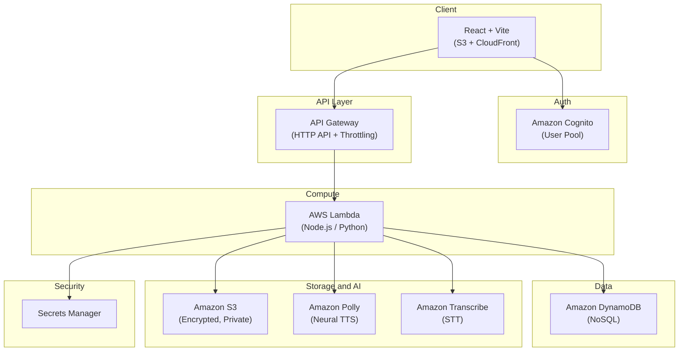

# DỰ ÁN WEBSITE TEXT TO SPEECH & SPEECH TO TEXT

## 1. Introduction

### 1.1 Project Name

**Polly Voice**

---

### 1.2 Project Objective

Xây dựng một website cho phép người dùng chuyển đổi **Text-to-Speech (TTS)** và **Speech-to-Text (STT)**. Hệ thống hỗ trợ tùy chỉnh giọng đọc, xem trước kết quả, lưu lịch sử chuyển đổi và tải xuống các tệp đã tạo.

---

## 2. Main Features

### 2.1 Text-to-Speech (TTS)

**Description:** Chuyển đổi văn bản thành giọng nói.

#### Features

| Feature        | Description                       |
| -------------- | --------------------------------- |
| Text Input     | Nhập văn bản trực tiếp            |
| Text Upload    | Tải lên file `.txt` *(Optional)*  |
| Language       | Chọn ngôn ngữ (Hiện tại chỉ triển khai tiếng anh)                   |
| Voice          | Chọn giọng đọc                    |
| Preset         | Chọn cấu hình giọng đọc có sẵn    |
| Voice Settings | Điều chỉnh các thông số giọng đọc |
| Preview        | Nghe thử trước khi xuất file      |
| Export         | Xuất file âm thanh                |

#### Voice Settings

> **Engine mặc định:** **Neural** — cung cấp giọng đọc tự nhiên nhất. Một số thông số chỉ khả dụng với Standard engine và sẽ được ghi chú rõ.

| Setting      | SSML Tag                   | Giá trị hợp lệ                                                     | Engine hỗ trợ        | Description                          |
| ------------ | -------------------------- | ------------------------------------------------------------------ | -------------------- | ------------------------------------ |
| Language     | *(API parameter)*          | `en-US`, `en-GB`, `en-AU`, ...                                     | All                  | Ngôn ngữ (hiện tại chỉ tiếng Anh)   |
| Voice        | *(API parameter)*          | Danh sách giọng Polly (vd: `Joanna`, `Matthew`, `Amy`, ...)        | All                  | Giọng đọc                            |
| Engine       | *(API parameter)*          | `neural` *(mặc định)*, `standard`, `long-form`                     | —                    | Bộ máy tổng hợp giọng nói            |
| Preset       | *(combination)*            | Deep Male, Young Male, Soft Female, Expressive Female, MC, Podcast, Audiobook | All     | Cấu hình giọng đọc có sẵn           |
| Speed        | `<prosody rate="...">`     | `x-slow`, `slow`, `medium`, `fast`, `x-fast` hoặc `20%`–`200%`    | All                  | Điều chỉnh tốc độ đọc               |
| Volume       | `<prosody volume="...">`   | `x-soft`, `soft`, `medium`, `loud`, `x-loud` hoặc `+ndB` / `-ndB` | All                  | Điều chỉnh âm lượng                 |
| Pitch        | `<prosody pitch="...">`    | `x-low`, `low`, `medium`, `high`, `x-high` hoặc `+n%` / `-n%`     | **Standard only**    | Điều chỉnh cao độ giọng              |
| Break        | `<break time="...">`       | `0ms` – `10000ms` (vd: `500ms`, `2s`)                              | All                  | Tạm dừng giữa các câu               |
| Emphasis     | `<emphasis level="...">`   | `strong`, `moderate`, `reduced`                                    | **Standard only**    | Nhấn mạnh từ hoặc cụm từ            |
| Domain Style | `<amazon:domain name="...">` | `news`, `conversational`                                         | **Neural only**      | Phong cách đọc (tin tức / hội thoại) |

> **Lưu ý:** Với engine **Neural** (mặc định), `Pitch` và `Emphasis` **không được hỗ trợ** — UI cần ẩn hoặc vô hiệu hóa các thông số này khi chọn Neural engine.

#### Available Presets

| Preset            | Voice mặc định | Engine    | Mô tả                                        |
| ----------------- | -------------- | --------- | -------------------------------------------- |
| Deep Male         | Matthew        | Neural    | Giọng nam trầm, uy quyền                     |
| Young Male        | Kevin          | Neural    | Giọng nam trẻ, năng động                     |
| Soft Female       | Joanna         | Neural    | Giọng nữ nhẹ nhàng, chậm rãi                 |
| Expressive Female | Danielle       | Long-form | Giọng nữ biểu cảm, phù hợp đọc truyện       |
| MC                | Stephen        | Neural    | Giọng MC rõ ràng, tốc độ vừa phải            |
| Podcast           | Matthew        | Neural    | Giọng podcast tự nhiên, Domain conversational |
| Audiobook         | Joanna         | Long-form | Giọng đọc sách, nhịp chậm, rõ ràng           |

---

### 2.2 Speech-to-Text (STT) *(Optional)*

**Description:** Chuyển đổi file âm thanh thành văn bản.

#### Features

| Feature            | Description                    |
| ------------------ | ------------------------------ |
| Audio Upload       | Tải lên file âm thanh          |
| Speech Recognition | Chuyển giọng nói thành văn bản |
| Text Result        | Hiển thị kết quả               |
| Copy               | Sao chép nội dung              |
| Download           | Tải xuống file `.txt`          |

#### Supported Audio Formats

|  Format |  Support  |
| :-----: | :-------: |
|  `.mp3` | Supported |
|  `.wav` |  Optional |
|  `.m4a` |  Optional |
| `.flac` |  Optional |


## 3. Supported File Formats

### Text Files

> **Description:** Các định dạng văn bản được hệ thống hỗ trợ.

| Format | Usage          |
| :----: | -------------- |
| `.txt` | Input / Output |

---

### Audio Files

> **Description:** Các định dạng âm thanh được hệ thống hỗ trợ.

| Format | Usage          |
| :----: | -------------- |
| `.mp3` | Input / Output |

---

## 4. User Roles

### Guest

**Description:** Người dùng chưa đăng nhập.

| Permission                              | Status |
| --------------------------------------- | :----: |
| Sử dụng Text-to-Speech                  |    ✓   |
| Sử dụng Speech-to-Text                  |    ✓   |
| Upload file để chuyển đổi               |    ✓   |
| Giới hạn số ký tự hoặc thời lượng xử lý |   Yes  |
| Lưu lịch sử chuyển đổi                  |   No   |
| Quản lý file                            |   No   |

---

### User

**Description:** Người dùng đã đăng nhập.

| Permission                                   | Status |
| -------------------------------------------- | :----: |
| Sử dụng Text-to-Speech                       |    ✓   |
| Sử dụng Speech-to-Text                       |    ✓   |
| Upload file để chuyển đổi                    |    ✓   |
| Lưu lịch sử chuyển đổi                       |    ✓   |
| Quản lý file                                 |    ✓   |
| Tăng giới hạn số ký tự hoặc thời lượng xử lý |    ✓   |
| Quản lý thông tin cá nhân                    |    ✓   |

---

### Permission Comparison

| Feature         | Guest |  User |
| --------------- | :---: | :---: |
| Text-to-Speech  |   ✓   |   ✓   |
| Speech-to-Text  |   ✓   |   ✓   |
| Upload File     |   ✓   |   ✓   |
| Lưu lịch sử     |   ✗   |   ✓   |
| Quản lý File    |   ✗   |   ✓   |
| Quản lý Profile |   ✗   |   ✓   |
| Giới hạn ký tự  |   Có  | Không |


## 5. User Interface

### 5.1 Text-to-Speech

**Description:** Giao diện chuyển đổi văn bản thành giọng nói.

| Section      | Features                                                                                                                           |
| ------------ | ---------------------------------------------------------------------------------------------------------------------------------- |
| **Input**    | Nhập văn bản trực tiếp hoặc tải lên file (`.txt`)                                                                                  |
| **Settings** | Chọn **Language**, **Voice**, **Engine**, **Preset**, điều chỉnh **Speed**, **Volume**, **Break**; **Pitch** (Standard only), **Emphasis** (Standard only), **Domain Style** (Neural only) |
| **Preview**  | Nút **Generate**, **Play Preview** và trình phát âm thanh                                                                          |
| **Export**   | Chọn định dạng đầu ra (`.mp3`) và tải xuống                                                                                        |

---

### 5.2 Speech-to-Text

**Description:** Giao diện chuyển đổi giọng nói thành văn bản.

| Section        | Features                                    |
| -------------- | ------------------------------------------- |
| **Upload**     | Tải lên file âm thanh (MP3, WAV,...)        |
| **Processing** | Hiển thị trạng thái xử lý                   |
| **Result**     | Hiển thị văn bản sau khi nhận dạng          |
| **Export**     | Tải kết quả dưới dạng file văn bản (`.txt`) |

---

### 5.3 Login *(Optional)*

**Description:** Giao diện xác thực người dùng.

| Features                              |
| ------------------------------------- |
| Đăng nhập bằng Email và Password      |
| Điều hướng đến trang đăng ký (nếu có) |

---

### 5.4 Profile *(Optional)*

**Description:** Quản lý thông tin cá nhân và lịch sử sử dụng.

| Features                      |
| ----------------------------- |
| Hiển thị thông tin người dùng |
| Chỉnh sửa thông tin cá nhân   |
| Xem lịch sử Text-to-Speech    |
| Xem lịch sử Speech-to-Text    |


## 6. System Architecture

### 6.1 Tổng quan

> **Kiến trúc Serverless** trên AWS — không cần quản lý server, tự động scale, chi phí cực thấp (~$10/tháng).



### 6.2 AWS Services

| Dịch vụ | Vai trò | Chi phí/tháng |
|---|---|---|
| **Amazon Cognito** | Xác thực người dùng (đăng ký, đăng nhập, MFA, JWT) | $0 (Free: 50K MAU) |
| **API Gateway (HTTP API)** | Routing, throttling, request validation | $0 (Free: 1M requests) |
| **AWS Lambda** | Backend logic (xử lý TTS/STT requests) | $0 (Free: 1M requests) |
| **Amazon DynamoDB** | Database NoSQL (Serverless) | $0 (Free: 25GB, 25 WCU/RCU) |
| **Amazon S3** | Lưu trữ file audio/text (encrypted) | ~$0.50 |
| **Amazon CloudFront** | CDN cho frontend + audio files | $0 (Free: 1TB transfer) |
| **Amazon Polly** | Text-to-Speech (Neural engine) | ~$1–5 (tùy usage) |
| **Amazon Transcribe** | Speech-to-Text | ~$1–3 (tùy usage) |
| **Secrets Manager** | Lưu trữ DB credentials, API config | ~$0.80 |
| **Tổng ước tính** | | **~$3–10/tháng** |

> **Lưu ý:** Các dịch vụ như Cognito, Lambda, API Gateway và DynamoDB có Free Tier vĩnh viễn rất rộng rãi, hoàn toàn phù hợp để duy trì budget ~$10/tháng kể cả sau năm đầu tiên.

### 6.3 Caching Strategy

> Không sử dụng ElastiCache (ngoài budget). Thay thế bằng **S3-based cache** kết hợp **hash key**.

| Bước | Mô tả |
|---|---|
| 1 | Client gửi `POST /tts` với text + settings |
| 2 | Lambda tính `cache_key = SHA256(text + voice + engine + speed + volume + ssml_params)` |
| 3 | Kiểm tra S3: `s3://bucket/cache/{cache_key}.mp3` |
| 4 | **Cache HIT** → Trả Pre-Signed URL ngay ($0 Polly cost) |
| 5 | **Cache MISS** → Gọi Polly, lưu audio lên S3 cache path, trả URL |

---

## 7. Security

### 7.1 Authentication — Amazon Cognito

| Tính năng | Chi tiết |
|---|---|
| Đăng ký / Đăng nhập | Cognito User Pool xử lý hoàn toàn |
| Password Policy | Tối thiểu 8 ký tự, chữ hoa + chữ thường + số + ký tự đặc biệt |
| Email Verification | Cognito tự động gửi email xác nhận |
| Token Management | JWT (ID Token + Access Token + Refresh Token), tự động rotation |
| MFA | Có thể bật TOTP hoặc SMS *(optional)* |
| Social Login | Hỗ trợ Google, Facebook, Apple *(optional)* |

> **Thay đổi:** Backend **không** tự lưu password. Bảng `users` chỉ lưu `cognito_sub` (Cognito User ID) để mapping với dữ liệu nội bộ.

### 7.2 API Rate Limiting — API Gateway Throttling

> Không sử dụng AWS WAF (ngoài budget ~$5/tháng). Thay thế bằng **API Gateway built-in throttling** (miễn phí).

| Loại user | Rate Limit | Burst Limit | Ghi chú |
|---|---|---|---|
| Guest (No Auth) | 20 requests/giây | 50 | Chặn spam, giới hạn ký tự 500/request |
| User (Authenticated) | 50 requests/giây | 100 | Giới hạn ký tự 3000/request |
| `/tts/preview` | 5 requests/giây | 10 | Endpoint dễ bị abuse nhất |

### 7.3 S3 Security

| Cấu hình | Giá trị |
|---|---|
| Block Public Access | **ON** (tất cả 4 options) |
| Server-Side Encryption | SSE-S3 (AES-256) |
| Bucket Versioning | Enabled |
| Access Method | **Pre-Signed URLs only** (TTL: 15 phút) |
| CORS | Chỉ cho phép frontend domain |
| Lifecycle Policy | Xóa file trong `/cache/` sau 30 ngày; xóa file trong `/temp/` sau 7 ngày |

> **Quan trọng:** Database chỉ lưu Key S3 (ví dụ: `audio_s3_key`), **không bao giờ lưu public URL**. API `/files/{id}/download` trả về Pre-Signed URL có thời hạn 15 phút.

### 7.4 Input Validation

| Field | Rule | Lý do |
|---|---|---|
| `text_content` | Max 3,000 ký tự (Guest: 500) | Giới hạn của AWS Polly Neural |
| `voice` | Whitelist: `Joanna`, `Matthew`, `Kevin`, `Danielle`, `Stephen`, `Amy`, `Emma`, `Brian` | Chống giá trị không hợp lệ |
| `engine` | Enum: `neural`, `standard`, `long-form` | Chống injection |
| `language` | Whitelist: `en-US`, `en-GB` | Giới hạn scope hiện tại |
| `speed` | Range: `20%`–`200%` hoặc enum SSML | Giới hạn SSML |
| `volume` | Range: `-10dB`–`+10dB` hoặc enum SSML | Giới hạn SSML |
| File upload | Max 10MB, chỉ `.txt` / `.mp3` / `.wav` | Chống upload file độc hại |
| SSML content | Sanitize: chỉ cho phép tags trong whitelist | **Chống SSML Injection** |

### 7.5 Secrets Management — AWS Secrets Manager

| Secret Name | Nội dung |
|---|---|
| `polly-voice/db-credentials` | RDS host, port, username, password, database name |
| `polly-voice/cognito-config` | Cognito User Pool ID, App Client ID |

> Backend (Lambda) gọi Secrets Manager khi **cold start**, cache credentials trong memory. Không bao giờ lưu credentials trong `.env` file hay source code.

---

## 8. Database (Amazon DynamoDB)

> **Kiến trúc NoSQL:** Hệ thống sử dụng Amazon DynamoDB theo chuẩn Serverless. Việc không sử dụng RDBMS (SQL) nhằm tránh lỗi cạn kiệt connection (Connection Exhaustion) khi Lambda tự động scale out. Dữ liệu được thiết kế theo các bảng (Tables) với Partition Key (PK) và Sort Key (SK). Mọi thời gian đều dùng định dạng **Epoch Timestamp** để dễ dàng query và hỗ trợ TTL.

### 8.1 Bảng `Users`

**Description:** Lưu trữ thông tin tài khoản (đã mapping với Cognito).

| Attribute | Type | Key | Description |
|---|---|---|---|
| `cognito_sub` | String | **Partition Key** | Cognito User ID (UUID) làm khóa chính |
| `email` | String | | Email người dùng |
| `name` | String | | Họ và tên |
| `created_at` | Number | | Epoch Timestamp (Thời điểm tạo) |
| `updated_at` | Number | | Epoch Timestamp (Thời điểm cập nhật) |

---

### 8.2 Bảng `TextHistory`

**Description:** Lịch sử Text-to-Speech. (Gộp chung các thông tin file metadata trực tiếp vào bảng để tránh dư thừa).

| Attribute | Type | Key | Description |
|---|---|---|---|
| `user_id` | String | **Partition Key** | ID của user (`cognito_sub`) |
| `created_at` | Number | **Sort Key** | Epoch Timestamp (giúp Query nhanh lịch sử theo thời gian và hỗ trợ TTL) |
| `history_id` | String | | UUID của record này |
| `text_content` | String | | Nội dung văn bản (nếu nhập trực tiếp) |
| `text_s3_key` | String | | **S3 Key** của file văn bản gốc (nếu upload) |
| `audio_s3_key` | String | | **S3 Key** của file audio mp3 sinh ra (vd: `tts/user1/abc.mp3`) |
| `audio_file_size`| Number | | Dung lượng file (Bytes) - Max 10MB (tương đương INT) |
| `engine` | String | | `neural` (default), `standard` |
| `voice` | String | | `Joanna`, `Matthew`,... |
| `language` | String | | `en-US`, `en-GB` |
| `preset` | String | | Preset đã chọn |
| `ssml_enabled` | Boolean| | `true`/`false` |
| `ssml_params` | Map | | JSON config cho pitch, emphasis... |
| `character_count`| Number | | Số lượng ký tự (để tính cost) |
| `updated_at` | Number | | Epoch Timestamp |
| `deleted_at` | Number | | Epoch Timestamp (Soft delete. Null = active) |

---

### 8.3 Bảng `SpeechHistory`

**Description:** Lịch sử Speech-to-Text. (Gộp chung metadata của file upload).

| Attribute | Type | Key | Description |
|---|---|---|---|
| `user_id` | String | **Partition Key** | ID của user (`cognito_sub`) |
| `created_at` | Number | **Sort Key** | Epoch Timestamp (giúp Query nhanh lịch sử theo thời gian và hỗ trợ TTL) |
| `history_id` | String | | UUID của record này |
| `audio_s3_key` | String | | **S3 Key** của file gốc tải lên |
| `audio_file_size`| Number | | Dung lượng file tải lên (Bytes) - Max 10MB (tương đương INT) |
| `text_s3_key` | String | | **S3 Key** của file văn bản bóc băng |
| `result_text` | String | | Nội dung bóc băng |
| `updated_at` | Number | | Epoch Timestamp |
| `deleted_at` | Number | | Epoch Timestamp (Soft delete. Null = active) |

> **Lưu ý về thiết kế NoSQL:** Bảng `Files` riêng biệt đã được loại bỏ. Mọi thông tin về file như dung lượng (`_file_size`) và đường dẫn (`_s3_key`) được lưu trực tiếp vào các bảng History tương ứng. Việc này giúp tối ưu hóa một truy vấn (GetItem) duy nhất mà lấy được cả lịch sử lẫn file, rất phù hợp với mô hình truy xuất NoSQL. Mọi trường thời gian sử dụng **Number (Epoch)** thay vì ISO8601 String để tăng tốc Sort/Query và sẵn sàng tích hợp TTL.

## 9. Backend (Serverless)

> **Runtime:** AWS Lambda (Node.js hoặc Python) — mỗi API endpoint là một Lambda function.
> **API Gateway:** HTTP API — routing, throttling, CORS, request validation.
> **Auth:** Tất cả endpoints (trừ Guest endpoints) yêu cầu Cognito JWT token trong header `Authorization: Bearer <token>`.

### Authentication — Amazon Cognito (Managed)

| Method | Endpoint | Auth | Description |
| :----: | -------- | :--: | ----------- |
| `POST` | `/auth/register` | Public | Đăng ký (Cognito signUp) |
| `POST` | `/auth/login` | Public | Đăng nhập (Cognito initiateAuth) |
| `POST` | `/auth/logout` | User | Đăng xuất (Cognito globalSignOut) |
| `GET` | `/auth/profile` | User | Lấy thông tin user từ Cognito + DB |
| `PUT` | `/auth/profile` | User | Cập nhật thông tin cá nhân |

> **Lưu ý:** Cognito SDK xử lý logic xác thực. Backend Lambda chỉ cần verify JWT token và mapping `cognito_sub` → `users.id`.

---

### Text-to-Speech (TTS)

| Method | Endpoint | Auth | Pagination | Description |
| :----: | -------- | :--: | :--------: | ----------- |
| `POST` | `/tts` | Guest / User | — | Chuyển văn bản thành giọng nói |
| `POST` | `/tts/preview` | Guest / User | — | Nghe thử (không lưu lịch sử, giới hạn 500 ký tự) |
| `GET` | `/tts/history` | User | `?limit=20&cursor=<Base64>` | Lấy danh sách lịch sử (Cursor-based pagination) |
| `GET` | `/tts/{id}` | User | — | Lấy chi tiết một lần chuyển đổi |
| `GET` | `/tts/{id}/download` | User | — | Tạo Pre-Signed GET URL (15 phút) từ `audio_s3_key` |
| `DELETE` | `/tts/{id}` | User | — | Soft delete một lịch sử |

#### POST /tts — Request Validation

| Field | Type | Required | Validation |
|-------|------|:--------:|------------|
| `text` | string | ✓ | Max 3,000 ký tự (Guest: 500) |
| `voice` | string | ✓ | Whitelist: `Joanna`, `Matthew`, `Kevin`, `Danielle`, `Stephen`, `Amy`, `Emma`, `Brian` |
| `engine` | string | — | Enum: `neural` (default), `standard`, `long-form` |
| `language` | string | — | Whitelist: `en-US` (default), `en-GB` |
| `speed` | string | — | SSML rate hoặc `20%`–`200%` |
| `volume` | string | — | SSML volume hoặc `-10dB`–`+10dB` |
| `preset` | string | — | Enum từ Available Presets |
| `ssml_params` | object | — | JSON chứa `pitch`, `break_time`, `emphasis`, `domain_style` |

---

### Speech-to-Text (STT)

| Method | Endpoint | Auth | Pagination | Description |
| :----: | -------- | :--: | :--------: | ----------- |
| `POST` | `/stt/presign-upload` | User | — | Tạo Pre-Signed POST URL để client upload trực tiếp file audio lên S3 |
| `POST` | `/stt` | Guest / User | — | Chuyển file âm thanh thành văn bản |
| `GET` | `/stt/history` | User | `?limit=20&cursor=<Base64>` | Lấy danh sách lịch sử (Cursor-based pagination) |
| `GET` | `/stt/{id}` | User | — | Lấy chi tiết một lần chuyển đổi |
| `GET` | `/stt/{id}/download` | User | — | Tạo Pre-Signed GET URL (15 phút) cho file văn bản kết quả (`text_s3_key`) |
| `DELETE` | `/stt/{id}` | User | — | Soft delete một lịch sử |

---

### Pagination Response Format (DynamoDB Cursor-Based)

```json
{
  "data": [],
  "pagination": {
    "limit": 20,
    "next_cursor": "eyJ1c2VyX2lkIjoiMTIzIiwiY3JlYXRlZF9hdCI6MTY5ODc2NTQzMn0="
  }
}
```

---

### API Summary

| Module         | Number of APIs |
| -------------- | :------------: |
| Authentication |        5       |
| Text-to-Speech |        6       |
| Speech-to-Text |        6       |
| **Total**      |   **17 APIs**  |

## 10. References

### AWS Services Documentation

| Resource | Description |
| -------- | ----------- |
| **Amazon Polly** | Text-to-Speech service. <br> https://docs.aws.amazon.com/polly/latest/dg/ |
| **Amazon Transcribe** | Speech-to-Text service. <br> https://docs.aws.amazon.com/transcribe/ |
| **Amazon Cognito** | User authentication & authorization. <br> https://docs.aws.amazon.com/cognito/ |
| **API Gateway** | REST/HTTP API management. <br> https://docs.aws.amazon.com/apigateway/ |
| **AWS Lambda** | Serverless compute. <br> https://docs.aws.amazon.com/lambda/ |
| **Amazon S3** | Object storage. <br> https://docs.aws.amazon.com/s3/ |
| **AWS Secrets Manager** | Secrets management. <br> https://docs.aws.amazon.com/secretsmanager/ |
| **Amazon CloudFront** | CDN. <br> https://docs.aws.amazon.com/cloudfront/ |
| **SSML Documentation** | Speech Synthesis Markup Language for Polly. <br> https://docs.aws.amazon.com/polly/latest/dg/ssml.html |

---

### Development Workflow

1. Cấu hình **Amazon Cognito** User Pool cho authentication.
2. Thiết lập **API Gateway** HTTP API với Lambda integration.
3. Viết **Lambda functions** cho từng endpoint (Node.js hoặc Python).
4. Cấu hình **Amazon S3** bucket (encryption, lifecycle, CORS).
5. Tích hợp **Amazon Polly** (TTS) và **Amazon Transcribe** (STT) qua AWS SDK.
6. Deploy frontend lên **S3 + CloudFront**.
7. Lưu credentials trong **Secrets Manager**.
8. Áp dụng **SSML** để tùy chỉnh giọng đọc.

---

### Related AWS Services

* **Amazon Polly** – Chuyển đổi văn bản thành giọng nói (Text-to-Speech).
* **Amazon Transcribe** – Chuyển đổi giọng nói thành văn bản (Speech-to-Text).
* **Amazon Cognito** – Xác thực và quản lý người dùng.
* **API Gateway** – Quản lý và bảo vệ API endpoints.
* **AWS Lambda** – Xử lý backend logic (serverless).
* **Amazon S3** – Lưu trữ file văn bản và file âm thanh.
* **Amazon CloudFront** – CDN cho frontend và audio files.
* **AWS Secrets Manager** – Quản lý credentials và API keys.
* **AWS IAM** – Quản lý quyền truy cập vào các dịch vụ AWS.
