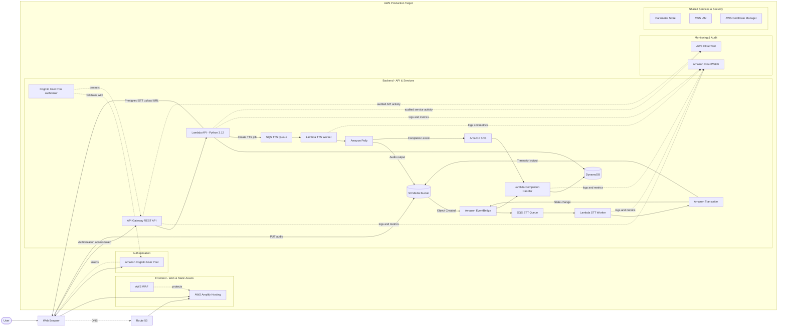
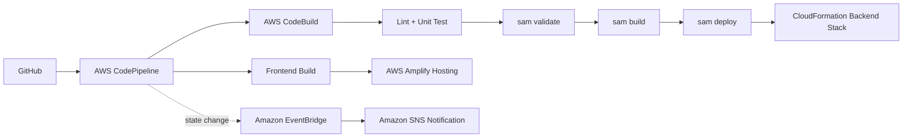

# DỰ ÁN WEBSITE TEXT TO SPEECH & SPEECH TO TEXT

## 1. Introduction

### 1.1 Project Name

**Polly Voice**

---

### 1.2 Project Objective

Xây dựng một website cho phép người dùng chuyển đổi **Text-to-Speech (TTS)** và **Speech-to-Text (STT)**. Hệ thống hỗ trợ tùy chỉnh giọng đọc, xem trước kết quả, lưu lịch sử chuyển đổi và tải xuống các tệp đã tạo.

---

## 2. Main Features

### 2.1 Text-to-Speech (TTS)

**Description:** Chuyển đổi văn bản thành giọng nói.

#### Features

| Feature        | Description                       |
| -------------- | --------------------------------- |
| Text Input     | Nhập văn bản trực tiếp            |
| Text Upload    | Chọn file `.txt`; browser đọc nội dung rồi gửi text đến API *(User only)* |
| Language       | Chọn ngôn ngữ (Hiện tại chỉ triển khai tiếng anh)                   |
| Voice          | Chọn giọng đọc                    |
| Preset         | Chọn cấu hình giọng đọc có sẵn    |
| Voice Settings | Điều chỉnh các thông số giọng đọc |
| Preview        | Nghe thử trước khi xuất file      |
| Export         | Xuất file âm thanh                |

#### Voice Settings

> **Engine mặc định:** **Neural**. UI và backend phải kiểm tra tổ hợp `region + language + voice + engine + SSML tag`; không gửi tag không tương thích vì Polly sẽ trả lỗi.

| Setting | SSML Tag | Giá trị hợp lệ | Quy tắc tương thích | Description |
|---|---|---|---|---|
| Language | *(API parameter)* | `en-US`, `en-GB` | Theo voice | Ngôn ngữ trong phạm vi MVP |
| Voice | *(API parameter)* | Lấy từ allowlist đã kiểm tra theo Region | Theo engine/language | Giọng đọc |
| Engine | *(API parameter)* | `neural` *(mặc định)*, `standard`, `long-form` | Theo voice/Region | Bộ máy tổng hợp giọng nói |
| Preset | *(combination)* | Deep Male, Young Male, Soft Female, Expressive Female, MC, Podcast, Audiobook | Theo voice/engine | Cấu hình có sẵn |
| Speed | `<prosody rate="...">` | `x-slow`, `slow`, `medium`, `fast`, `x-fast` hoặc `20%`–`200%` | Kiểm tra theo engine | Tốc độ đọc |
| Volume | `<prosody volume="...">` | `x-soft`, `soft`, `medium`, `loud`, `x-loud` hoặc `+ndB` / `-ndB` | Kiểm tra theo engine | Âm lượng |
| Pitch | `<prosody pitch="...">` | `x-low`, `low`, `medium`, `high`, `x-high` hoặc `+n%` / `-n%` | **Standard only** | Cao độ |
| Break | `<break time="...">` | `0ms`–`10000ms` | Standard, Neural, Long-form | Khoảng dừng |
| Emphasis | `<emphasis level="...">` | `strong`, `moderate`, `reduced` | **Standard only** | Nhấn mạnh |
| Domain Style | `<amazon:domain name="news">` | `news` | Chỉ một số Neural voice | Phong cách phát thanh |

`news` chỉ bật cho các tổ hợp được hỗ trợ trong phạm vi hiện tại: `Matthew/en-US/neural`, `Joanna/en-US/neural` và `Amy/en-GB/neural`. Không sử dụng giá trị `conversational` cho `<amazon:domain>`.

> **Trạng thái MVP hiện tại:** bảng Voice Settings và Presets mô tả thiết kế UI/target. Backend đang triển khai request cơ bản với `text`, `voice`, `engine` (`standard`/`neural`) và `output_format`; speed, volume, pitch, break, emphasis, domain style và engine `long-form` chưa được nối vào API hiện tại.

#### Available Presets

| Preset            | Voice mặc định | Engine    | Mô tả                                        |
| ----------------- | -------------- | --------- | -------------------------------------------- |
| Deep Male         | Matthew        | Neural    | Giọng nam trầm, uy quyền                     |
| Young Male        | Kevin          | Neural    | Giọng nam trẻ, năng động                     |
| Soft Female       | Joanna         | Neural    | Giọng nữ nhẹ nhàng, chậm rãi                 |
| Expressive Female | Danielle       | Long-form | Giọng nữ biểu cảm, phù hợp đọc truyện       |
| MC                | Stephen        | Neural    | Giọng MC rõ ràng, tốc độ vừa phải            |
| Podcast           | Matthew        | Neural    | Giọng podcast tự nhiên                         |
| Audiobook         | Ruth           | Long-form | Giọng đọc sách dài, tự nhiên                   |

> Long-form voice hiện được triển khai tại Region hỗ trợ (MVP chọn `us-east-1`). Preset phải được kiểm tra lại bằng `DescribeVoices` khi đổi Region.

#### Giới hạn TTS

| Chế độ | Polly operation | Billed characters | Total characters | Xử lý |
|---|---|---:|---:|---|
| Preview/real-time | `SynthesizeSpeech` | Tối đa 3.000 | Tối đa 6.000 | Đồng bộ |
| Export/long-form | `StartSpeechSynthesisTask` | Tối đa 100.000 | Tối đa 200.000 | Bất đồng bộ |

SSML tags không được tính vào billed characters nhưng vẫn nằm trong total characters.

---

### 2.2 Speech-to-Text (STT) *(Optional)*

**Description:** Chuyển đổi file âm thanh thành văn bản.

#### Features

| Feature            | Description                    |
| ------------------ | ------------------------------ |
| Audio Upload       | Tải lên file âm thanh          |
| Speech Recognition | Chuyển giọng nói thành văn bản |
| Text Result        | Hiển thị kết quả               |
| Copy               | Sao chép nội dung              |
| Download           | Tải xuống file `.txt`          |

#### Supported Audio Formats

| Format | Backend MVP |
|:---:|:---:|
| `.mp3` | Supported |
| `.mp4` | Supported |
| `.wav` | Supported |
| `.flac` | Supported |
| `.ogg` | Supported |
| `.amr` | Supported |
| `.webm` | Supported |
| `.m4a` | Supported |

## 3. Supported File Formats

### Text Files

> **Description:** Các định dạng văn bản được hệ thống hỗ trợ.

| Format | Usage          |
| :----: | -------------- |
| `.txt` | Input / Output |

---

### Audio Files

> **Description:** Các định dạng âm thanh được hệ thống hỗ trợ.

| Format | Input | Output |
|:---:|:---:|:---:|
| `.mp3` | ✓ | ✓ |
| `.mp4` | ✓ | — |
| `.wav` | ✓ | — |
| `.flac` | ✓ | — |
| `.ogg` | ✓ | — |
| `.amr` | ✓ | — |
| `.webm` | ✓ | — |
| `.m4a` | ✓ | — |

---

## 4. User Roles

### Guest

**Description:** Người dùng chưa đăng nhập, chỉ được dùng TTS preview để hạn chế abuse và chi phí.

| Permission | Status |
|---|:---:|
| TTS preview tối đa 500 ký tự | ✓ |
| Tạo TTS export/job | ✗ |
| Sử dụng Speech-to-Text | ✗ |
| Upload file | ✗ |
| Lưu lịch sử chuyển đổi | ✗ |
| Quản lý file | ✗ |

---

### User

**Description:** Người dùng đã đăng nhập.

| Permission                                   | Status |
| -------------------------------------------- | :----: |
| Sử dụng Text-to-Speech                       |    ✓   |
| Sử dụng Speech-to-Text                       |    ✓   |
| Upload file để chuyển đổi                    |    ✓   |
| Lưu lịch sử chuyển đổi                       |    ✓   |
| Quản lý file                                 |    ✓   |
| TTS preview tối đa 3.000 billed / 6.000 total characters | ✓ |
| TTS async tối đa 100.000 billed / 200.000 total characters | ✓ |
| Quản lý thông tin cá nhân                    |    ✓   |

---

### Permission Comparison

| Feature | Guest | User |
|---|:---:|:---:|
| TTS Preview | ✓ (500 ký tự) | ✓ |
| TTS Export/Job | ✗ | ✓ |
| Speech-to-Text | ✗ | ✓ |
| Upload File | ✗ | ✓ |
| Lưu lịch sử | ✗ | ✓ |
| Quản lý File | ✗ | ✓ |
| Quản lý Profile | ✗ | ✓ |

> Các quyền tải xuống/xóa file là mục tiêu sản phẩm. Trong backend MVP hiện tại, route `/download` và `DELETE` đã được khai báo nhưng vẫn trả `501`; frontend chỉ nên bật chức năng này sau khi endpoint tương ứng được triển khai.


## 5. User Interface

### 5.1 Text-to-Speech

**Description:** Giao diện chuyển đổi văn bản thành giọng nói.

| Section      | Features                                                                                                                           |
| ------------ | ---------------------------------------------------------------------------------------------------------------------------------- |
| **Input**    | Nhập văn bản trực tiếp hoặc tải lên file (`.txt`)                                                                                  |
| **Settings** | Chọn **Language**, **Voice**, **Engine**, **Preset**, điều chỉnh **Speed**, **Volume**, **Break**; **Pitch** (Standard only), **Emphasis** (Standard only), **Domain Style** (Neural only) |
| **Preview**  | Nút **Generate**, **Play Preview** và trình phát âm thanh                                                                          |
| **Export**   | Chọn định dạng đầu ra (`.mp3`) và tải xuống                                                                                        |

> Giao diện hiện là prototype. Khi kết nối backend, chỉ bật các control có field tương ứng trong API; không gửi SSML/preset setting chưa được backend hỗ trợ.

---

### 5.2 Speech-to-Text

**Description:** Giao diện chuyển đổi giọng nói thành văn bản.

| Section        | Features                                    |
| -------------- | ------------------------------------------- |
| **Upload**     | Tải lên file âm thanh (MP3, WAV,...)        |
| **Processing** | Hiển thị trạng thái xử lý                   |
| **Result**     | Hiển thị văn bản sau khi nhận dạng          |
| **Export**     | Tải kết quả dưới dạng file văn bản (`.txt`) |

---

### 5.3 Login

**Description:** React SPA xác thực trực tiếp với Cognito Managed Login bằng **OAuth 2.0 Authorization Code Grant + PKCE**. Backend không proxy đăng ký, đăng nhập hoặc đăng xuất. **AWS Amplify Hosting** chỉ đảm nhiệm build/deploy/host frontend; frontend có thể tự triển khai PKCE bằng browser API mà không bắt buộc cài Amplify Auth.

| Features |
|---|
| Đăng ký/đăng nhập qua Cognito User Pool |
| Email verification và quên mật khẩu do Cognito xử lý |
| Nhận JWT sau khi đổi authorization code bằng PKCE |
| Đăng xuất qua Cognito và xóa session/token phía SPA |

---

### 5.4 Profile *(Optional)*

**Description:** Quản lý thông tin cá nhân và lịch sử sử dụng.

| Features                      |
| ----------------------------- |
| Hiển thị thông tin người dùng |
| Chỉnh sửa thông tin cá nhân   |
| Xem lịch sử Text-to-Speech    |
| Xem lịch sử Speech-to-Text    |


## 6. System Architecture

> **Phân biệt vai trò dịch vụ:** **AWS Amplify Hosting** dùng để build, deploy và host React SPA. **Amazon CloudWatch** chỉ dùng cho logs, metrics, dashboard và alarms; CloudWatch không triển khai hoặc lưu trữ frontend.
>
> Sơ đồ kiến trúc production bên dưới là **kiến trúc đích**. Backend MVP hiện đã chạy trên stack `dev` bằng AWS SAM/CloudFormation; frontend đang được tích hợp và sẽ được deploy riêng lên Amplify Hosting. Những thành phần production chưa triển khai được ghi rõ là *Target* để README không mô tả nhầm chúng là tài nguyên đang hoạt động.

### 6.1 Kiến trúc hiện tại và kiến trúc đích

| Hạng mục | Current MVP | Target Production |
|---|---|---|
| Frontend | React 19 + TypeScript + Vite, chạy local trong giai đoạn tích hợp | **AWS Amplify Hosting** build/deploy/host SPA |
| Frontend protection | Chưa triển khai | AWS WAF Web ACL tích hợp với Amplify |
| DNS và TLS | Dùng URL mặc định của dịch vụ trong môi trường `dev` | Route 53 + AWS Certificate Manager |
| Authentication | Cognito User Pool, Hosted/Managed Login, Authorization Code Grant + PKCE | Giữ nguyên; frontend Amplify vẫn xác thực trực tiếp với Cognito |
| API | API Gateway REST API stage `dev` + Cognito User Pool Authorizer | Custom domain và Regional WAF nếu cần |
| Compute | Lambda API, TTS Worker, STT Worker và Completion Handler, Python 3.12 | Published versions/alias và SnapStart khi được cấu hình trong production |
| Data | DynamoDB `Users` và `ConversionJobs` | Giữ nguyên, bổ sung backup/retention theo yêu cầu production |
| Media | S3 private bucket cho `cache/`, `input/` và `output/` | Giữ nguyên, bổ sung lifecycle/versioning theo retention policy |
| Async TTS | SQS → TTS Worker → Polly → S3/SNS → Completion Lambda | Giữ nguyên, bổ sung vận hành/reconciliation nếu cần |
| Async STT | S3 EventBridge → SQS → STT Worker → Transcribe → EventBridge → Completion Lambda | Giữ nguyên |
| Monitoring | CloudWatch Logs và Alarms | CloudWatch dashboard/alarms + CloudTrail audit |
| Infrastructure as Code | AWS SAM/CloudFormation, deploy thủ công bằng SAM CLI | CodePipeline/CodeBuild tự động chạy test, build và deploy |
| Frontend deployment | Chưa deploy production | Amplify Hosting, không dùng CloudWatch để deploy frontend |

### 6.2 Runtime Architecture


```mermaid
flowchart LR
    USER([User]) --> BROWSER[Web Browser]
    BROWSER -. DNS .-> R53[Route 53]

    subgraph PROD["AWS Production Target"]
        subgraph FRONTEND["Frontend - Web & Static Assets"]
            WAF_WEB[AWS WAF]
            AMP[AWS Amplify Hosting]
        end

        subgraph IDENTITY["Authentication"]
            COG[Amazon Cognito User Pool]
        end

        subgraph BACKEND["Backend - API & Services"]
            APIGW[API Gateway REST API]
            AUTH[Cognito User Pool Authorizer]
            API_FN[Lambda API - Python 3.12]
            DDB[(DynamoDB)]

            TTS_QUEUE[SQS TTS Queue]
            TTS_WORKER[Lambda TTS Worker]
            POLLY[Amazon Polly]
            POLLY_SNS[Amazon SNS]

            STT_QUEUE[SQS STT Queue]
            STT_WORKER[Lambda STT Worker]
            TRANSCRIBE[Amazon Transcribe]

            COMPLETE[Lambda Completion Handler]
            S3[(S3 Media Bucket)]
            EVENTBRIDGE[Amazon EventBridge]
        end

        subgraph MONITORING["Monitoring & Audit"]
            CW[Amazon CloudWatch]
            CT[AWS CloudTrail]
        end

        subgraph SHARED["Shared Services & Security"]
            PARAM[Parameter Store]
            IAM[AWS IAM]
            ACM[AWS Certificate Manager]
        end
    end

    R53 --> AMP
    WAF_WEB -. protects .-> AMP
    BROWSER --> AMP

    BROWSER --> COG
    COG -. tokens .-> BROWSER
    AUTH -. validates with .-> COG
    AUTH -. protects .-> APIGW
    BROWSER -->|Authorization access token| APIGW

    APIGW --> API_FN
    API_FN --> DDB

    API_FN -->|Create TTS job| TTS_QUEUE
    TTS_QUEUE --> TTS_WORKER
    TTS_WORKER --> POLLY
    POLLY -->|Audio output| S3
    POLLY -->|Completion event| POLLY_SNS
    POLLY_SNS --> COMPLETE

    API_FN -->|Presigned STT upload URL| BROWSER
    BROWSER -->|PUT audio| S3
    S3 -->|Object Created| EVENTBRIDGE
    EVENTBRIDGE --> STT_QUEUE
    STT_QUEUE --> STT_WORKER
    STT_WORKER --> TRANSCRIBE
    TRANSCRIBE -->|Transcript output| S3
    TRANSCRIBE -->|State change| EVENTBRIDGE
    EVENTBRIDGE --> COMPLETE

    COMPLETE --> DDB

    APIGW -. logs and metrics .-> CW
    API_FN -. logs and metrics .-> CW
    TTS_WORKER -. logs and metrics .-> CW
    STT_WORKER -. logs and metrics .-> CW
    COMPLETE -. logs and metrics .-> CW
    APIGW -. audited API activity .-> CT
    API_FN -. audited service activity .-> CT
```

Luồng frontend đúng là:

```text
Git/source code → Amplify build → Amplify Hosting → trình duyệt người dùng
```

CloudWatch nằm ở nhánh vận hành:

```text
API Gateway/Lambda/SQS/CodeBuild → logs và metrics → CloudWatch
```

### 6.3 Authentication Flow

1. Browser mở React SPA được host bởi Amplify.
2. SPA chuyển người dùng đến Cognito Managed Login.
3. SPA dùng OAuth 2.0 Authorization Code Grant với PKCE; Cognito trả authorization code về callback của SPA.
4. SPA đổi code lấy access token, ID token và refresh token trực tiếp tại Cognito; backend không xử lý password.
5. SPA gửi access token trong header `Authorization` khi gọi endpoint được bảo vệ.
6. Cognito User Pool Authorizer của API Gateway xác thực token trước khi gọi Lambda.
7. Lambda đọc claim `sub` từ authorizer context và dùng làm `owner_sub` khi truy cập dữ liệu.
8. AWS Amplify trong kiến trúc này là **Amplify Hosting**. Việc dùng thư viện Amplify Auth là tùy chọn, không phải điều kiện để deploy frontend lên Amplify.

### 6.4 Speech-to-Text Async Flow

```text
POST /stt/jobs
  → tạo ConversionJobs record với status AWAITING_UPLOAD
  → trả HTTP 201 cùng presigned PUT URL
Browser
  → upload trực tiếp audio vào input/stt/jobs/{job_id}/source.{ext}
S3 Object Created
  → EventBridge
  → SQS STT Queue
  → Lambda STT Worker
STT Worker
  → Amazon Transcribe StartTranscriptionJob
  → cập nhật status PROCESSING
Amazon Transcribe
  → ghi output/stt/jobs/{job_id}/transcript.json vào S3
  → phát EventBridge state-change event
Completion Lambda
  → cập nhật status COMPLETED hoặc FAILED trong DynamoDB
```

State machine hiện tại:

```text
AWAITING_UPLOAD → PROCESSING → COMPLETED
                           └→ FAILED
```

- API không gửi trực tiếp message STT vào SQS; SQS chỉ nhận event sau khi S3 upload thành công.
- STT Worker và Completion Lambda phải idempotent để không tạo Transcribe job trùng lặp hoặc ghi đè trạng thái cuối.
- EventBridge chỉ match object dưới prefix `input/stt/`.
- DynamoDB lưu metadata và S3 key; transcript đầy đủ nằm trong S3 private bucket.

### 6.5 Text-to-Speech Flows

#### Preview đồng bộ

```text
POST /tts/preview
  → Lambda API
  → kiểm tra cache/tts trong S3
  → cache miss: Amazon Polly SynthesizeSpeech
  → lưu audio trong S3
  → trả presigned audio URL
```

- Endpoint preview là public trong MVP.
- Preview không tạo record trong `ConversionJobs`.
- Engine hiện triển khai trong backend là `standard` hoặc `neural`.

#### Export bất đồng bộ

```text
POST /tts/jobs
  → ConversionJobs + SQS TTS Queue
  → Lambda TTS Worker
  → Amazon Polly StartSpeechSynthesisTask
  → S3 output + SNS completion event
  → Lambda Completion Handler
  → cập nhật ConversionJobs
```

State machine hiện tại:

```text
QUEUED → PROCESSING → COMPLETED
                   └→ FAILED
```

### 6.6 S3 Media Layout và TTS Cache

| Prefix | Vai trò |
|---|---|
| `cache/tts/` | Audio preview được cache và phát bằng presigned GET URL |
| `input/stt/jobs/{job_id}/` | Audio được upload trực tiếp từ browser để chạy STT |
| `output/tts/jobs/{job_id}/` | Audio của async TTS |
| `output/stt/jobs/{job_id}/` | Transcript JSON của STT |

S3 bucket là private và bật Block Public Access. DynamoDB chỉ lưu object key; URL tạm thời được phát hành bằng presigned URL khi endpoint tương ứng được triển khai.

### 6.7 CI/CD và Infrastructure as Code

#### Hiện tại

```text
Developer
  → pytest / lint
  → sam validate
  → sam build
  → sam deploy
  → CloudFormation stack dev
```

Frontend được kiểm tra riêng bằng:

```text
npm run lint
npm run build
```

#### Production target


```mermaid
flowchart LR
    GH[GitHub] --> PIPE[AWS CodePipeline]
    PIPE --> BUILD[AWS CodeBuild]
    BUILD --> TEST[Lint + Unit Test]
    TEST --> VALIDATE[sam validate]
    VALIDATE --> SAMBUILD[sam build]
    SAMBUILD --> DEPLOY[sam deploy]
    DEPLOY --> STACK[CloudFormation Backend Stack]

    PIPE --> FRONTEND_BUILD[Frontend Build]
    FRONTEND_BUILD --> AMP[AWS Amplify Hosting]

    PIPE -. state change .-> EVENT[Amazon EventBridge]
    EVENT --> SNS[Amazon SNS Notification]
```

- Backend được quản lý bằng AWS SAM/CloudFormation.
- Frontend được build và host bởi **AWS Amplify Hosting**.
- CloudWatch thu thập log/metric từ API Gateway, Lambda và CodeBuild; CloudWatch không thay thế Amplify Hosting.
- EventBridge và SNS trong phần CI/CD dùng để thông báo trạng thái pipeline, tách biệt với EventBridge/SNS của runtime TTS/STT.

### 6.8 AWS Services và vai trò

| Nhóm | Dịch vụ | Vai trò | Trạng thái |
|---|---|---|---|
| Frontend | React, Vite, AWS Amplify Hosting | Build, deploy và host SPA | React/Vite hiện có; Amplify là target deploy |
| DNS & TLS | Route 53, Certificate Manager | Custom domain và TLS | Target production |
| Frontend security | AWS WAF | Bảo vệ Amplify application | Target production |
| Identity | Amazon Cognito User Pool | Managed Login, OAuth 2.0 PKCE và token | Đã có trong backend stack |
| API | API Gateway REST API | Routing và Cognito authorization | Đã triển khai ở môi trường `dev` |
| Compute | AWS Lambda Python 3.12 | API, TTS worker, STT worker, completion | Đã triển khai |
| Messaging | SQS, EventBridge, SNS | Async queue và completion events | Đã triển khai cho TTS/STT |
| Data | DynamoDB | User profile và conversion-job metadata | Đã triển khai |
| Storage | Amazon S3 | Cache, STT input, TTS/STT output | Đã triển khai |
| AI | Amazon Polly, Amazon Transcribe | Text-to-Speech và Speech-to-Text | Đã triển khai |
| Monitoring | Amazon CloudWatch | Logs, metrics và alarms | Đã triển khai một phần |
| Audit | AWS CloudTrail | Audit AWS API activity | Target/operation-level setup |
| Configuration | Parameter Store | Runtime configuration | Target production |
| CI/CD | GitHub, CodePipeline, CodeBuild | Test, build và deploy tự động | Target production |
| IaC | AWS SAM/CloudFormation | Quản lý backend infrastructure | Đã triển khai |

## 7. Security

### 7.1 Authentication — Amazon Cognito

| Tính năng | Chi tiết |
|---|---|
| SPA OAuth flow | Authorization Code Grant + PKCE; app client không có client secret |
| API authorizer | REST API Cognito User Pool Authorizer |
| Identity source | Header `Authorization: Bearer <access-token>` |
| Password/Email/MFA | Cognito User Pool quản lý |
| Backend identity | Đọc claim `sub`; không lưu hoặc xử lý password |
| Token storage | Không lưu token trong localStorage nếu có thể; ưu tiên cơ chế lưu trữ giảm rủi ro XSS |

### 7.2 AWS WAF, Throttling và Authorization

> AWS WAF và custom production throttling trong mục này là **target production**; Cognito authorizer và API Gateway authorization đã được triển khai trong stack `dev`.

- Một Global (`CLOUDFRONT` scope) Web ACL bảo vệ Amplify frontend; ACL này khác Regional API Web ACL.
- Một **Regional Web ACL** gắn trực tiếp với API Gateway REST API stage `prod`.
- WAF dùng AWS Managed Rules, IP reputation và rate-based rule.
- Cognito authorizer bảo vệ mọi application endpoint ngoại trừ `POST /tts/preview`.
- API Gateway usage/throttling và Lambda reserved concurrency tạo thêm lớp giới hạn chi phí.

| Route/Actor | Rate | Burst | Ghi chú |
|---|---:|---:|---|
| Public `/tts/preview` | 5 request/giây | 10 | Tối đa 500 ký tự, WAF rate rule riêng |
| Authenticated API | 50 request/giây | 100 | Áp dụng theo stage/method và theo dõi chi phí |
| Async create-job routes | 5 request/giây | 10 | Chống tạo hàng loạt Polly/Transcribe job |

### 7.3 S3 Security

| Cấu hình | Giá trị |
|---|---|
| Block Public Access | **ON** |
| Server-Side Encryption | SSE-S3 (AES-256) |
| Bucket Versioning | Enabled |
| Browser access | Presigned URL/POST, TTL 15 phút |
| Upload constraint | Ràng buộc key prefix, content type và content length |
| CORS | Chỉ frontend domain và method/header cần thiết |
| Lifecycle | `temp/` 7 ngày, `cache/` 30 ngày, output theo retention policy |

Database chỉ lưu S3 key, không lưu public URL. Mọi download endpoint phải kiểm tra `owner_sub` trước khi phát hành presigned URL.

### 7.4 Input Validation

| Field | Rule |
|---|---|
| Guest preview text | Tối đa 500 ký tự |
| User real-time text | Tối đa 3.000 billed và 6.000 total characters |
| Async TTS text | Tối đa 100.000 billed và 200.000 total characters |
| `voice + engine + language` | Allowlist theo Region và ma trận tương thích |
| `engine` | `neural`, `standard`, `long-form` |
| `speed`, `volume`, SSML | Validate range, sanitize XML và allowlist tag |
| Domain style | Chỉ `news` với voice/engine được hỗ trợ |
| STT upload | User only; backend MVP allowlist `mp3`, `mp4`, `wav`, `flac`, `ogg`, `amr`, `webm`, `m4a`; giới hạn kích thước chặt chẽ là phần cần bổ sung |
| S3 object | Kiểm tra magic bytes/content type và kích thước trước khi chạy Transcribe |

### 7.5 Configuration Management — Parameter Store

> Parameter Store là **target production**. Stack MVP hiện truyền cấu hình qua SAM parameters và Lambda environment variables.

| Parameter Name | Kiểu | Nội dung |
|---|---|---|
| `/polly-voice/prod/cognito/user-pool-id` | `String` | Cognito User Pool ID |
| `/polly-voice/prod/cognito/app-client-id` | `String` | Public SPA App Client ID |
| `/polly-voice/prod/storage/media-bucket` | `String` | S3 media bucket với các prefix `input/`, `output/`, `cache/`, `temp/` |
| `/polly-voice/prod/app/private-config` | `SecureString` | Giá trị nhạy cảm nếu có |

Lambda đọc đúng parameter path thông qua IAM role tối thiểu. `SecureString` được mã hóa bằng KMS; không commit secrets hoặc file `.env`.

### 7.6 IAM và TLS

> IAM least privilege đã được khai báo trong SAM. Custom domain và ACM là **target production**.

| Thành phần | Yêu cầu |
|---|---|
| Lambda API/Worker/Completion | Role riêng, chỉ cấp action/resource cần dùng |
| CodeBuild/CloudFormation | Deployment role riêng, không dùng quyền admin dài hạn |
| Certificate Manager | TLS cho app domain và Regional API custom domain |
| SQS/SNS/EventBridge | Resource policy chỉ cho phép đúng producer/consumer |

### 7.7 Monitoring, Audit và Reliability

> CloudWatch Logs/Alarms đã được dùng trong MVP. CloudTrail, dashboard tổng hợp và pipeline notifications là **target production/operations**.

- CloudWatch Logs nhận structured logs từ REST API, Lambda và CodeBuild; log có `request_id`/`job_id`.
- CloudWatch Alarms theo dõi API 4XX/5XX, Lambda error/throttle/duration, SQS queue age/DLQ, job thất bại và chi phí.
- CloudTrail ghi lại AWS API calls và thay đổi cấu hình.
- Alarm/pipeline events đi qua EventBridge → SNS.
- Không log token, presigned URL, text/audio đầy đủ hoặc dữ liệu cá nhân nhạy cảm.

---

## 8. Database — Amazon DynamoDB

> Phần này mô tả schema đang được dùng bởi MVP đã triển khai, không phải schema thiết kế dự kiến ban đầu.

### 8.1 Quy ước thời gian và ID

- `job_id`: UUID string được tạo bởi ứng dụng.
- `created_at`, `updated_at`, `completed_at`: Unix epoch **seconds**.
- `expires_at`: Unix epoch **seconds**, dùng làm thuộc tính DynamoDB TTL.
- DynamoDB TTL xóa item bất đồng bộ; code không giả định item biến mất ngay khi hết hạn.

### 8.2 Bảng `Users`

| Attribute | Type | Key | Description |
|---|---|---|---|
| `cognito_sub` | String | Partition Key | Claim `sub` từ Cognito |
| `display_name` | String |  | Tên hiển thị do người dùng cập nhật |
| `preferred_language` | String |  | Ngôn ngữ ưu tiên |
| `created_at` | Number |  | Epoch seconds |
| `updated_at` | Number |  | Epoch seconds |

Backend dùng trực tiếp Cognito claim `sub` để đọc và cập nhật profile. Frontend không được gửi `cognito_sub` hoặc tự quyết định danh tính người dùng.

### 8.3 Bảng `ConversionJobs`

**Primary key**

```text
PK: job_id (String/UUID)
```

**Global Secondary Index**

```text
Index name: ownerSub-createdAt-index
Partition key: owner_sub (String)
Sort key: created_at (Number, epoch seconds)
```

| Attribute | Type | Áp dụng | Description |
|---|---|---|---|
| `job_id` | String | All | Application job ID |
| `owner_sub` | String | All | Cognito `sub`, dùng cho authorization và GSI |
| `type` | String | All | `TTS` hoặc `STT` |
| `status` | String | All | Trạng thái application job |
| `created_at`, `updated_at` | Number | All | Epoch seconds |
| `completed_at` | Number | Terminal job | Epoch seconds |
| `expires_at` | Number | All | DynamoDB TTL, epoch seconds |
| `error_code`, `error_message` | String | Failed job | Lỗi đã sanitize |
| `voice`, `engine`, `output_format` | String | TTS | Cấu hình Polly |
| `polly_task_id`, `polly_task_status` | String | TTS async | Metadata của Polly synthesis task |
| `media_format`, `content_type`, `language_code` | String | STT | Cấu hình media và ngôn ngữ |
| `input_key` | String | STT | S3 input object key |
| `transcribe_job_name`, `transcribe_job_status` | String | STT | Metadata của Amazon Transcribe |
| `output_key` | String | TTS/STT | S3 output object key |
| `transcript_key` | String | STT | S3 transcript JSON key |

Dữ liệu media và transcript đầy đủ nằm trong S3 private bucket. DynamoDB lưu metadata và S3 key, không lưu public URL lâu dài.

### 8.4 Access Patterns

| Use case | DynamoDB operation |
|---|---|
| Lấy job theo `{job_id}` | `GetItem(job_id)` |
| Cập nhật trạng thái job | `UpdateItem(job_id)` |
| Lịch sử của user | `Query ownerSub-createdAt-index` theo `owner_sub`, mới nhất trước |
| Kiểm tra quyền truy cập | So sánh authorizer `sub` với item `owner_sub` |
| Tách TTS/STT trong bảng chung | Filter/kiểm tra thuộc tính `type` trong application layer |

---

## 9. Backend Specification — Current MVP

> **Runtime:** Python 3.12  
> **API:** API Gateway REST API + Lambda proxy integration  
> **Auth:** Cognito User Pool Authorizer; endpoint public hiện tại là `POST /tts/preview`  
> **Deployment:** AWS SAM/CloudFormation stack `dev`; SnapStart/version alias là production target, chưa được mô tả là đã bật trong MVP hiện tại.

### 9.1 Profile APIs

Đăng ký, đăng nhập, refresh token và logout không đi qua backend API.

| Method | Endpoint | Auth | Status |
|:---:|---|:---:|---|
| `GET` | `/profile` | User | Implemented |
| `PUT` | `/profile` | User | Implemented |

Profile hiện sử dụng các trường ứng dụng như `display_name` và `preferred_language`.

### 9.2 Text-to-Speech APIs

| Method | Endpoint | Auth | Status |
|:---:|---|:---:|---|
| `POST` | `/tts/preview` | Public | Implemented |
| `POST` | `/tts/jobs` | User | Implemented |
| `GET` | `/tts/jobs` | User | Implemented |
| `GET` | `/tts/jobs/{job_id}` | User | Implemented |
| `GET` | `/tts/jobs/{job_id}/download` | User | Route declared, currently returns `501` |
| `DELETE` | `/tts/jobs/{job_id}` | User | Route declared, currently returns `501` |

#### TTS request fields currently used

```json
{
  "text": "Hello from Polly Voice.",
  "voice": "Joanna",
  "engine": "neural",
  "output_format": "mp3"
}
```

- Engine hiện hỗ trợ `standard` hoặc `neural` trong backend MVP.
- Các tùy chỉnh speed, volume, pitch, break, emphasis, preset và domain style đang thuộc UI prototype/target và chưa được nối vào request schema hiện tại.
- Async TTS application status:

```text
QUEUED → PROCESSING → COMPLETED
                   └→ FAILED
```

### 9.3 Speech-to-Text APIs

| Method | Endpoint | Auth | Status |
|:---:|---|:---:|---|
| `POST` | `/stt/jobs` | User | Implemented |
| `GET` | `/stt/jobs` | User | Implemented |
| `GET` | `/stt/jobs/{job_id}` | User | Implemented |
| `GET` | `/stt/jobs/{job_id}/download` | User | Route declared, currently returns `501` |
| `DELETE` | `/stt/jobs/{job_id}` | User | Route declared, currently returns `501` |

#### Create STT Job Request

```json
{
  "media_format": "mp3",
  "language_code": "en-US"
}
```

Backend MVP allowlist:

- `media_format`: `mp3`, `mp4`, `wav`, `flac`, `ogg`, `amr`, `webm`, `m4a`.
- `language_code`: `vi-VN`, `en-US`.

#### Create STT Job Response

```http
HTTP/1.1 201 Created
```

```json
{
  "job": {
    "job_id": "82a5b9dd-e98c-44a9-bbfd-9b1a269af532",
    "type": "STT",
    "status": "AWAITING_UPLOAD",
    "media_format": "mp3",
    "language_code": "en-US",
    "input_key": "input/stt/jobs/82a5b9dd-e98c-44a9-bbfd-9b1a269af532/source.mp3"
  },
  "upload": {
    "method": "PUT",
    "url": "<presigned-url>",
    "headers": {
      "Content-Type": "audio/mpeg"
    },
    "expires_in": 900
  }
}
```

STT application status:

```text
AWAITING_UPLOAD → PROCESSING → COMPLETED
                           └→ FAILED
```

### 9.4 Job Responses và Authorization

- List endpoints trả một object chứa mảng `jobs`.
- Detail endpoint trả một object chứa `job`.
- DynamoDB Number được serialize thành JSON number, không phải string.
- API trả `404 JOB_NOT_FOUND` khi job không tồn tại, khác loại hoặc thuộc user khác; cách này tránh làm lộ tài nguyên của người dùng khác.
- GET detail chỉ trả field public và không trả `owner_sub`, `expires_at` hoặc raw service URL nội bộ.
- Download URL cho async TTS và transcript STT chưa có vì hai route `/download` vẫn chưa được triển khai.

Ví dụ STT job hoàn tất:

```json
{
  "job": {
    "job_id": "82a5b9dd-e98c-44a9-bbfd-9b1a269af532",
    "type": "STT",
    "status": "COMPLETED",
    "media_format": "mp3",
    "language_code": "en-US",
    "input_key": "input/stt/jobs/82a5b9dd-e98c-44a9-bbfd-9b1a269af532/source.mp3",
    "output_key": "output/stt/jobs/82a5b9dd-e98c-44a9-bbfd-9b1a269af532/transcript.json",
    "transcript_key": "output/stt/jobs/82a5b9dd-e98c-44a9-bbfd-9b1a269af532/transcript.json",
    "created_at": 1785136989,
    "updated_at": 1785137277,
    "completed_at": 1785137277
  }
}
```

### 9.5 API Summary

| Module | Functional APIs | Declared but not implemented |
|---|:---:|:---:|
| Profile | 2 | 0 |
| Text-to-Speech | 4 | 2 |
| Speech-to-Text | 3 | 2 |
| **Total** | **9** | **4** |

## 10. References

### AWS Services Documentation

| Resource | Description |
| -------- | ----------- |
| **AWS Amplify Hosting** | Build, deploy và host frontend. <br> https://docs.aws.amazon.com/amplify/latest/userguide/welcome.html |
| **Amplify + AWS WAF** | Global Web ACL cho Amplify application. <br> https://docs.aws.amazon.com/amplify/latest/userguide/amplify-waf-configuration.html |
| **Amazon Route 53** | DNS và domain routing. <br> https://docs.aws.amazon.com/Route53/latest/DeveloperGuide/ |
| **AWS WAF for REST API** | Regional Web ACL cho API Gateway REST API stage. <br> https://docs.aws.amazon.com/apigateway/latest/developerguide/apigateway-control-access-aws-waf.html |
| **Amazon Polly** | Text-to-Speech service. <br> https://docs.aws.amazon.com/polly/latest/dg/ |
| **Polly Quotas** | Giới hạn real-time và async synthesis. <br> https://docs.aws.amazon.com/polly/latest/dg/limits.html |
| **Polly Voices** | Ma trận voice/engine/language. <br> https://docs.aws.amazon.com/polly/latest/dg/available-voices.html |
| **Polly SSML Tags** | Ma trận hỗ trợ tag theo engine. <br> https://docs.aws.amazon.com/polly/latest/dg/supportedtags.html |
| **Amazon Transcribe** | Speech-to-Text service. <br> https://docs.aws.amazon.com/transcribe/ |
| **Transcribe Events** | EventBridge events khi job hoàn thành/thất bại. <br> https://docs.aws.amazon.com/transcribe/latest/dg/monitoring-events.html |
| **Amazon Cognito PKCE** | Authorization Code Grant + PKCE. <br> https://docs.aws.amazon.com/cognito/latest/developerguide/using-pkce-in-authorization-code.html |
| **Cognito Authorizer** | Bảo vệ REST API bằng Cognito User Pool Authorizer. <br> https://docs.aws.amazon.com/apigateway/latest/developerguide/apigateway-integrate-with-cognito.html |
| **API Gateway** | REST API management. <br> https://docs.aws.amazon.com/apigateway/ |
| **AWS Lambda & SnapStart** | Serverless compute và tối ưu startup. <br> https://docs.aws.amazon.com/lambda/latest/dg/snapstart.html |
| **Amazon DynamoDB** | Serverless NoSQL database. <br> https://docs.aws.amazon.com/amazondynamodb/latest/developerguide/ |
| **DynamoDB TTL** | TTL attribute dạng epoch seconds. <br> https://docs.aws.amazon.com/amazondynamodb/latest/developerguide/TTL.html |
| **DynamoDB Constraints** | Item size và các giới hạn dữ liệu. <br> https://docs.aws.amazon.com/amazondynamodb/latest/developerguide/Constraints.html |
| **Amazon S3** | Object storage. <br> https://docs.aws.amazon.com/s3/ |
| **Amazon SQS** | Queue, retry và dead-letter queue. <br> https://docs.aws.amazon.com/AWSSimpleQueueService/latest/SQSDeveloperGuide/ |
| **Systems Manager Parameter Store** | Configuration và secure strings. <br> https://docs.aws.amazon.com/systems-manager/latest/userguide/systems-manager-parameter-store.html |
| **AWS IAM** | Identity và access management. <br> https://docs.aws.amazon.com/IAM/latest/UserGuide/ |
| **AWS Certificate Manager** | Quản lý chứng chỉ TLS. <br> https://docs.aws.amazon.com/acm/latest/userguide/ |
| **Amazon CloudWatch** | Logs, metrics, dashboards và alarms. <br> https://docs.aws.amazon.com/cloudwatch/ |
| **AWS CloudTrail** | Audit AWS API activity. <br> https://docs.aws.amazon.com/awscloudtrail/latest/userguide/ |
| **AWS CodePipeline** | CI/CD pipeline orchestration. <br> https://docs.aws.amazon.com/codepipeline/latest/userguide/ |
| **AWS CodeBuild** | Build và test tự động. <br> https://docs.aws.amazon.com/codebuild/latest/userguide/ |
| **Amazon EventBridge** | Event routing. <br> https://docs.aws.amazon.com/eventbridge/latest/userguide/ |
| **Amazon SNS** | Gửi thông báo. <br> https://docs.aws.amazon.com/sns/latest/dg/ |
| **AWS SAM** | Infrastructure as Code cho serverless application. <br> https://docs.aws.amazon.com/serverless-application-model/ |

---

### Development Workflow

1. Định nghĩa toàn bộ backend infrastructure bằng **AWS SAM/CloudFormation**.
2. Tạo Cognito public SPA client, Managed Login và Authorization Code Grant + PKCE.
3. Tạo **REST API Regional**, Lambda proxy integration và Cognito User Pool Authorizer.
4. Gắn Regional WAF Web ACL vào API stage `prod`; cấu hình WAF cho Amplify frontend.
5. Tạo `Users`, `ConversionJobs` và GSI `ownerSub-createdAt-index`; bật TTL trên `expires_at`.
6. Tạo private S3 media bucket với các prefix input/output/cache/temp, SQS queues/DLQs, EventBridge rules và SNS topics.
7. Viết Lambda Python 3.12 cho API, STT/TTS workers và completion handlers.
8. Tích hợp Polly real-time/async và Transcribe async; triển khai idempotency/conditional updates.
9. Cấu hình IAM least privilege, Parameter Store, Route 53, ACM, CloudWatch và CloudTrail.
10. Chạy `lint`, unit test, `sam validate`, `sam build` và integration test.
11. **Hiện tại:** deploy backend thủ công bằng SAM CLI vào stack `dev`. **Production target:** CodePipeline/CodeBuild chạy `sam deploy`, publish version/alias và bật SnapStart khi cấu hình được bổ sung.
12. Build/deploy frontend riêng đến **AWS Amplify Hosting**; CloudWatch chỉ nhận logs/metrics, còn EventBridge → SNS dùng để thông báo trạng thái pipeline.

---

### Related AWS Services

- **Frontend & DNS:** AWS Amplify, Route 53, AWS WAF, AWS Certificate Manager.
- **Backend:** API Gateway REST API, Lambda Python 3.12, Cognito, DynamoDB; SnapStart/version alias là target production.
- **AI & Storage:** Amazon Polly, Amazon Transcribe, Amazon S3.
- **Async Processing:** Amazon SQS, EventBridge, Amazon SNS.
- **Shared Services & Security:** Parameter Store, AWS IAM.
- **Monitoring & Audit:** Amazon CloudWatch, AWS CloudTrail.
- **Frontend Hosting:** AWS Amplify Hosting.
- **CI/CD & IaC:** CodePipeline, CodeBuild, AWS SAM/CloudFormation.
