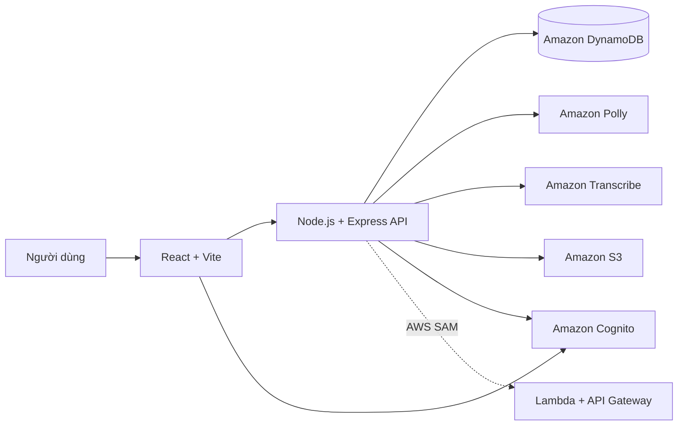

# Polly Voice

Ứng dụng chuyển văn bản thành giọng nói (TTS) và âm thanh thành văn bản (STT), gồm:

- Nhập văn bản, chọn giọng/engine/tốc độ và nghe thử.
- Tạo, phát và tải file âm thanh.
- Tải file MP3, WAV, M4A hoặc FLAC để nhận dạng lời nói.
- Đăng ký/đăng nhập và lưu lịch sử riêng cho từng người dùng.
- Chạy hoàn toàn ở máy cá nhân hoặc sử dụng dịch vụ AWS tại `eu-north-1`.

## 1. Kiến trúc


```mermaid
flowchart LR
  U["Người dùng"] --> R["React + Vite"]
  R --> A["Node.js + Express API"]
  A --> D[("Amazon DynamoDB")]
  A --> P["Amazon Polly"]
  A --> T["Amazon Transcribe"]
  A --> S["Amazon S3"]
  R --> C["Amazon Cognito"]
  A --> C
  A -. "AWS SAM" .-> L["Lambda + API Gateway"]
```

| Thành phần | Công nghệ | Vai trò |
|---|---|---|
| Frontend | React 19, TypeScript, Vite | Giao diện TTS, STT, đăng nhập và lịch sử |
| Backend | Node.js 20+, Express, TypeScript | REST API, xác thực, điều phối AWS |
| Database | Amazon DynamoDB (on-demand) | Lưu lịch sử và trạng thái xử lý |
| Media | Ổ đĩa local / Amazon S3 | Lưu audio và kết quả STT |
| TTS | Bộ tạo WAV giả lập / Amazon Polly | Sinh âm thanh |
| STT | Kết quả giả lập / Amazon Transcribe | Chuyển audio thành text |
| Auth | `X-User-Id` local / Amazon Cognito | Xác thực người dùng |
| Deploy API | AWS SAM, Lambda, HTTP API | Chạy backend serverless |

## 2. Các trang

Ứng dụng React là một dashboard responsive gồm:

- **Text to Speech:** nhập text, chọn voice/engine, điều chỉnh cách đọc, nghe thử, tạo media và tải xuống.
- **Speech to Text:** tải audio lên, theo dõi trạng thái và tải kết quả.
- **History:** xem, phát/tải và xóa mềm lịch sử TTS/STT.
- **Sign in / Sign up:** dùng tài khoản local khi phát triển và Cognito khi chạy AWS.

## 3. Cấu trúc dự án

```text
polly-voice/
├─ frontend/
│  ├─ src/
│  │  ├─ App.tsx            # UI và luồng chính
│  │  ├─ api.ts             # REST client
│  │  ├─ auth.ts            # Local auth / Cognito
│  │  └─ index.css          # Giao diện responsive
│  ├─ .env.example
│  └─ package.json
├─ backend/
│  ├─ src/
│  │  ├─ app.ts             # Express application
│  │  ├─ server.ts          # Local server
│  │  ├─ lambda.ts          # AWS Lambda entry
│  │  ├─ auth.ts            # JWT Cognito / local auth
│  │  ├─ models.ts          # DynamoDB repository
│  │  ├─ speech.ts          # Polly / mock TTS
│  │  ├─ media.ts           # S3 / local storage
│  │  ├─ tts.ts             # TTS endpoints
│  │  └─ stt.ts             # Transcribe endpoints
│  ├─ template.yaml         # AWS SAM
│  └─ .env.example
└─ README.md
```

## 4. API

Base URL local: `http://localhost:8080/api/v1`

| Method | Endpoint | Đăng nhập | Mô tả |
|---|---|---:|---|
| GET | `/health` | Không | Kiểm tra backend (không có `/api/v1`) |
| GET | `/api/v1/voices` | Không | Danh sách giọng |
| POST | `/api/v1/tts/preview` | Không | Nghe thử, tối đa 500 ký tự |
| POST | `/api/v1/tts` | Tùy chọn | Tạo audio; có đăng nhập sẽ lưu lịch sử |
| GET | `/api/v1/tts/history` | Có | Danh sách lịch sử TTS |
| GET | `/api/v1/tts/:id` | Có | Chi tiết một bản ghi |
| GET | `/api/v1/tts/:id/download` | Có | URL tải có thời hạn |
| DELETE | `/api/v1/tts/:id` | Có | Xóa mềm bản ghi |
| POST | `/api/v1/stt` | Có | Upload `multipart/form-data`, field `file` |
| GET | `/api/v1/stt/history` | Có | Danh sách và cập nhật trạng thái STT |
| GET | `/api/v1/stt/:id` | Có | Chi tiết/kết quả STT |
| GET | `/api/v1/stt/:id/download` | Có | URL tải kết quả |
| DELETE | `/api/v1/stt/:id` | Có | Xóa mềm bản ghi |

Local gửi header `X-User-Id: demo-user`. Trên AWS gửi `Authorization: Bearer <Cognito access token>`.

Ví dụ tạo TTS:

```powershell
$body = @{
  text = "Hello from Polly Voice"
  language = "en-US"
  voice = "Joanna"
  engine = "neural"
  outputFormat = "mp3"
  settings = @{
    speed = 100; volume = 0; breakTimeMs = 0
    pitch = 0; emphasis = "none"; domainStyle = "none"
  }
} | ConvertTo-Json

Invoke-RestMethod `
  -Uri "http://localhost:8080/api/v1/tts" `
  -Method Post `
  -Headers @{"X-User-Id"="demo-user"} `
  -ContentType "application/json" `
  -Body $body
```

## 5. Chạy local từ đầu

### Yêu cầu

- Node.js `20.19+` (khuyến nghị Node.js 22 LTS).
- npm.
- Git.

### Bước 1 — Backend

```powershell
cd backend
Copy-Item .env.example .env
npm install
npm run dev
```

Kiểm tra trong terminal khác:

```powershell
Invoke-RestMethod http://localhost:8080/health
```

Ở chế độ local, backend tạo WAV thử nghiệm và lưu trong `backend/data/media`; không phát sinh phí AWS.

### Bước 2 — Frontend

```powershell
cd frontend
Copy-Item .env.example .env
npm install
npm run dev
```

Mở `http://localhost:5173`. Có thể dùng bất kỳ username/password nào ở chế độ local.

### Bước 3 — Kiểm tra

```powershell
cd backend
npm test
npm run build

cd ..\frontend
npm run build
```

## 6. Triển khai AWS A–Z (`eu-north-1`)

### 6.1 Cài AWS CLI và SAM CLI trên Windows

Tải AWS CLI v2 và AWS SAM CLI bằng bộ cài MSI chính thức, mở PowerShell mới rồi kiểm tra:

```powershell
aws --version
sam --version
```

### 6.2 Đăng nhập AWS CLI

Khuyến nghị AWS IAM Identity Center (SSO):

```powershell
aws configure sso --profile polly-voice
aws sso login --profile polly-voice
aws sts get-caller-identity --profile polly-voice
```

Khi CLI hỏi `Default client Region`, nhập `eu-north-1`. Nếu tài khoản chưa dùng SSO, có thể dùng `aws configure --profile polly-voice`, nhưng không commit access key vào Git.

Đặt mặc định cho phiên PowerShell:

```powershell
$env:AWS_PROFILE = "polly-voice"
$env:AWS_REGION = "eu-north-1"
$env:AWS_DEFAULT_REGION = "eu-north-1"
```

### 6.3 Tạo S3 bucket

Tên bucket phải duy nhất toàn cầu:

```powershell
$bucket = "polly-voice-media-THAY-BANG-TEN-DUY-NHAT"
aws s3api create-bucket `
  --bucket $bucket `
  --region eu-north-1 `
  --create-bucket-configuration LocationConstraint=eu-north-1

aws s3api put-public-access-block `
  --bucket $bucket `
  --public-access-block-configuration `
  BlockPublicAcls=true,IgnorePublicAcls=true,BlockPublicPolicy=true,RestrictPublicBuckets=true

aws s3api put-bucket-encryption `
  --bucket $bucket `
  --server-side-encryption-configuration `
  '{"Rules":[{"ApplyServerSideEncryptionByDefault":{"SSEAlgorithm":"AES256"}}]}'
```

Bucket luôn private; backend trả presigned URL có thời hạn để nghe/tải media.

### 6.4 Tạo Cognito

```powershell
$poolId = aws cognito-idp create-user-pool `
  --pool-name polly-voice-users `
  --region eu-north-1 `
  --username-attributes email `
  --auto-verified-attributes email `
  --query UserPool.Id --output text

$clientId = aws cognito-idp create-user-pool-client `
  --user-pool-id $poolId `
  --client-name polly-voice-react `
  --region eu-north-1 `
  --no-generate-secret `
  --explicit-auth-flows ALLOW_USER_SRP_AUTH ALLOW_REFRESH_TOKEN_AUTH `
  --query UserPoolClient.ClientId --output text

"POOL_ID=$poolId"
"CLIENT_ID=$clientId"
```

React là public client nên không tạo client secret. Giao diện hiện tại dùng SRP, không cần Cognito Hosted UI/domain.

### 6.5 Deploy backend bằng SAM

```powershell
cd backend
sam validate --lint
sam build
sam deploy --guided
```

Nhập:

```text
Stack Name: polly-voice-api
AWS Region: eu-north-1
Parameter MediaBucketName: <tên bucket>
Parameter HistoryTableName: polly-voice-history
Parameter CognitoUserPoolId: <POOL_ID>
Parameter CognitoClientId: <CLIENT_ID>
Parameter AllowedOrigins: http://localhost:5173
Confirm changes before deploy: Y
Allow SAM CLI IAM role creation: Y
Save arguments to configuration file: Y
```

Lấy API URL:

```powershell
$apiUrl = aws cloudformation describe-stacks `
  --stack-name polly-voice-api `
  --region eu-north-1 `
  --query "Stacks[0].Outputs[?OutputKey=='ApiUrl'].OutputValue" `
  --output text
$apiUrl
```

### 6.6 Cấu hình và build React cho AWS

Sửa `frontend/.env.production`:

```dotenv
VITE_API_BASE_URL=https://YOUR_API_ID.execute-api.eu-north-1.amazonaws.com/api/v1
VITE_AWS_ENABLED=true
VITE_AWS_REGION=eu-north-1
VITE_COGNITO_USER_POOL_ID=eu-north-1_XXXXXXXXX
VITE_COGNITO_CLIENT_ID=XXXXXXXXXXXXXXXXXXXXXXXXXX
```

Sau đó:

```powershell
cd frontend
npm install
npm run build
```

Thư mục cần deploy là `frontend/dist`. Có thể đưa lên AWS Amplify Hosting hoặc S3 + CloudFront. Sau khi có domain thật, chạy lại `sam deploy` và đổi `AllowedOrigins` thành domain đó.

### 6.7 Kiểm tra production

```powershell
Invoke-RestMethod "$apiUrl/health"
aws logs tail /aws/lambda/polly-voice-api-PollyVoiceFunction `
  --follow --region eu-north-1
```

Đăng ký tài khoản trên giao diện, nhập mã xác nhận email, đăng nhập, tạo TTS và kiểm tra:

- File xuất hiện trong S3.
- Lịch sử xuất hiện trong bảng DynamoDB `polly-voice-history`.
- Audio nghe và tải được qua presigned URL.
- Upload STT chuyển từ `PROCESSING` sang `COMPLETED`.

## 7. Biến môi trường

### Backend

| Biến | Local | AWS |
|---|---|---|
| `AWS_DYNAMODB_TABLE_NAME` | Không dùng khi mock local | Tên bảng DynamoDB |
| `AWS_ENABLED` | `false` | `true` |
| `AWS_REGION` | `eu-north-1` | `eu-north-1` |
| `AWS_S3_MEDIA_BUCKET` | trống | Tên S3 bucket |
| `AWS_COGNITO_USER_POOL_ID` | trống | User Pool ID |
| `AWS_COGNITO_CLIENT_ID` | trống | App Client ID |
| `AWS_COGNITO_ISSUER_URI` | trống | URL issuer của pool |
| `ALLOWED_ORIGINS` | `http://localhost:5173` | Domain frontend |

### Frontend

| Biến | Ý nghĩa |
|---|---|
| `VITE_API_BASE_URL` | Base URL có `/api/v1` |
| `VITE_AWS_ENABLED` | Bật đăng nhập Cognito |
| `VITE_AWS_REGION` | `eu-north-1` |
| `VITE_COGNITO_USER_POOL_ID` | User Pool ID |
| `VITE_COGNITO_CLIENT_ID` | App Client ID không có secret |

## 8. Lệnh vận hành

```powershell
# Xem Lambda log
aws logs tail /aws/lambda/<FUNCTION_NAME> --follow --region eu-north-1

# Deploy lại backend
cd backend
sam build
sam deploy
```

> Các lệnh tạo/deploy AWS có thể phát sinh chi phí. Đặt AWS Budget/Cost Anomaly Detection và xóa stack/bucket khi không còn sử dụng.

## 9. Tài liệu chính thức

- [Cài AWS CLI v2](https://docs.aws.amazon.com/cli/latest/userguide/getting-started-install.html)
- [Cài AWS SAM CLI](https://docs.aws.amazon.com/serverless-application-model/latest/developerguide/install-sam-cli.html)
- [Cognito app client](https://docs.aws.amazon.com/cognito/latest/developerguide/user-pool-settings-client-apps.html)
- [Danh sách giọng Amazon Polly](https://docs.aws.amazon.com/polly/latest/dg/available-voices.html)
