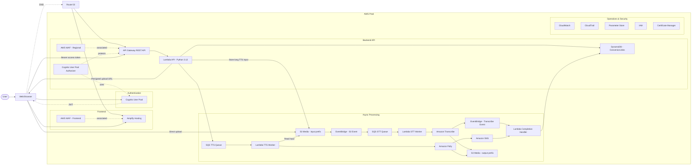
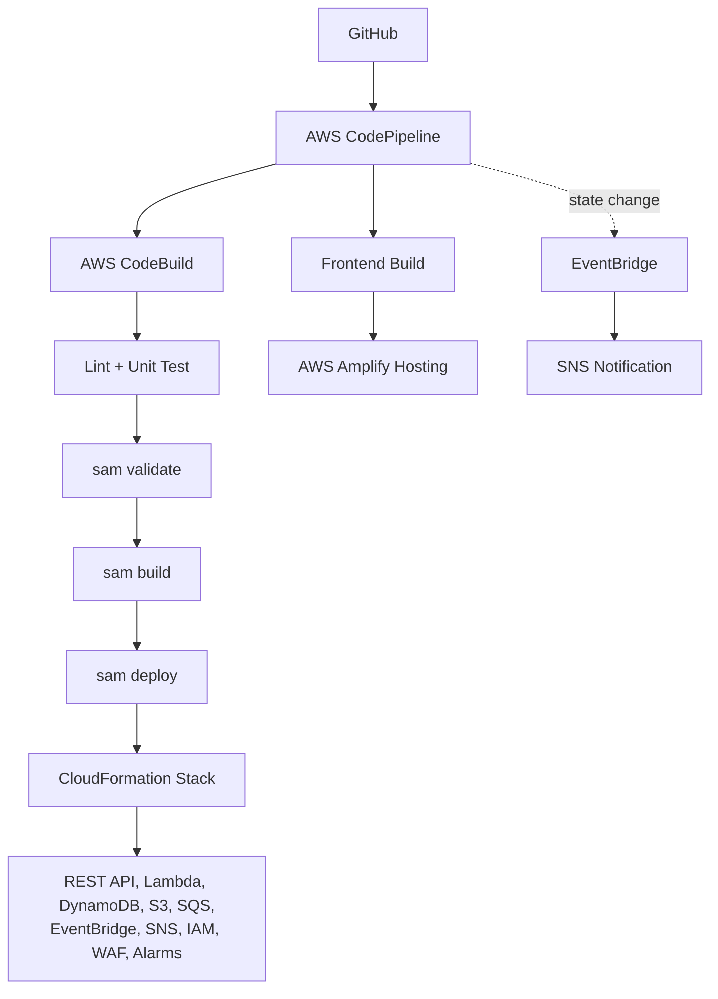

# DỰ ÁN WEBSITE TEXT TO SPEECH & SPEECH TO TEXT

## 1. Introduction

### 1.1 Project Name

**Polly Voice**

---

### 1.2 Project Objective

Xây dựng một website cho phép người dùng chuyển đổi **Text-to-Speech (TTS)** và **Speech-to-Text (STT)**. Hệ thống hỗ trợ tùy chỉnh giọng đọc, xem trước kết quả, lưu lịch sử chuyển đổi và tải xuống các tệp đã tạo.

---

## 2. Main Features

### 2.1 Text-to-Speech (TTS)

**Description:** Chuyển đổi văn bản thành giọng nói.

#### Features

| Feature        | Description                       |
| -------------- | --------------------------------- |
| Text Input     | Nhập văn bản trực tiếp            |
| Text Upload    | Chọn file `.txt`; browser đọc nội dung rồi gửi text đến API *(User only)* |
| Language       | Chọn ngôn ngữ (Hiện tại chỉ triển khai tiếng anh)                   |
| Voice          | Chọn giọng đọc                    |
| Preset         | Chọn cấu hình giọng đọc có sẵn    |
| Voice Settings | Điều chỉnh các thông số giọng đọc |
| Preview        | Nghe thử trước khi xuất file      |
| Export         | Xuất file âm thanh                |

#### Voice Settings

> **Engine mặc định:** **Neural**. UI và backend phải kiểm tra tổ hợp `region + language + voice + engine + SSML tag`; không gửi tag không tương thích vì Polly sẽ trả lỗi.

| Setting | SSML Tag | Giá trị hợp lệ | Quy tắc tương thích | Description |
|---|---|---|---|---|
| Language | *(API parameter)* | `en-US`, `en-GB` | Theo voice | Ngôn ngữ trong phạm vi MVP |
| Voice | *(API parameter)* | Lấy từ allowlist đã kiểm tra theo Region | Theo engine/language | Giọng đọc |
| Engine | *(API parameter)* | `neural` *(mặc định)*, `standard`, `long-form` | Theo voice/Region | Bộ máy tổng hợp giọng nói |
| Preset | *(combination)* | Deep Male, Young Male, Soft Female, Expressive Female, MC, Podcast, Audiobook | Theo voice/engine | Cấu hình có sẵn |
| Speed | `<prosody rate="...">` | `x-slow`, `slow`, `medium`, `fast`, `x-fast` hoặc `20%`–`200%` | Kiểm tra theo engine | Tốc độ đọc |
| Volume | `<prosody volume="...">` | `x-soft`, `soft`, `medium`, `loud`, `x-loud` hoặc `+ndB` / `-ndB` | Kiểm tra theo engine | Âm lượng |
| Pitch | `<prosody pitch="...">` | `x-low`, `low`, `medium`, `high`, `x-high` hoặc `+n%` / `-n%` | **Standard only** | Cao độ |
| Break | `<break time="...">` | `0ms`–`10000ms` | Standard, Neural, Long-form | Khoảng dừng |
| Emphasis | `<emphasis level="...">` | `strong`, `moderate`, `reduced` | **Standard only** | Nhấn mạnh |
| Domain Style | `<amazon:domain name="news">` | `news` | Chỉ một số Neural voice | Phong cách phát thanh |

`news` chỉ bật cho các tổ hợp được hỗ trợ trong phạm vi hiện tại: `Matthew/en-US/neural`, `Joanna/en-US/neural` và `Amy/en-GB/neural`. Không sử dụng giá trị `conversational` cho `<amazon:domain>`.

#### Available Presets

| Preset            | Voice mặc định | Engine    | Mô tả                                        |
| ----------------- | -------------- | --------- | -------------------------------------------- |
| Deep Male         | Matthew        | Neural    | Giọng nam trầm, uy quyền                     |
| Young Male        | Kevin          | Neural    | Giọng nam trẻ, năng động                     |
| Soft Female       | Joanna         | Neural    | Giọng nữ nhẹ nhàng, chậm rãi                 |
| Expressive Female | Danielle       | Long-form | Giọng nữ biểu cảm, phù hợp đọc truyện       |
| MC                | Stephen        | Neural    | Giọng MC rõ ràng, tốc độ vừa phải            |
| Podcast           | Matthew        | Neural    | Giọng podcast tự nhiên                         |
| Audiobook         | Ruth           | Long-form | Giọng đọc sách dài, tự nhiên                   |

> Long-form voice hiện được triển khai tại Region hỗ trợ (MVP chọn `us-east-1`). Preset phải được kiểm tra lại bằng `DescribeVoices` khi đổi Region.

#### Giới hạn TTS

| Chế độ | Polly operation | Billed characters | Total characters | Xử lý |
|---|---|---:|---:|---|
| Preview/real-time | `SynthesizeSpeech` | Tối đa 3.000 | Tối đa 6.000 | Đồng bộ |
| Export/long-form | `StartSpeechSynthesisTask` | Tối đa 100.000 | Tối đa 200.000 | Bất đồng bộ |

SSML tags không được tính vào billed characters nhưng vẫn nằm trong total characters.

---

### 2.2 Speech-to-Text (STT) *(Optional)*

**Description:** Chuyển đổi file âm thanh thành văn bản.

#### Features

| Feature            | Description                    |
| ------------------ | ------------------------------ |
| Audio Upload       | Tải lên file âm thanh          |
| Speech Recognition | Chuyển giọng nói thành văn bản |
| Text Result        | Hiển thị kết quả               |
| Copy               | Sao chép nội dung              |
| Download           | Tải xuống file `.txt`          |

#### Supported Audio Formats

|  Format |  Support  |
| :-----: | :-------: |
|  `.mp3` | Supported |
|  `.wav` | Supported |
| `.flac` | Supported |


## 3. Supported File Formats

### Text Files

> **Description:** Các định dạng văn bản được hệ thống hỗ trợ.

| Format | Usage          |
| :----: | -------------- |
| `.txt` | Input / Output |

---

### Audio Files

> **Description:** Các định dạng âm thanh được hệ thống hỗ trợ.

| Format | Usage          |
| :----: | -------------- |
| `.mp3` | Input / Output |
| `.wav` | Input          |
| `.flac` | Input         |

---

## 4. User Roles

### Guest

**Description:** Người dùng chưa đăng nhập, chỉ được dùng TTS preview để hạn chế abuse và chi phí.

| Permission | Status |
|---|:---:|
| TTS preview tối đa 500 ký tự | ✓ |
| Tạo TTS export/job | ✗ |
| Sử dụng Speech-to-Text | ✗ |
| Upload file | ✗ |
| Lưu lịch sử chuyển đổi | ✗ |
| Quản lý file | ✗ |

---

### User

**Description:** Người dùng đã đăng nhập.

| Permission                                   | Status |
| -------------------------------------------- | :----: |
| Sử dụng Text-to-Speech                       |    ✓   |
| Sử dụng Speech-to-Text                       |    ✓   |
| Upload file để chuyển đổi                    |    ✓   |
| Lưu lịch sử chuyển đổi                       |    ✓   |
| Quản lý file                                 |    ✓   |
| TTS preview tối đa 3.000 billed / 6.000 total characters | ✓ |
| TTS async tối đa 100.000 billed / 200.000 total characters | ✓ |
| Quản lý thông tin cá nhân                    |    ✓   |

---

### Permission Comparison

| Feature | Guest | User |
|---|:---:|:---:|
| TTS Preview | ✓ (500 ký tự) | ✓ |
| TTS Export/Job | ✗ | ✓ |
| Speech-to-Text | ✗ | ✓ |
| Upload File | ✗ | ✓ |
| Lưu lịch sử | ✗ | ✓ |
| Quản lý File | ✗ | ✓ |
| Quản lý Profile | ✗ | ✓ |


## 5. User Interface

### 5.1 Text-to-Speech

**Description:** Giao diện chuyển đổi văn bản thành giọng nói.

| Section      | Features                                                                                                                           |
| ------------ | ---------------------------------------------------------------------------------------------------------------------------------- |
| **Input**    | Nhập văn bản trực tiếp hoặc tải lên file (`.txt`)                                                                                  |
| **Settings** | Chọn **Language**, **Voice**, **Engine**, **Preset**, điều chỉnh **Speed**, **Volume**, **Break**; **Pitch** (Standard only), **Emphasis** (Standard only), **Domain Style** (Neural only) |
| **Preview**  | Nút **Generate**, **Play Preview** và trình phát âm thanh                                                                          |
| **Export**   | Chọn định dạng đầu ra (`.mp3`) và tải xuống                                                                                        |

---

### 5.2 Speech-to-Text

**Description:** Giao diện chuyển đổi giọng nói thành văn bản.

| Section        | Features                                    |
| -------------- | ------------------------------------------- |
| **Upload**     | Tải lên file âm thanh (MP3, WAV,...)        |
| **Processing** | Hiển thị trạng thái xử lý                   |
| **Result**     | Hiển thị văn bản sau khi nhận dạng          |
| **Export**     | Tải kết quả dưới dạng file văn bản (`.txt`) |

---

### 5.3 Login

**Description:** React SPA xác thực trực tiếp với Cognito Managed Login/Amplify Auth bằng **OAuth 2.0 Authorization Code Grant + PKCE**. Backend không proxy đăng ký, đăng nhập hoặc đăng xuất.

| Features |
|---|
| Đăng ký/đăng nhập qua Cognito User Pool |
| Email verification và quên mật khẩu do Cognito xử lý |
| Nhận JWT sau khi đổi authorization code bằng PKCE |
| Đăng xuất và xóa token local thông qua Cognito/Amplify Auth |

---

### 5.4 Profile *(Optional)*

**Description:** Quản lý thông tin cá nhân và lịch sử sử dụng.

| Features                      |
| ----------------------------- |
| Hiển thị thông tin người dùng |
| Chỉnh sửa thông tin cá nhân   |
| Xem lịch sử Text-to-Speech    |
| Xem lịch sử Speech-to-Text    |


## 6. System Architecture

### 6.1 Quyết định kiến trúc đã chốt

| Hạng mục | Quyết định |
|---|---|
| API | **API Gateway REST API**, Regional endpoint |
| API protection | Regional AWS WAF Web ACL gắn với REST API stage |
| Frontend protection | Global (`CLOUDFRONT`) AWS WAF Web ACL gắn với Amplify app |
| API integration | Lambda proxy integration |
| Authorization | Cognito User Pool Authorizer (`COGNITO_USER_POOLS`) |
| SPA authentication | Authorization Code Grant + PKCE qua Cognito Managed Login/Amplify Auth |
| Lambda runtime | **Python 3.12** |
| SnapStart | Bật trên published version, alias `prod`; không dùng `$LATEST` |
| Database | `Users` và bảng chung `ConversionJobs` |
| Async processing | EventBridge, SQS, Lambda worker/completion handler và SNS |
| Infrastructure as Code | AWS SAM/CloudFormation |
| Region cho Long-form MVP | `us-east-1` |

### 6.2 Runtime Architecture


```mermaid
flowchart LR
    USER([User]) --> BROWSER[Web Browser]
    BROWSER -. DNS .-> R53[Route 53]

    subgraph PROD["AWS Prod"]
        subgraph FRONTEND["Frontend"]
            WAF_WEB[AWS WAF - Frontend]
            AMP[Amplify Hosting]
        end

        subgraph IDENTITY["Authentication"]
            COG[Cognito User Pool]
        end

        subgraph API["Backend API"]
            WAF_API[AWS WAF - Regional]
            APIGW[API Gateway REST API]
            AUTH[Cognito User Pool Authorizer]
            API_FN[Lambda API - Python 3.12]
            DDB[DynamoDB - ConversionJobs]
        end

        subgraph ASYNC["Async Processing"]
            S3IN[S3 Media - input prefix]
            UPLOAD_EVENT[EventBridge - S3 Event]
            STT_QUEUE[SQS STT Queue]
            STT_WORKER[Lambda STT Worker]
            TRANSCRIBE[Amazon Transcribe]
            TRANSCRIBE_EVENT[EventBridge - Transcribe Event]
            TTS_QUEUE[SQS TTS Queue]
            TTS_WORKER[Lambda TTS Worker]
            POLLY[Amazon Polly]
            SNS[Amazon SNS]
            COMPLETE[Lambda Completion Handler]
            S3OUT[S3 Media - output prefix]
        end

        subgraph OPERATIONS["Operations & Security"]
            CW[CloudWatch]
            CT[CloudTrail]
            PARAM[Parameter Store]
            IAM[IAM]
            ACM[Certificate Manager]
        end
    end

    R53 --> AMP
    R53 --> APIGW
    WAF_WEB -. associated .-> AMP
    WAF_API -. associated .-> APIGW

    BROWSER --> AMP
    BROWSER --> COG
    COG -. JWT .-> BROWSER
    AUTH -. uses .-> COG
    AUTH -. protects .-> APIGW
    BROWSER -->|Bearer access token| APIGW
    APIGW --> API_FN
    API_FN --> DDB
    API_FN -->|Store long TTS input| S3IN

    API_FN -->|Presigned upload URL| BROWSER
    BROWSER -->|Direct upload| S3IN
    S3IN --> UPLOAD_EVENT
    UPLOAD_EVENT --> STT_QUEUE
    STT_QUEUE --> STT_WORKER
    STT_WORKER --> TRANSCRIBE
    TRANSCRIBE --> S3OUT
    TRANSCRIBE --> TRANSCRIBE_EVENT
    TRANSCRIBE_EVENT --> COMPLETE

    API_FN --> TTS_QUEUE
    TTS_QUEUE --> TTS_WORKER
    TTS_WORKER -->|Read input| S3IN
    TTS_WORKER --> POLLY
    POLLY --> S3OUT
    POLLY --> SNS
    SNS --> COMPLETE
    COMPLETE --> DDB
```

### 6.3 Authentication Flow

1. Browser chuyển người dùng đến Cognito Managed Login.
2. SPA dùng OAuth 2.0 Authorization Code Grant với PKCE; Cognito trả authorization code rồi phát hành ID, access và refresh token.
3. SPA gửi **access token** trong `Authorization: Bearer <token>` khi gọi API.
4. Cognito User Pool Authorizer của REST API xác thực token trước khi gọi Lambda.
5. Lambda đọc claim `sub` từ authorizer context và dùng trực tiếp làm `Users.cognito_sub`/`ConversionJobs.owner_sub`.
6. Đăng ký, đăng nhập, refresh token và đăng xuất được xử lý trực tiếp bởi Cognito/Amplify Auth; không có backend endpoint `/auth/register`, `/auth/login` hoặc `/auth/logout`.

### 6.4 Speech-to-Text Async Flow

```text
POST /stt/jobs
  → tạo record WAITING_UPLOAD
  → trả HTTP 202 + presigned upload URL
Browser → upload trực tiếp lên S3
S3 Object Created → EventBridge → SQS → STT Worker
STT Worker → StartTranscriptionJob → status TRANSCRIBING
Transcribe → ghi transcript vào S3
Transcribe COMPLETED/FAILED → EventBridge → Completion Lambda
Completion Lambda → cập nhật ConversionJobs
```

State machine:

```text
WAITING_UPLOAD → QUEUED → TRANSCRIBING → COMPLETED
                                  └────→ FAILED
```

- SQS worker và completion handler phải **idempotent**, cập nhật trạng thái bằng DynamoDB conditional update.
- SQS cấu hình retry và dead-letter queue.
- EventBridge chỉ match object thuộc prefix `input/stt/`; upload key có dạng `input/stt/{owner_sub}/{job_id}/source.{ext}`.
- EventBridge events của Transcribe được giao theo best effort; production cần scheduled reconciliation cho job bị kẹt quá timeout.
- Transcript đầy đủ lưu ở S3. DynamoDB chỉ lưu `result_preview`, `word_count`, `duration_seconds` và metadata.

### 6.5 Text-to-Speech Flows

#### Preview đồng bộ

```text
POST /tts/preview → Lambda → Polly SynthesizeSpeech → audio/presigned URL
```

- Guest: tối đa 500 ký tự, không upload, không tạo lịch sử.
- User: tối đa 3.000 billed characters và 6.000 total characters.
- Preview không tạo record `ConversionJobs`.

#### Export bất đồng bộ

```text
POST /tts/jobs → ConversionJobs + SQS → TTS Worker
TTS Worker → Polly StartSpeechSynthesisTask
Polly → S3 output + SNS completion
SNS → Completion Lambda → cập nhật ConversionJobs
```

State machine:

```text
QUEUED → SYNTHESIZING → COMPLETED
                   └──→ FAILED
```

Async TTS hỗ trợ tối đa 100.000 billed characters và 200.000 total characters. Nội dung dài lưu tại S3; DynamoDB chỉ giữ preview và SHA-256 hash.

### 6.6 S3-based TTS Cache

| Bước | Mô tả |
|---|---|
| 1 | Tạo `cache_key = SHA256(text + language + voice + engine + output_format + normalized_ssml_params)` |
| 2 | Kiểm tra object `cache/tts/{cache_key}.mp3` trong S3 |
| 3 | **Cache hit:** trả presigned URL hoặc gắn object có sẵn vào job |
| 4 | **Cache miss:** gọi Polly, lưu output theo cache key rồi cập nhật job |

Cache object có lifecycle 30 ngày. Cache không thay thế quyền sở hữu job; API vẫn phải kiểm tra `owner_sub` trước khi trả URL.

### 6.7 CI/CD và Infrastructure as Code


```mermaid
flowchart TD
    GH[GitHub] --> PIPE[AWS CodePipeline]
    PIPE --> BUILD[AWS CodeBuild]
    BUILD --> LINT[Lint + Unit Test]
    LINT --> VALIDATE[sam validate]
    VALIDATE --> SAMBUILD[sam build]
    SAMBUILD --> DEPLOY[sam deploy]
    DEPLOY --> STACK[CloudFormation Stack]
    STACK --> RESOURCES[REST API, Lambda, DynamoDB, S3, SQS,<br/>EventBridge, SNS, IAM, WAF, Alarms]
    PIPE --> FRONTEND[Frontend Build]
    FRONTEND --> AMP[AWS Amplify Hosting]
    PIPE -. state change .-> EVENT[EventBridge]
    EVENT --> NOTIFY[SNS Notification]
```

- Backend pipeline triển khai **toàn bộ SAM/CloudFormation stack**, không chỉ cập nhật Lambda.
- Deploy Lambda tạo published version mới, bật SnapStart và chuyển alias `prod` sau khi smoke test thành công.
- Frontend có build/deploy stage riêng đến Amplify Hosting.
- Thất bại build/deploy được EventBridge chuyển đến SNS.

### 6.8 AWS Services

| Nhóm | Dịch vụ | Vai trò |
|---|---|---|
| DNS & TLS | Route 53, Certificate Manager | Custom domain, DNS và chứng chỉ |
| Frontend | Amplify Hosting, AWS WAF | Host/deploy SPA và bảo vệ frontend |
| Identity | Cognito User Pool | OAuth 2.0 PKCE và JWT |
| API | API Gateway REST API, Regional WAF | Routing, validation, throttling và protection |
| Compute | Lambda Python 3.12 + SnapStart | API, worker và completion handler |
| Messaging | SQS, EventBridge, SNS | Queue, event routing và completion/deploy notification |
| Data & Storage | DynamoDB, S3 | Job metadata và private media |
| AI | Polly, Transcribe | TTS và STT |
| Operations | CloudWatch, CloudTrail | Logs, metrics, alarms và audit |
| Configuration | Parameter Store | Runtime configuration/`SecureString` |
| CI/CD | CodePipeline, CodeBuild, SAM/CloudFormation | Test, build và deploy toàn bộ stack |

> Chi phí thực tế phụ thuộc Region, lưu lượng và thời lượng sử dụng. Amplify Firewall có phí tích hợp riêng ngoài phí AWS WAF. Thiết lập AWS Budgets và dùng AWS Pricing Calculator trước khi triển khai Prod.

---

## 7. Security

### 7.1 Authentication — Amazon Cognito

| Tính năng | Chi tiết |
|---|---|
| SPA OAuth flow | Authorization Code Grant + PKCE; app client không có client secret |
| API authorizer | REST API Cognito User Pool Authorizer |
| Identity source | Header `Authorization: Bearer <access-token>` |
| Password/Email/MFA | Cognito User Pool quản lý |
| Backend identity | Đọc claim `sub`; không lưu hoặc xử lý password |
| Token storage | Không lưu token trong localStorage nếu có thể; ưu tiên cơ chế lưu trữ giảm rủi ro XSS |

### 7.2 AWS WAF, Throttling và Authorization

- Một Global (`CLOUDFRONT` scope) Web ACL bảo vệ Amplify frontend; ACL này khác Regional API Web ACL.
- Một **Regional Web ACL** gắn trực tiếp với API Gateway REST API stage `prod`.
- WAF dùng AWS Managed Rules, IP reputation và rate-based rule.
- Cognito authorizer bảo vệ mọi application endpoint ngoại trừ `POST /tts/preview`.
- API Gateway usage/throttling và Lambda reserved concurrency tạo thêm lớp giới hạn chi phí.

| Route/Actor | Rate | Burst | Ghi chú |
|---|---:|---:|---|
| Public `/tts/preview` | 5 request/giây | 10 | Tối đa 500 ký tự, WAF rate rule riêng |
| Authenticated API | 50 request/giây | 100 | Áp dụng theo stage/method và theo dõi chi phí |
| Async create-job routes | 5 request/giây | 10 | Chống tạo hàng loạt Polly/Transcribe job |

### 7.3 S3 Security

| Cấu hình | Giá trị |
|---|---|
| Block Public Access | **ON** |
| Server-Side Encryption | SSE-S3 (AES-256) |
| Bucket Versioning | Enabled |
| Browser access | Presigned URL/POST, TTL 15 phút |
| Upload constraint | Ràng buộc key prefix, content type và content length |
| CORS | Chỉ frontend domain và method/header cần thiết |
| Lifecycle | `temp/` 7 ngày, `cache/` 30 ngày, output theo retention policy |

Database chỉ lưu S3 key, không lưu public URL. Mọi download endpoint phải kiểm tra `owner_sub` trước khi phát hành presigned URL.

### 7.4 Input Validation

| Field | Rule |
|---|---|
| Guest preview text | Tối đa 500 ký tự |
| User real-time text | Tối đa 3.000 billed và 6.000 total characters |
| Async TTS text | Tối đa 100.000 billed và 200.000 total characters |
| `voice + engine + language` | Allowlist theo Region và ma trận tương thích |
| `engine` | `neural`, `standard`, `long-form` |
| `speed`, `volume`, SSML | Validate range, sanitize XML và allowlist tag |
| Domain style | Chỉ `news` với voice/engine được hỗ trợ |
| STT upload | User only; tối đa 10 MB; `.mp3`, `.wav`, `.flac` theo allowlist |
| S3 object | Kiểm tra magic bytes/content type và kích thước trước khi chạy Transcribe |

### 7.5 Configuration Management — Parameter Store

| Parameter Name | Kiểu | Nội dung |
|---|---|---|
| `/polly-voice/prod/cognito/user-pool-id` | `String` | Cognito User Pool ID |
| `/polly-voice/prod/cognito/app-client-id` | `String` | Public SPA App Client ID |
| `/polly-voice/prod/storage/media-bucket` | `String` | S3 media bucket với các prefix `input/`, `output/`, `cache/`, `temp/` |
| `/polly-voice/prod/app/private-config` | `SecureString` | Giá trị nhạy cảm nếu có |

Lambda đọc đúng parameter path thông qua IAM role tối thiểu. `SecureString` được mã hóa bằng KMS; không commit secrets hoặc file `.env`.

### 7.6 IAM và TLS

| Thành phần | Yêu cầu |
|---|---|
| Lambda API/Worker/Completion | Role riêng, chỉ cấp action/resource cần dùng |
| CodeBuild/CloudFormation | Deployment role riêng, không dùng quyền admin dài hạn |
| Certificate Manager | TLS cho app domain và Regional API custom domain |
| SQS/SNS/EventBridge | Resource policy chỉ cho phép đúng producer/consumer |

### 7.7 Monitoring, Audit và Reliability

- CloudWatch Logs nhận structured logs từ REST API, Lambda và CodeBuild; log có `request_id`/`job_id`.
- CloudWatch Alarms theo dõi API 4XX/5XX, Lambda error/throttle/duration, SQS queue age/DLQ, job thất bại và chi phí.
- CloudTrail ghi lại AWS API calls và thay đổi cấu hình.
- Alarm/pipeline events đi qua EventBridge → SNS.
- Không log token, presigned URL, text/audio đầy đủ hoặc dữ liệu cá nhân nhạy cảm.

---

## 8. Database — Amazon DynamoDB

### 8.1 Quy ước thời gian và ID

- `job_id`: ULID string, dùng làm partition key và có tính duy nhất.
- `created_at`, `updated_at`, `started_at`, `completed_at`, `deleted_at`: Unix epoch **milliseconds**.
- `expires_at`: Unix epoch **seconds**, là thuộc tính TTL riêng được bật trên table.
- DynamoDB TTL xóa bất đồng bộ; code không được giả định item biến mất ngay khi hết hạn.

### 8.2 Bảng `Users`

| Attribute | Type | Key | Description |
|---|---|---|---|
| `cognito_sub` | String | **Partition Key** | Claim `sub` từ Cognito |
| `email` | String | | Email |
| `name` | String | | Họ và tên |
| `created_at` | Number | | Epoch milliseconds |
| `updated_at` | Number | | Epoch milliseconds |

Backend dùng trực tiếp claim `sub` làm `Users.cognito_sub`; không có mapping sang `users.id`.

### 8.3 Bảng `ConversionJobs`

**Primary key**

```text
PK: job_id (String/ULID)
```

**Global Secondary Index**

```text
Index name: ownerSub-createdAt-index
Partition key: owner_sub (String)
Sort key: created_at (Number, epoch milliseconds)
```

| Attribute | Type | Áp dụng | Description |
|---|---|---|---|
| `job_id` | String | All | Primary key |
| `owner_sub` | String | All | Cognito `sub`, dùng cho authorization và GSI |
| `type` | String | All | `TTS` hoặc `STT` |
| `status` | String | All | Trạng thái job |
| `created_at`, `updated_at` | Number | All | Epoch milliseconds |
| `started_at`, `completed_at` | Number | All | Epoch milliseconds, optional |
| `expires_at` | Number | All | DynamoDB TTL, epoch seconds |
| `input_s3_key` | String | TTS/STT | Input dài hoặc audio upload |
| `output_s3_key` | String | TTS/STT | Audio hoặc transcript đầy đủ |
| `input_preview` | String | TTS | Chỉ đoạn đầu ngắn, không lưu toàn bộ input dài |
| `input_sha256` | String | TTS | Hash nội dung để cache/deduplicate |
| `result_preview` | String | STT | 500–2.000 ký tự đầu |
| `word_count` | Number | STT | Số từ |
| `duration_seconds` | Number | STT | Thời lượng audio |
| `transcribe_job_name` | String | STT | Tên job bên Amazon Transcribe |
| `polly_task_id` | String | TTS | Task ID từ Polly |
| `language_code` | String | TTS/STT | Mã ngôn ngữ |
| `voice`, `engine`, `preset` | String | TTS | Cấu hình giọng |
| `ssml_params` | Map | TTS | SSML đã validate |
| `character_count`, `total_character_count` | Number | TTS | Billed và total characters |
| `output_format` | String | TTS | `mp3` trong MVP |
| `input_file_size`, `output_file_size` | Number | TTS/STT | Bytes |
| `error_code`, `error_message` | String | Failed job | Lỗi đã sanitize |
| `deleted_at` | Number | Soft delete | Epoch milliseconds |

Không lưu transcript dài hoặc full long-form input trong DynamoDB vì giới hạn item 400 KB. Dữ liệu đầy đủ nằm trong S3 private.

### 8.4 Access Patterns

| Use case | DynamoDB operation |
|---|---|
| Lấy job theo `{job_id}` | `GetItem(job_id)` |
| Cập nhật trạng thái job | `UpdateItem(job_id)` + condition expression |
| Lịch sử của user | `Query ownerSub-createdAt-index` theo `owner_sub`, giảm dần |
| Kiểm tra quyền truy cập | So sánh authorizer `sub` với item `owner_sub` |
| Phân trang | Encode DynamoDB `LastEvaluatedKey` thành opaque Base64 cursor |

---

## 9. Backend Specification

> **Runtime:** Python 3.12.
>
> **SnapStart:** Enabled cho published Lambda versions và alias `prod`; không áp dụng cho `$LATEST`.
>
> **API:** API Gateway REST API Regional + Lambda proxy integration.
>
> **Auth:** Cognito User Pool Authorizer; public duy nhất là `POST /tts/preview`.

### 9.1 Profile APIs

Đăng ký/đăng nhập/logout không đi qua backend.

| Method | Endpoint | Auth | Description |
|:---:|---|:---:|---|
| `GET` | `/profile` | User | Lấy profile theo JWT `sub` |
| `PUT` | `/profile` | User | Cập nhật các trường profile được phép |

### 9.2 Text-to-Speech APIs

| Method | Endpoint | Auth | Description |
|:---:|---|:---:|---|
| `POST` | `/tts/preview` | Public/User | TTS đồng bộ, không lưu lịch sử |
| `POST` | `/tts/jobs` | User | Tạo async TTS job, trả `202 Accepted` |
| `GET` | `/tts/jobs` | User | Query lịch sử TTS bằng cursor |
| `GET` | `/tts/jobs/{job_id}` | User | Lấy trạng thái/chi tiết job |
| `GET` | `/tts/jobs/{job_id}/download` | User | Presigned GET URL 15 phút khi `COMPLETED` |
| `DELETE` | `/tts/jobs/{job_id}` | User | Soft delete job và áp retention policy |

#### TTS Request Rules

| Field | Preview | Async job |
|---|---|---|
| `text` | Required; Guest 500 ký tự, User 3.000 billed/6.000 total | Required; 100.000 billed/200.000 total |
| `voice` | Required; allowlist theo Region | Required; allowlist theo Region |
| `engine` | `neural` hoặc `standard` | `neural`, `standard` hoặc `long-form` |
| `language` | `en-US` hoặc `en-GB` | `en-US` hoặc `en-GB` |
| `output_format` | `mp3` | `mp3` |
| `preset` | Optional | Optional |
| `ssml_params` | Optional; phải khớp compatibility matrix | Optional; phải khớp compatibility matrix |

Khi người dùng chọn `.txt`, frontend đọc và validate file cục bộ rồi gửi trường `text`; TTS không cấp presigned upload URL cho file text.

#### Create TTS Job Response

```http
HTTP/1.1 202 Accepted
```

```json
{
  "job_id": "01JXYZ...",
  "type": "TTS",
  "status": "QUEUED"
}
```

### 9.3 Speech-to-Text APIs

| Method | Endpoint | Auth | Description |
|:---:|---|:---:|---|
| `POST` | `/stt/jobs` | User | Tạo job và presigned upload URL |
| `GET` | `/stt/jobs` | User | Query lịch sử STT bằng cursor |
| `GET` | `/stt/jobs/{job_id}` | User | Lấy trạng thái/chi tiết job |
| `GET` | `/stt/jobs/{job_id}/download` | User | Presigned GET URL đến transcript khi `COMPLETED` |
| `DELETE` | `/stt/jobs/{job_id}` | User | Soft delete job và áp retention policy |

#### Create STT Job Request

| Field | Required | Validation |
|---|:---:|---|
| `file_name` | ✓ | Tên file đã sanitize; extension `.mp3`, `.wav` hoặc `.flac` |
| `content_type` | ✓ | Allowlist MIME type |
| `file_size` | ✓ | Tối đa 10 MB và phải khớp object sau upload |
| `language_code` | ✓ | `en-US` hoặc `en-GB` |

#### Create STT Job Response

```http
HTTP/1.1 202 Accepted
```

```json
{
  "job_id": "01JXYZ...",
  "type": "STT",
  "status": "WAITING_UPLOAD",
  "upload_url": "https://example-presigned-url",
  "expires_in": 900
}
```

### 9.4 Job Response và Pagination

`GET /tts/jobs/{job_id}` và `GET /stt/jobs/{job_id}` là endpoint polling trạng thái. API trả `404` nếu job không tồn tại và cũng trả `404` thay vì làm lộ job thuộc user khác.

```json
{
  "job_id": "01JXYZ...",
  "type": "STT",
  "status": "TRANSCRIBING",
  "created_at": 1785080000123,
  "updated_at": 1785080010456
}
```

List response:

```json
{
  "data": [],
  "pagination": {
    "limit": 20,
    "next_cursor": "opaque-base64-last-evaluated-key"
  }
}
```

Cursor là opaque token; client không tự tạo hoặc sửa nội dung cursor.

### 9.5 API Summary

| Module | Number of APIs |
|---|:---:|
| Profile | 2 |
| Text-to-Speech | 6 |
| Speech-to-Text | 5 |
| **Total application APIs** | **13** |

## 10. References

### AWS Services Documentation

| Resource | Description |
| -------- | ----------- |
| **AWS Amplify Hosting** | Build, deploy và host frontend. <br> https://docs.aws.amazon.com/amplify/latest/userguide/welcome.html |
| **Amplify + AWS WAF** | Global Web ACL cho Amplify application. <br> https://docs.aws.amazon.com/amplify/latest/userguide/amplify-waf-configuration.html |
| **Amazon Route 53** | DNS và domain routing. <br> https://docs.aws.amazon.com/Route53/latest/DeveloperGuide/ |
| **AWS WAF for REST API** | Regional Web ACL cho API Gateway REST API stage. <br> https://docs.aws.amazon.com/apigateway/latest/developerguide/apigateway-control-access-aws-waf.html |
| **Amazon Polly** | Text-to-Speech service. <br> https://docs.aws.amazon.com/polly/latest/dg/ |
| **Polly Quotas** | Giới hạn real-time và async synthesis. <br> https://docs.aws.amazon.com/polly/latest/dg/limits.html |
| **Polly Voices** | Ma trận voice/engine/language. <br> https://docs.aws.amazon.com/polly/latest/dg/available-voices.html |
| **Polly SSML Tags** | Ma trận hỗ trợ tag theo engine. <br> https://docs.aws.amazon.com/polly/latest/dg/supportedtags.html |
| **Amazon Transcribe** | Speech-to-Text service. <br> https://docs.aws.amazon.com/transcribe/ |
| **Transcribe Events** | EventBridge events khi job hoàn thành/thất bại. <br> https://docs.aws.amazon.com/transcribe/latest/dg/monitoring-events.html |
| **Amazon Cognito PKCE** | Authorization Code Grant + PKCE. <br> https://docs.aws.amazon.com/cognito/latest/developerguide/using-pkce-in-authorization-code.html |
| **Cognito Authorizer** | Bảo vệ REST API bằng Cognito User Pool Authorizer. <br> https://docs.aws.amazon.com/apigateway/latest/developerguide/apigateway-integrate-with-cognito.html |
| **API Gateway** | REST API management. <br> https://docs.aws.amazon.com/apigateway/ |
| **AWS Lambda & SnapStart** | Serverless compute và tối ưu startup. <br> https://docs.aws.amazon.com/lambda/latest/dg/snapstart.html |
| **Amazon DynamoDB** | Serverless NoSQL database. <br> https://docs.aws.amazon.com/amazondynamodb/latest/developerguide/ |
| **DynamoDB TTL** | TTL attribute dạng epoch seconds. <br> https://docs.aws.amazon.com/amazondynamodb/latest/developerguide/TTL.html |
| **DynamoDB Constraints** | Item size và các giới hạn dữ liệu. <br> https://docs.aws.amazon.com/amazondynamodb/latest/developerguide/Constraints.html |
| **Amazon S3** | Object storage. <br> https://docs.aws.amazon.com/s3/ |
| **Amazon SQS** | Queue, retry và dead-letter queue. <br> https://docs.aws.amazon.com/AWSSimpleQueueService/latest/SQSDeveloperGuide/ |
| **Systems Manager Parameter Store** | Configuration và secure strings. <br> https://docs.aws.amazon.com/systems-manager/latest/userguide/systems-manager-parameter-store.html |
| **AWS IAM** | Identity và access management. <br> https://docs.aws.amazon.com/IAM/latest/UserGuide/ |
| **AWS Certificate Manager** | Quản lý chứng chỉ TLS. <br> https://docs.aws.amazon.com/acm/latest/userguide/ |
| **Amazon CloudWatch** | Logs, metrics, dashboards và alarms. <br> https://docs.aws.amazon.com/cloudwatch/ |
| **AWS CloudTrail** | Audit AWS API activity. <br> https://docs.aws.amazon.com/awscloudtrail/latest/userguide/ |
| **AWS CodePipeline** | CI/CD pipeline orchestration. <br> https://docs.aws.amazon.com/codepipeline/latest/userguide/ |
| **AWS CodeBuild** | Build và test tự động. <br> https://docs.aws.amazon.com/codebuild/latest/userguide/ |
| **Amazon EventBridge** | Event routing. <br> https://docs.aws.amazon.com/eventbridge/latest/userguide/ |
| **Amazon SNS** | Gửi thông báo. <br> https://docs.aws.amazon.com/sns/latest/dg/ |
| **AWS SAM** | Infrastructure as Code cho serverless application. <br> https://docs.aws.amazon.com/serverless-application-model/ |

---

### Development Workflow

1. Định nghĩa toàn bộ backend infrastructure bằng **AWS SAM/CloudFormation**.
2. Tạo Cognito public SPA client, Managed Login và Authorization Code Grant + PKCE.
3. Tạo **REST API Regional**, Lambda proxy integration và Cognito User Pool Authorizer.
4. Gắn Regional WAF Web ACL vào API stage `prod`; cấu hình WAF cho Amplify frontend.
5. Tạo `Users`, `ConversionJobs` và GSI `ownerSub-createdAt-index`; bật TTL trên `expires_at`.
6. Tạo private S3 media bucket với các prefix input/output/cache/temp, SQS queues/DLQs, EventBridge rules và SNS topics.
7. Viết Lambda Python 3.12 cho API, STT/TTS workers và completion handlers.
8. Tích hợp Polly real-time/async và Transcribe async; triển khai idempotency/conditional updates.
9. Cấu hình IAM least privilege, Parameter Store, Route 53, ACM, CloudWatch và CloudTrail.
10. Chạy `lint`, unit test, `sam validate`, `sam build` và integration test.
11. Pipeline chạy `sam deploy` cho stack, publish Lambda version, bật SnapStart và cập nhật alias `prod`.
12. Build/deploy frontend riêng đến Amplify Hosting; gửi trạng thái pipeline qua EventBridge → SNS.

---

### Related AWS Services

- **Frontend & DNS:** AWS Amplify, Route 53, AWS WAF, AWS Certificate Manager.
- **Backend:** API Gateway REST API, Lambda Python 3.12 + SnapStart, Cognito, DynamoDB.
- **AI & Storage:** Amazon Polly, Amazon Transcribe, Amazon S3.
- **Async Processing:** Amazon SQS, EventBridge, Amazon SNS.
- **Shared Services & Security:** Parameter Store, AWS IAM.
- **Monitoring:** Amazon CloudWatch, AWS CloudTrail.
- **CI/CD & IaC:** CodePipeline, CodeBuild, AWS SAM/CloudFormation.
