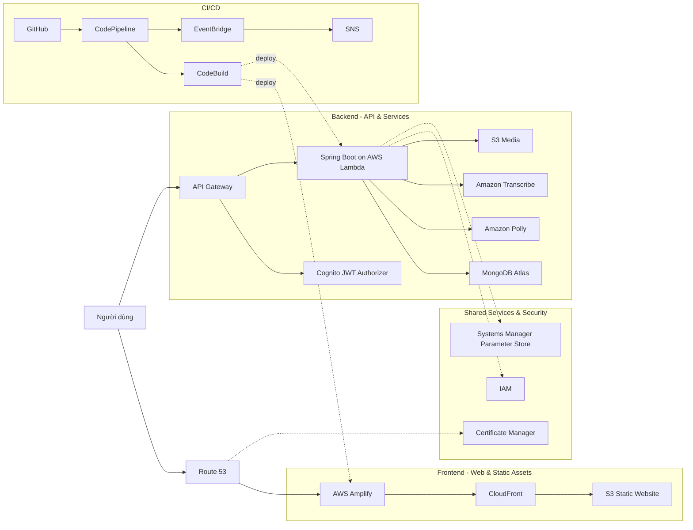
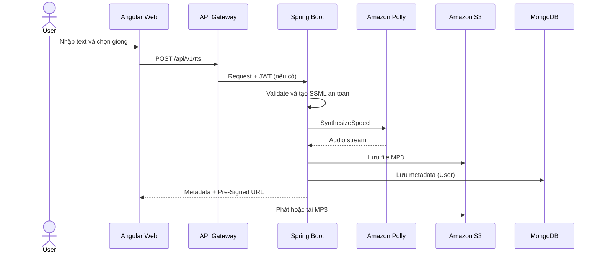

# 🎙️ Polly Voice

> Ứng dụng web chuyển văn bản thành giọng nói (Text-to-Speech), cho phép nghe thử,
> tạo và tải file MP3. Hệ thống được định hướng triển khai theo kiến trúc serverless
> trên AWS, với backend viết bằng **Spring Boot**.

## Mục lục

- [Tổng quan](#tổng-quan)
- [Chức năng chính](#chức-năng-chính)
- [Các trang giao diện](#các-trang-giao-diện)
- [Kiến trúc hệ thống](#kiến-trúc-hệ-thống)
- [Luồng xử lý](#luồng-xử-lý)
- [Thiết kế API](#thiết-kế-api)
- [Cấu trúc dự án](#cấu-trúc-dự-án)
- [Mô hình dữ liệu](#mô-hình-dữ-liệu)
- [Bảo mật](#bảo-mật)
- [Cài đặt và chạy dự án](#cài-đặt-và-chạy-dự-án)
- [Cấu hình môi trường](#cấu-hình-môi-trường)
- [Lộ trình triển khai](#lộ-trình-triển-khai)

---

## Tổng quan

Polly Voice cung cấp một giao diện đơn giản để người dùng:

1. Nhập trực tiếp nội dung hoặc tải lên file `.txt`.
2. Chọn ngôn ngữ, giọng đọc và engine của Amazon Polly.
3. Điều chỉnh tốc độ, âm lượng, khoảng nghỉ và các tham số SSML.
4. Nghe thử kết quả ngay trên trình duyệt.
5. Tạo, phát và tải file âm thanh MP3.
6. Đăng nhập để lưu, tìm kiếm và quản lý lịch sử chuyển đổi.
7. Mở rộng sang Speech-to-Text bằng Amazon Transcribe.

### Công nghệ sử dụng

| Thành phần | Công nghệ |
|---|---|
| Frontend | Angular, TypeScript, RxJS, Angular CLI |
| Backend | Java 17, Spring Boot 4.1, Maven |
| Authentication | Amazon Cognito + JWT |
| Text-to-Speech | Amazon Polly |
| Speech-to-Text | Amazon Transcribe |
| Database | MongoDB / MongoDB Atlas |
| Media storage | Amazon S3 |
| API | Amazon API Gateway |
| Compute | AWS Lambda chạy Spring Boot |
| Hosting frontend | AWS Amplify hoặc S3 + CloudFront |
| CI/CD | CodePipeline, CodeBuild, EventBridge, SNS |

> **Trạng thái hiện tại:** repository đang chứa bản giao diện demo React/Vite. Theo
> kiến trúc mục tiêu, frontend sẽ được chuyển sang Angular. Backend đã có project
> Spring Boot khởi tạo tại `backend/demo/demo`, nhưng chưa có API nghiệp vụ hoặc
> tích hợp AWS. Các API dưới đây là hợp đồng đề xuất cho giai đoạn tiếp theo.

---

## Chức năng chính

### Text-to-Speech

| Chức năng | Mô tả |
|---|---|
| Nhập văn bản | Nhập trực tiếp hoặc đọc nội dung từ file `.txt` |
| Chọn giọng | Joanna, Matthew, Kevin, Danielle, Stephen, Amy, Emma, Brian |
| Chọn engine | `neural`, `standard`, `long-form` |
| Preset | Deep Male, Young Male, Soft Female, MC, Podcast, Audiobook... |
| Tùy chỉnh | Tốc độ, âm lượng, khoảng nghỉ, cao độ, nhấn mạnh, phong cách đọc |
| Nghe thử | Tổng hợp bản xem trước, không lưu vào lịch sử |
| Tạo media | Tổng hợp và lưu file MP3 vào Amazon S3 |
| Phát audio | Play, pause và tua ngay trên trình duyệt |
| Download | Nhận URL có thời hạn để tải file MP3 |

### Speech-to-Text

Đây là module mở rộng đã có giao diện demo:

- Tải file `.mp3`, `.wav`, `.m4a` hoặc `.flac`, tối đa 10 MB.
- Gửi file lên S3 và tạo tác vụ Amazon Transcribe.
- Theo dõi trạng thái xử lý.
- Hiển thị, sao chép và tải kết quả dưới dạng `.txt`.

### Phân quyền

| Quyền | Guest | User đã đăng nhập |
|---|:---:|:---:|
| Sử dụng TTS | ✅ | ✅ |
| Nghe thử | ✅ | ✅ |
| Tạo và tải MP3 | ✅ | ✅ |
| Giới hạn văn bản mỗi lượt | 500 ký tự | 3.000 ký tự |
| Lưu lịch sử | ❌ | ✅ |
| Quản lý file và lịch sử | ❌ | ✅ |
| Xem hồ sơ | ❌ | ✅ |

---

## Các trang giao diện

Frontend Angular được xây dựng theo dạng Single Page Application, sử dụng Angular
Router để chuyển trang mà không tải lại toàn bộ ứng dụng.

| Route | Component đề xuất | Quyền truy cập |
|---|---|---|
| `/tts` | `TtsPageComponent` | Guest / User |
| `/stt` | `SttPageComponent` | Guest / User |
| `/history` | `HistoryPageComponent` | User |
| `/profile` | `ProfilePageComponent` | User |
| `/auth/login` | `LoginPageComponent` | Public |
| `/auth/register` | `RegisterPageComponent` | Public |

Các route `history` và `profile` được bảo vệ bởi `AuthGuard`. JWT được tự động gắn
vào request API bằng Angular `HttpInterceptor`.

### 1. Text-to-Speech

Trang chính của hệ thống, gồm hai khu vực:

- **Văn bản đầu vào:** textarea, upload `.txt`, bộ đếm ký tự.
- **Cấu hình giọng đọc:** preset, language, voice, engine và tham số SSML.
- **Thao tác:** `Nghe thử Preview` hoặc `Tạo Audio MP3`.
- **Media player:** phát/tạm dừng, thanh thời gian và tải MP3.

Quy tắc theo engine:

| Thiết lập | Neural | Standard | Long-form |
|---|:---:|:---:|:---:|
| Speed, Volume, Break | ✅ | ✅ | ✅ |
| Pitch, Emphasis | ❌ | ✅ | ❌ |
| News/Conversational style | ✅ | ❌ | ❌ |

### 2. Speech-to-Text

- Chọn hoặc kéo thả file âm thanh.
- Hiển thị tên, dung lượng và tiến độ xử lý.
- Hiển thị nội dung nhận dạng.
- Cho phép copy hoặc tải kết quả `.txt`.

### 3. Lịch sử

Chỉ hiển thị với người dùng đã đăng nhập:

- Chuyển đổi giữa lịch sử TTS và STT.
- Tìm kiếm theo nội dung.
- Nghe lại audio TTS.
- Tải lại media thông qua Pre-Signed URL.
- Xóa mềm một bản ghi.

### 4. Hồ sơ và xác thực

- Đăng ký, đăng nhập bằng email và mật khẩu.
- Nhận JWT từ Amazon Cognito.
- Hiển thị email, Cognito Subject ID, vai trò và hạn mức.
- Đăng xuất và hủy phiên đăng nhập.

---

## Kiến trúc hệ thống

Kiến trúc bám theo sơ đồ AWS được cung cấp, nhưng phần xử lý nghiệp vụ dùng
**Spring Boot** thay cho Lambda handler thuần.


```mermaid
flowchart LR
    U["Người dùng"] --> R53["Route 53"]

    subgraph FE["Frontend - Web & Static Assets"]
        AMP["AWS Amplify"]
        CF["CloudFront"]
        S3FE["S3 Static Website"]
        AMP --> CF --> S3FE
    end

    R53 --> AMP
    U --> APIGW

    subgraph BE["Backend - API & Services"]
        APIGW["API Gateway"]
        COG["Cognito JWT Authorizer"]
        SB["Spring Boot on AWS Lambda"]
        MONGO["MongoDB Atlas"]
        POLLY["Amazon Polly"]
        TRANS["Amazon Transcribe"]
        S3MEDIA["S3 Media"]

        APIGW --> COG
        APIGW --> SB
        SB --> MONGO
        SB --> POLLY
        SB --> TRANS
        SB --> S3MEDIA
    end

    subgraph SEC["Shared Services & Security"]
        IAM["IAM"]
        PARAM["Systems Manager Parameter Store"]
        ACM["Certificate Manager"]
    end

    SB -.-> IAM
    SB -.-> PARAM
    R53 -.-> ACM

    subgraph CICD["CI/CD"]
        GH["GitHub"]
        CP["CodePipeline"]
        CB["CodeBuild"]
        EB["EventBridge"]
        SNS["SNS"]
        GH --> CP --> CB
        CP --> EB --> SNS
    end

    CB -. deploy .-> AMP
    CB -. deploy .-> SB
```

### Vai trò của từng thành phần

| Dịch vụ | Trách nhiệm |
|---|---|
| Route 53 | Quản lý domain và điều hướng traffic |
| Amplify / S3 / CloudFront | Build, lưu trữ và phân phối frontend |
| API Gateway | Public API, CORS, throttling và route request |
| Cognito Authorizer | Kiểm tra JWT trước khi request tới backend |
| Spring Boot Lambda | Validation, nghiệp vụ, gọi AWS SDK và trả response |
| Polly | Tổng hợp văn bản/SSML thành audio |
| Transcribe | Nhận dạng nội dung từ file audio |
| MongoDB Atlas | Lưu thông tin người dùng, lịch sử chuyển đổi và metadata media |
| S3 Media | Lưu audio, text nguồn và kết quả |
| Parameter Store | Lưu cấu hình theo môi trường |
| IAM | Cấp quyền tối thiểu cho từng dịch vụ |
| CodePipeline/CodeBuild | Build, kiểm thử và triển khai tự động |

> Spring Boot có thể chạy trong Lambda qua
> `aws-serverless-java-container-springboot3`. Nếu hệ thống cần xử lý lâu, lưu lượng
> ổn định hoặc muốn giảm cold start, có thể giữ nguyên các lớp nghiệp vụ và chuyển
> runtime sang ECS Fargate/App Runner.

---

## Luồng xử lý

### Tạo và nghe file Text-to-Speech


```mermaid
sequenceDiagram
    actor User
    participant Web as Angular Web
    participant API as API Gateway
    participant App as Spring Boot
    participant Polly as Amazon Polly
    participant S3 as Amazon S3
    participant DB as MongoDB

    User->>Web: Nhập text và chọn giọng
    Web->>API: POST /api/v1/tts
    API->>App: Request + JWT (nếu có)
    App->>App: Validate và tạo SSML an toàn
    App->>Polly: SynthesizeSpeech
    Polly-->>App: Audio stream
    App->>S3: Lưu file MP3
    App->>DB: Lưu metadata (User)
    App-->>Web: Metadata + Pre-Signed URL
    Web->>S3: Phát hoặc tải MP3
```

### Nghe thử

`POST /api/v1/tts/preview` sử dụng cùng quy trình tổng hợp nhưng:

- Giới hạn tối đa 500 ký tự.
- Không tạo bản ghi lịch sử.
- Có thể lưu file tạm với lifecycle tự động xóa.
- Nên có rate limit riêng để tránh lạm dụng Amazon Polly.

### Download media

Backend không trả S3 key công khai và không mở public bucket. Frontend gọi
endpoint download, backend kiểm tra quyền sở hữu rồi tạo **Pre-Signed URL** có thời
hạn ngắn, ví dụ 15 phút.

---

## Thiết kế API

Base URL đề xuất: `/api/v1`

Quy ước:

- `Public`: không cần token.
- `Optional`: hỗ trợ Guest; nếu có token thì lưu lịch sử theo user.
- `User`: yêu cầu `Authorization: Bearer <access-token>`.

### Authentication và profile

| Method | Endpoint | Auth | Mô tả |
|---|---|:---:|---|
| `POST` | `/auth/register` | Public | Đăng ký tài khoản Cognito |
| `POST` | `/auth/login` | Public | Đăng nhập và nhận token |
| `POST` | `/auth/logout` | User | Đăng xuất |
| `GET` | `/users/me` | User | Lấy thông tin người dùng hiện tại |
| `PUT` | `/users/me` | User | Cập nhật tên hoặc thông tin hồ sơ |

> Có thể để frontend giao tiếp trực tiếp với Cognito bằng AWS Amplify Auth. Khi đó
> backend chỉ cần `/users/me` và lấy danh tính từ JWT đã được API Gateway xác thực.

### Text-to-Speech

| Method | Endpoint | Auth | Mô tả |
|---|---|:---:|---|
| `GET` | `/voices?language=en-US&engine=neural` | Public | Danh sách giọng hợp lệ |
| `POST` | `/tts/preview` | Optional | Tạo bản nghe thử, không lưu lịch sử |
| `POST` | `/tts` | Optional | Tạo audio MP3 |
| `GET` | `/tts/history?limit=20&cursor=...` | User | Lấy lịch sử theo cursor |
| `GET` | `/tts/{id}` | User | Chi tiết một lần chuyển đổi |
| `GET` | `/tts/{id}/download` | User | Lấy Pre-Signed URL tải MP3 |
| `DELETE` | `/tts/{id}` | User | Xóa mềm lịch sử |

#### Ví dụ tạo audio

```http
POST /api/v1/tts
Content-Type: application/json
Authorization: Bearer <access-token>
```

```json
{
  "text": "Welcome to Polly Voice.",
  "language": "en-US",
  "voice": "Joanna",
  "engine": "neural",
  "outputFormat": "mp3",
  "preset": "soft_female",
  "settings": {
    "speed": 100,
    "volume": 0,
    "breakTimeMs": 0,
    "pitch": 0,
    "emphasis": "none",
    "domainStyle": "conversational"
  }
}
```

Response thành công:

```json
{
  "data": {
    "id": "7b033728-91ed-4fb1-a8c0-e2fd4ef5b92c",
    "status": "COMPLETED",
    "voice": "Joanna",
    "engine": "neural",
    "characterCount": 23,
    "media": {
      "contentType": "audio/mpeg",
      "fileSize": 18240,
      "downloadUrl": "https://example-presigned-url",
      "expiresIn": 900
    },
    "createdAt": 1784995200000
  }
}
```

### Speech-to-Text

| Method | Endpoint | Auth | Mô tả |
|---|---|:---:|---|
| `POST` | `/stt/uploads` | User | Tạo Pre-Signed POST để upload audio |
| `POST` | `/stt` | User | Bắt đầu Transcribe job bằng S3 key |
| `GET` | `/stt/{id}` | User | Lấy trạng thái/kết quả |
| `GET` | `/stt/history?limit=20&cursor=...` | User | Lịch sử STT |
| `GET` | `/stt/{id}/download` | User | Tải file kết quả `.txt` |
| `DELETE` | `/stt/{id}` | User | Xóa mềm lịch sử |

### Response lỗi thống nhất

```json
{
  "timestamp": "2026-07-25T15:30:00Z",
  "status": 400,
  "code": "INVALID_TTS_REQUEST",
  "message": "Voice Joanna không hỗ trợ engine long-form",
  "fieldErrors": {
    "voice": "Unsupported voice for selected engine"
  },
  "traceId": "f901ac38e57b"
}
```

Các HTTP status chính: `200`, `201`, `202`, `400`, `401`, `403`, `404`, `409`,
`413`, `422`, `429`, `500`.

---

## Cấu trúc dự án

### Cấu trúc repository

```text
polly-voice/
├── frontend/                  # Angular + TypeScript + RxJS
│   ├── src/
│   │   ├── app/
│   │   │   ├── core/         # Auth, interceptor, guard, services dùng chung
│   │   │   ├── shared/       # Component, pipe, directive dùng lại
│   │   │   ├── features/
│   │   │   │   ├── auth/
│   │   │   │   ├── tts/
│   │   │   │   ├── stt/
│   │   │   │   ├── history/
│   │   │   │   └── profile/
│   │   │   ├── app.component.ts
│   │   │   ├── app.config.ts
│   │   │   └── app.routes.ts
│   │   ├── environments/
│   │   │   ├── environment.ts
│   │   │   └── environment.production.ts
│   │   ├── styles.scss
│   │   └── main.ts
│   ├── angular.json
│   ├── package.json
│   └── tsconfig.json
├── backend/
│   ├── demo.zip               # Gói Spring Initializr ban đầu
│   └── demo/demo/             # Spring Boot scaffold hiện tại
│       ├── pom.xml
│       ├── mvnw
│       ├── mvnw.cmd
│       └── src/
└── README.md
```

### Cấu trúc Spring Boot đề xuất

Nên chuẩn hóa project đang nằm trong `backend/demo/demo` về trực tiếp `backend/`
và tổ chức các package như sau:

```text
backend/
├── pom.xml
├── template.yaml             # AWS SAM: Lambda, API Gateway, S3...
├── src/
│   ├── main/
│   │   ├── java/com/pollyvoice/
│   │   │   ├── PollyVoiceApplication.java
│   │   │   ├── StreamLambdaHandler.java
│   │   │   ├── config/
│   │   │   │   ├── AwsConfig.java
│   │   │   │   ├── SecurityConfig.java
│   │   │   │   └── WebConfig.java
│   │   │   ├── auth/
│   │   │   ├── user/
│   │   │   ├── tts/
│   │   │   │   ├── TtsController.java
│   │   │   │   ├── TtsService.java
│   │   │   │   ├── TtsRepository.java
│   │   │   │   ├── dto/
│   │   │   │   └── model/
│   │   │   ├── stt/
│   │   │   ├── media/
│   │   │   │   ├── MediaService.java
│   │   │   │   └── PresignedUrlService.java
│   │   │   ├── common/
│   │   │   │   ├── exception/
│   │   │   │   ├── response/
│   │   │   │   └── validation/
│   │   │   └── security/
│   │   │       └── CognitoJwtConverter.java
│   │   └── resources/
│   │       ├── application.yml
│   │       ├── application-local.yml
│   │       └── application-aws.yml
│   └── test/
│       └── java/com/pollyvoice/
└── README.md
```

Mỗi module nên đi theo luồng:

```text
Controller → Service → Repository/AWS Client → AWS Service
```

- **Controller:** nhận/trả HTTP, không chứa nghiệp vụ.
- **Service:** validation nghiệp vụ, tạo SSML và kiểm tra quyền sở hữu.
- **Repository:** đọc/ghi MongoDB qua Spring Data MongoDB.
- **AWS Client:** gọi Polly, Transcribe, S3 thông qua AWS SDK for Java v2.
- **DTO:** tách request/response khỏi model lưu trữ.

---

## Mô hình dữ liệu

Backend sử dụng **Spring Data MongoDB**. Khi triển khai production, có thể dùng
MongoDB Atlas và đặt cluster trong cùng AWS Region với backend để giảm độ trễ.
Connection string phải được lưu trong AWS Systems Manager Parameter Store hoặc
Secrets Manager, không ghi trực tiếp trong `application.yml`.

### Collection `users`

| Thuộc tính | Kiểu | Mô tả |
|---|---|---|
| `_id` | ObjectId | Khóa chính do MongoDB tạo |
| `cognitoSub` | String | ID duy nhất từ Cognito, tạo unique index |
| `email` | String | Email người dùng |
| `name` | String | Tên hiển thị |
| `roles` | Array&lt;String&gt; | Danh sách quyền, ví dụ `ROLE_USER` |
| `createdAt` | Instant | Thời điểm tạo |
| `updatedAt` | Instant | Thời điểm cập nhật |

### Collection `text_histories`

| Thuộc tính | Kiểu | Mô tả |
|---|---|---|
| `_id` | ObjectId | Khóa chính do MongoDB tạo |
| `userId` | String | Cognito Subject ID |
| `createdAt` | Instant | Thời điểm tạo, dùng để sắp xếp |
| `historyId` | String | UUID public của bản ghi |
| `textContent` | String | Nội dung đầu vào |
| `audioS3Key` | String | Key file MP3 riêng tư |
| `voice` | String | Giọng đã sử dụng |
| `engine` | String | Engine đã sử dụng |
| `language` | String | Mã ngôn ngữ |
| `settings` | Map | Các tham số SSML |
| `characterCount` | Number | Số ký tự đã xử lý |
| `audioFileSize` | Number | Dung lượng file |
| `deletedAt` | Instant/Null | Thời điểm xóa mềm |

Index đề xuất:

```javascript
db.text_histories.createIndex({ userId: 1, createdAt: -1 })
db.text_histories.createIndex({ historyId: 1 }, { unique: true })
db.text_histories.createIndex({ deletedAt: 1 })
```

### Collection `speech_histories`

| Thuộc tính | Kiểu | Mô tả |
|---|---|---|
| `_id` | ObjectId | Khóa chính do MongoDB tạo |
| `userId` | String | Cognito Subject ID |
| `createdAt` | Instant | Thời điểm tạo |
| `historyId` | String | UUID public của bản ghi |
| `sourceAudioS3Key` | String | File âm thanh đầu vào |
| `resultTextS3Key` | String | File kết quả |
| `resultText` | String | Nội dung nhận dạng |
| `jobStatus` | String | `QUEUED`, `PROCESSING`, `COMPLETED`, `FAILED` |
| `deletedAt` | Instant/Null | Thời điểm xóa mềm |

Index đề xuất:

```javascript
db.speech_histories.createIndex({ userId: 1, createdAt: -1 })
db.speech_histories.createIndex({ historyId: 1 }, { unique: true })
db.speech_histories.createIndex({ jobStatus: 1 })
```

Gợi ý cấu trúc S3:

```text
media-bucket/
├── tts/{userId}/{yyyy}/{MM}/{historyId}.mp3
├── stt/source/{userId}/{historyId}.{extension}
├── stt/result/{userId}/{historyId}.txt
├── preview/{sessionId}/{uuid}.mp3
└── cache/{sha256}.mp3
```

---

## Bảo mật

- Bucket S3 bật **Block Public Access**; chỉ truy cập qua IAM và Pre-Signed URL.
- API Gateway/Cognito xác thực JWT; backend vẫn kiểm tra quyền sở hữu dữ liệu.
- Không lưu access key AWS trong repository. Dùng IAM Role khi chạy trên AWS.
- Validate cả MIME type, phần mở rộng và dung lượng file upload.
- Escape nội dung và chỉ cho phép các SSML tag/attribute trong whitelist.
- Giới hạn text: Guest 500, User 3.000 ký tự mỗi request.
- Throttling riêng cho `/tts/preview` và `/tts`.
- Pre-Signed URL có thời hạn ngắn, mặc định 15 phút.
- Mã hóa S3 và MongoDB at rest; chỉ sử dụng HTTPS/TLS.
- Không log JWT, mật khẩu, Pre-Signed URL hoặc toàn bộ văn bản nhạy cảm.
- Lifecycle S3 tự xóa file preview/temp; MongoDB TTL index xóa metadata tạm khi phù hợp.

---

## Cài đặt và chạy dự án

### Yêu cầu

- Node.js 20 trở lên, npm và Angular CLI.
- Java 17.
- Maven 3.9 trở lên hoặc Maven Wrapper.
- AWS CLI/SAM CLI nếu chạy hoặc deploy các dịch vụ AWS.

### Frontend

```bash
cd frontend
npm install
npm start
```

Hoặc chạy trực tiếp bằng Angular CLI:

```bash
ng serve
```

Mặc định Angular chạy tại `http://localhost:4200`.

Build production:

```bash
npm run build
```

### Backend Spring Boot

Sau khi khởi tạo mã nguồn backend:

```bash
cd backend
./mvnw spring-boot:run
```

Trên Windows PowerShell:

```powershell
cd backend
.\mvnw.cmd spring-boot:run
```

Backend local đề xuất chạy tại `http://localhost:8080`.

Kiểm thử:

```bash
./mvnw test
```

---

## Cấu hình môi trường

Frontend (`src/environments/environment.ts`):

```typescript
export const environment = {
  production: false,
  apiBaseUrl: 'http://localhost:8080/api/v1',
  awsRegion: 'ap-southeast-1',
  cognitoUserPoolId: 'your-user-pool-id',
  cognitoClientId: 'your-app-client-id'
};
```

Backend local:

```dotenv
AWS_REGION=ap-southeast-1
SPRING_DATA_MONGODB_URI=mongodb://localhost:27017/polly_voice
SPRING_DATA_MONGODB_DATABASE=polly_voice
MEDIA_BUCKET=polly-voice-media
COGNITO_ISSUER_URI=https://cognito-idp.ap-southeast-1.amazonaws.com/your-pool-id
PRESIGNED_URL_TTL_SECONDS=900
ALLOWED_ORIGINS=http://localhost:4200
```

Không commit file `.env`, token, mật khẩu hoặc AWS credentials.

---

## Lộ trình triển khai

- [x] Bản giao diện tham khảo cho TTS, STT, lịch sử và profile.
- [ ] Khởi tạo và chuyển giao diện sang Angular.
- [ ] Xây dựng Angular Router, services, guards và HTTP interceptor.
- [ ] Xây dựng player nghe thử và download media bằng Angular.
- [ ] Khởi tạo Spring Boot backend.
- [ ] Tích hợp Amazon Polly bằng AWS SDK for Java v2.
- [ ] Lưu media thật lên S3 và trả Pre-Signed URL.
- [ ] Tích hợp Cognito JWT.
- [ ] Lưu lịch sử trên MongoDB.
- [ ] Thay dữ liệu mô phỏng trong frontend bằng REST API.
- [ ] Tích hợp Amazon Transcribe.
- [ ] Viết unit test, integration test và contract test.
- [ ] Tạo hạ tầng bằng AWS SAM/CDK/Terraform.
- [ ] Thiết lập CI/CD và giám sát CloudWatch.

---

## Tài liệu tham khảo

- [Amazon Polly](https://docs.aws.amazon.com/polly/)
- [Amazon Transcribe](https://docs.aws.amazon.com/transcribe/)
- [Amazon Cognito](https://docs.aws.amazon.com/cognito/)
- [Amazon S3](https://docs.aws.amazon.com/s3/)
- [MongoDB](https://www.mongodb.com/docs/)
- [Spring Boot](https://spring.io/projects/spring-boot)
- [AWS SDK for Java 2.x](https://docs.aws.amazon.com/sdk-for-java/latest/developer-guide/)
