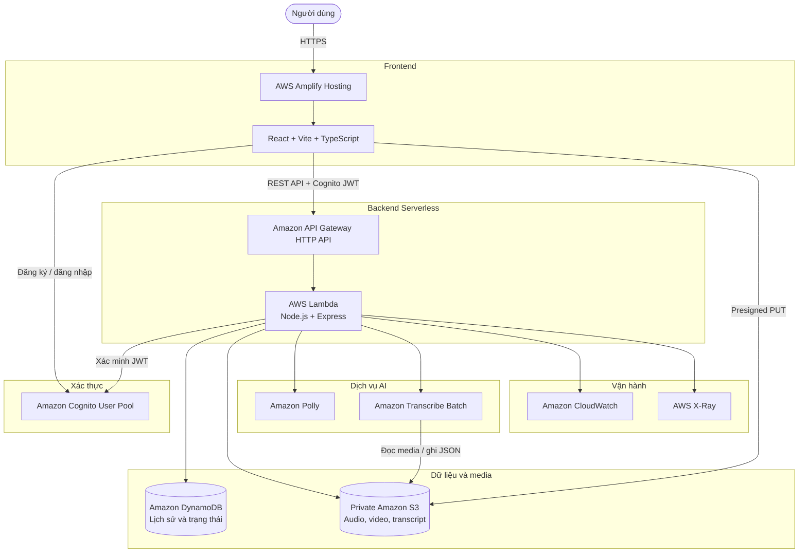
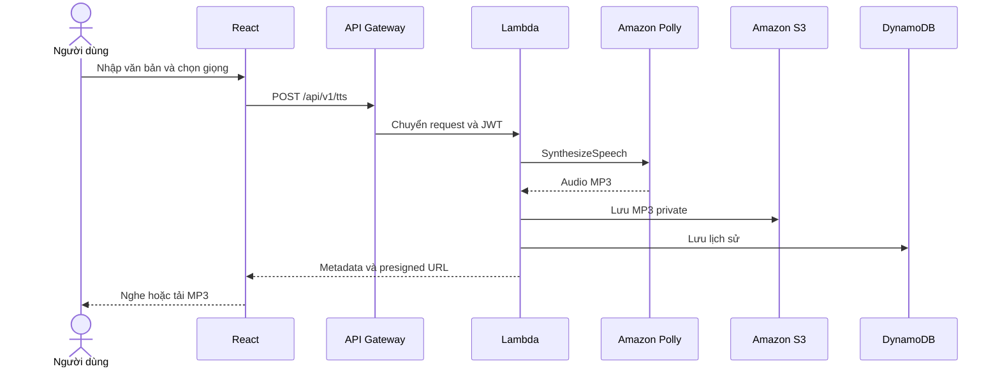
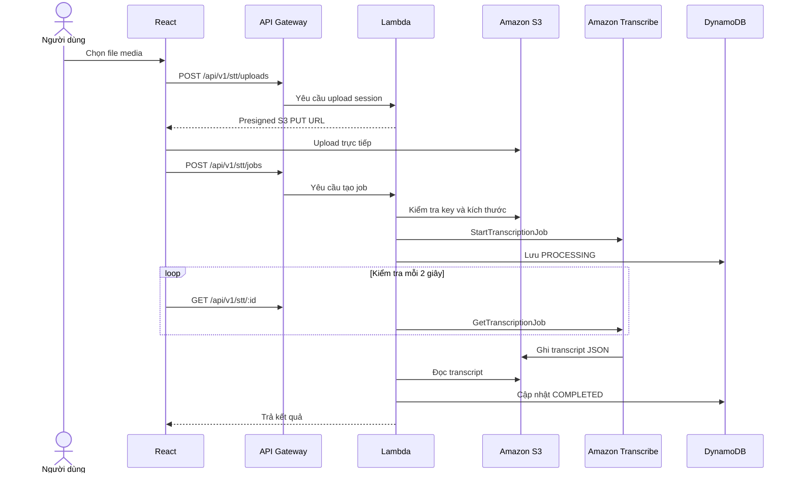

# Polly Voice
## Giải pháp AWS Serverless hợp nhất cho chuyển đổi văn bản và giọng nói

### 1. Tóm tắt điều hành

Polly Voice là nền tảng web serverless cung cấp hai chức năng chính: chuyển văn
bản thành giọng nói (Text-to-Speech) và chuyển giọng nói thành văn bản
(Speech-to-Text). Nền tảng hướng đến sinh viên, giảng viên, người sáng tạo nội
dung, podcaster và các nhóm nhỏ cần tạo giọng đọc hoặc transcript mà không phải
cài đặt và vận hành hệ thống xử lý âm thanh riêng.

Người dùng có thể nhập văn bản, chọn giọng đọc, điều chỉnh tốc độ và âm lượng,
nghe thử, tạo file MP3 và tải kết quả xuống. Với Speech-to-Text, người dùng có
thể tải lên file MP3, MP4, WAV, FLAC, M4A, OGG, WebM hoặc AMR để Amazon
Transcribe nhận dạng nội dung. Hệ thống hỗ trợ file batch đến 2 GB và lưu lịch
sử xử lý riêng cho từng tài khoản.

Nền tảng sử dụng React và Vite cho frontend, được triển khai bằng AWS Amplify
Hosting. Amazon Cognito chịu trách nhiệm đăng ký, xác nhận email và đăng nhập.
Backend Node.js và Express chạy trên AWS Lambda, được công khai qua Amazon API
Gateway HTTP API. Amazon Polly cung cấp khả năng tổng hợp giọng nói, Amazon
Transcribe xử lý nhận dạng âm thanh, Amazon S3 lưu media trong bucket private và
Amazon DynamoDB lưu lịch sử cùng trạng thái job.

Giải pháp áp dụng mô hình trả phí theo mức sử dụng, không yêu cầu máy chủ chạy
liên tục và có thể tự động mở rộng theo số lượng request.

### 2. Tuyên bố vấn đề

*Vấn đề hiện tại*

Người dùng cần tạo giọng đọc hoặc transcript thường phải sử dụng nhiều phần mềm
desktop hay website bên thứ ba. Những công cụ này có thể khó tích hợp, giới hạn
dung lượng, không có lịch sử xử lý tập trung hoặc yêu cầu người dùng tải dữ liệu
riêng tư lên các nền tảng không kiểm soát được.

Nếu tự xây dựng hệ thống theo cách truyền thống, nhóm phát triển phải:

- Cấp phát và duy trì máy chủ.
- Cài đặt speech engine và thư viện xử lý media.
- Xử lý khả năng mở rộng khi nhiều người dùng truy cập.
- Quản lý file media dung lượng lớn.
- Tự xây dựng cơ chế đăng nhập và phân quyền.
- Duy trì database, logging và hệ thống giám sát.

Đặc biệt, việc upload file media trực tiếp qua application server dễ gặp giới
hạn payload, timeout và tiêu tốn bộ nhớ.

*Giải pháp*

Polly Voice kết hợp các dịch vụ managed và serverless của AWS thành một nền
tảng thống nhất:

- Amazon Polly tạo audio MP3 từ văn bản.
- Amazon Transcribe chuyển nội dung audio/video thành văn bản.
- Amazon Cognito quản lý danh tính và cấp JWT cho người dùng.
- Amazon S3 lưu media trong bucket private.
- Presigned URL cho phép trình duyệt upload/download trực tiếp mà không cần AWS
  access key.
- Amazon DynamoDB lưu lịch sử TTS/STT và trạng thái job bất đồng bộ.
- AWS Lambda và API Gateway cung cấp backend serverless.
- AWS Amplify Hosting tự động build và triển khai frontend từ GitHub.

Đối với file Speech-to-Text, trình duyệt upload trực tiếp lên Amazon S3 thay vì
gửi toàn bộ file qua API Gateway và Lambda. Sau đó backend khởi chạy
Transcribe job và frontend định kỳ kiểm tra trạng thái đến khi hoàn thành.

*Lợi ích và hoàn vốn đầu tư (ROI)*

Giải pháp giảm thời gian xây dựng và vận hành nhờ sử dụng các dịch vụ AI managed
của AWS. Nhóm phát triển không phải huấn luyện mô hình speech, quản lý máy chủ
hay tự mở rộng hạ tầng. Audio đã tạo có thể được lưu và phát lại từ S3, tránh gọi
Polly lặp lại cho cùng một nội dung.

Với workload thử nghiệm gồm 100 người dùng, 500.000 ký tự Polly Standard, 300
phút Transcribe, 10 GB S3 và 10.000 API request mỗi tháng, chi phí kế hoạch
ước tính khoảng **11,30 USD/tháng** trước thuế và chưa áp dụng AWS Free Tier.
Chi phí thực tế phụ thuộc vào thời lượng audio, số ký tự, dữ liệu truyền ra,
CloudWatch Logs và khu vực AWS.

Giá trị dài hạn của dự án nằm ở khả năng mở rộng thành nền tảng tạo phụ đề,
dịch transcript và lồng tiếng tự động mà không phải thay đổi kiến trúc nền tảng.

### 3. Kiến trúc giải pháp

Polly Voice áp dụng kiến trúc serverless tại region `eu-north-1` (Europe –
Stockholm). Frontend và backend được triển khai độc lập. Cognito bảo vệ các chức
năng lưu lịch sử và STT, trong khi S3 luôn chặn truy cập public.

*Luồng Text-to-Speech*

*Luồng Speech-to-Text*

*Dịch vụ AWS sử dụng*

- *AWS Amplify Hosting*: Lưu trữ React frontend, build tự động từ GitHub, cung
  cấp HTTPS và CDN.
- *Amazon Cognito*: Đăng ký, xác nhận email, đăng nhập và phát hành JWT.
- *Amazon API Gateway HTTP API*: Tiếp nhận request từ frontend và chuyển đến
  Lambda.
- *AWS Lambda*: Chạy Node.js/Express backend theo mô hình serverless.
- *Amazon Polly*: Tổng hợp giọng nói từ văn bản và trả MP3.
- *Amazon Transcribe*: Nhận dạng lời nói theo batch từ media trong S3.
- *Amazon S3*: Lưu audio, video và transcript trong bucket private.
- *Amazon DynamoDB*: Lưu lịch sử TTS/STT và trạng thái job theo người dùng.
- *Amazon CloudWatch*: Thu thập Lambda Logs và các metric vận hành.
- *AWS X-Ray*: Theo dõi request và thời gian xử lý.
- *AWS SAM và CloudFormation*: Khai báo, build và triển khai hạ tầng.

*Thiết kế thành phần*

- *Giao diện web*: React dashboard gồm Text-to-Speech, Speech-to-Text, History
  và Profile.
- *Xác thực*: Cognito sử dụng SRP; backend xác minh issuer, User Pool và App
  Client của JWT.
- *TTS module*: Kiểm tra input, gọi Polly, lưu MP3 vào S3 và metadata vào
  DynamoDB.
- *STT module*: Cấp presigned upload URL, kiểm tra file, tạo Transcribe job và
  cập nhật trạng thái.
- *Media storage*: Dùng local filesystem khi phát triển và private S3 trên AWS.
- *Database repository*: Dùng DynamoDB on-demand để lưu dữ liệu theo người
  dùng.
- *Vận hành*: CloudWatch và X-Ray cung cấp log, metric và tracing.

### 4. Triển khai kỹ thuật

*Các giai đoạn triển khai*

Dự án được thực hiện qua 5 giai đoạn:

1. *Nghiên cứu và thiết kế kiến trúc*: Phân tích bài toán TTS/STT, nghiên cứu
   Polly, Transcribe và các dịch vụ serverless; lựa chọn region `eu-north-1`.
2. *Xây dựng ứng dụng local*: Phát triển React frontend, Node.js/Express
   backend, mock TTS/STT và local storage.
3. *Tích hợp AWS*: Cấu hình Cognito, Amplify, Polly, S3, DynamoDB, API Gateway
   và Lambda.
4. *Cải thiện độ ổn định*: Xử lý giới hạn voice tại Stockholm, sửa Lambda
   handler, chuyển STT sang upload trực tiếp S3 và thêm polling.
5. *Kiểm thử và triển khai*: Build TypeScript, chạy automated test, validate
   SAM, deploy CloudFormation và kiểm tra production.

*Yêu cầu kỹ thuật*

- *Công cụ*: Node.js 22 LTS, npm, Git, AWS CLI v2 và AWS SAM CLI.
- *Frontend*: React 19, TypeScript, Vite và
  `amazon-cognito-identity-js`.
- *Backend*: Node.js 22, Express, TypeScript, Zod, AWS SDK for JavaScript v3
  và `serverless-http`.
- *AWS account*: Có quyền triển khai CloudFormation, Lambda, IAM, API Gateway,
  S3, DynamoDB, Cognito, Amplify, CloudWatch và X-Ray.
- *Region*: Tất cả tài nguyên chính được triển khai tại `eu-north-1`.
- *Infrastructure as Code*: `backend/template.yaml` định nghĩa Lambda, API
  Gateway, DynamoDB, S3, IAM policy, environment variables và outputs.

*Bảo mật*

- Bật S3 Block Public Access và mã hóa AES-256.
- Chỉ cung cấp quyền truy cập media bằng presigned URL có thời hạn.
- CORS của S3 và API chỉ cho phép domain Amplify đã cấu hình.
- React là public client nên Cognito App Client không có client secret.
- Không hard-code AWS access key trong frontend hoặc repository.
- Lambda dùng IAM execution role để truy cập đúng bucket, table và AI service.
- S3 object key chứa Cognito Subject ID để phân tách dữ liệu người dùng.
- DynamoDB được mã hóa at rest.

*Kiểm thử*

- Kiểm tra `/health` trả HTTP 200.
- Kiểm tra endpoint được bảo vệ trả HTTP 401 khi thiếu JWT.
- Kiểm tra TTS preview, tạo MP3, phát và download.
- Kiểm tra định dạng media và giới hạn 2 GB.
- Kiểm tra upload S3 trực tiếp và CORS.
- Kiểm tra Transcribe chuyển từ `PROCESSING` sang `COMPLETED` hoặc `FAILED`.
- Kiểm tra frontend/backend production build.
- Kiểm tra SAM template và CloudFormation deployment.

### 5. Lộ trình & Mốc triển khai

- *Trước dự án*: Nghiên cứu AWS Serverless, Amazon Polly và Transcribe.
- *Tháng 1*:
  - Xác định phạm vi và mục tiêu.
  - Thiết kế kiến trúc.
  - Xây dựng frontend và backend local.
- *Tháng 2*:
  - Tích hợp Cognito và Amplify.
  - Tích hợp Polly, S3 và DynamoDB.
  - Triển khai Lambda và API Gateway.
- *Tháng 3*:
  - Tích hợp Amazon Transcribe.
  - Hoàn thiện direct-to-S3 upload.
  - Kiểm thử, bảo mật, monitoring và tài liệu.
- *Sau triển khai*:
  - Timestamp và speaker diarization.
  - Xuất SRT/WebVTT.
  - Tạo phụ đề video.
  - Dịch transcript bằng Amazon Translate.
  - Lồng tiếng tự động với Polly, Step Functions và MediaConvert.

### 6. Ước tính ngân sách

Ước tính dưới đây sử dụng workload giả định:

- 100 người dùng đăng ký.
- 10.000 API request/tháng.
- 500.000 ký tự Polly Standard/tháng.
- 300 phút Transcribe/tháng.
- 10 GB lưu trữ S3.
- 5 GB dữ liệu truyền ra Internet.
- 10.000 thao tác DynamoDB/tháng.
- Lượng CloudWatch Logs thấp.

*Chi phí hạ tầng dự kiến*

- Amazon Polly Standard: 2,00 USD/tháng.
- Amazon Transcribe Batch: 7,20 USD/tháng.
- Amazon S3 và request: 0,30 USD/tháng.
- AWS Amplify Hosting: 1,00 USD/tháng.
- Amazon API Gateway: dưới 0,10 USD/tháng.
- AWS Lambda arm64: dưới 0,10 USD/tháng.
- Amazon DynamoDB on-demand: dưới 0,10 USD/tháng.
- Amazon Cognito: 0,00 USD với workload giả định và chính sách giá phù hợp.
- Amazon CloudWatch và X-Ray: khoảng 0,50 USD/tháng.

*Tổng chi phí kế hoạch*: khoảng **11,30 USD/tháng**, tương đương **135,60
USD/12 tháng**, chưa bao gồm thuế và chưa áp dụng AWS Free Tier.

Đây là ước tính phục vụ proposal, không phải báo giá của AWS. Bản báo cáo cuối
cần đính kèm kết quả AWS Pricing Calculator cho region `eu-north-1`.

*Biện pháp tối ưu chi phí*

- Ưu tiên Polly Standard khi phù hợp với yêu cầu.
- Cache audio trong S3, không tổng hợp lại nội dung giống nhau.
- Sử dụng DynamoDB on-demand cho lưu lượng chưa ổn định.
- Upload file trực tiếp vào S3 để giảm Lambda duration.
- Cấu hình S3 Lifecycle xóa media cũ.
- Giới hạn ký tự TTS và thời lượng STT theo người dùng.
- Đặt CloudWatch Logs retention 14 hoặc 30 ngày.
- Thiết lập AWS Budget và cảnh báo email.

### 7. Đánh giá rủi ro

*Ma trận rủi ro*

- Voice hoặc engine Polly không hỗ trợ tại Stockholm: ảnh hưởng trung bình,
  xác suất trung bình.
- Upload file lớn qua API thất bại: ảnh hưởng cao, xác suất cao nếu dùng thiết
  kế cũ.
- Transcribe xử lý lâu hoặc thất bại: ảnh hưởng trung bình, xác suất trung bình.
- Codec media không tương thích: ảnh hưởng trung bình, xác suất trung bình.
- Truy cập media trái phép: ảnh hưởng cao, xác suất thấp.
- Vượt ngân sách AWS: ảnh hưởng cao, xác suất thấp.
- Lambda timeout hoặc throttle: ảnh hưởng trung bình, xác suất thấp.
- Log chứa token hoặc thông tin nhạy cảm: ảnh hưởng cao, xác suất thấp.

*Chiến lược giảm thiểu*

- Polly: Kiểm tra voice/engine và tự động fallback về Standard Engine.
- Upload: Sử dụng presigned URL và upload trực tiếp vào private S3.
- Transcribe: Chạy job bất đồng bộ, lưu trạng thái và hiển thị FailureReason.
- Codec: Kiểm tra định dạng trước khi upload; bổ sung MediaConvert khi cần.
- Bảo mật: Block Public Access, JWT validation, prefix theo user và URL có thời
  hạn.
- Chi phí: AWS Budgets, quota, S3 Lifecycle và log retention.
- Vận hành: CloudWatch Logs, metric, alarm và X-Ray tracing.
- Dữ liệu nhạy cảm: Không ghi password, token hoặc presigned URL vào log.

*Kế hoạch dự phòng*

- Giữ chế độ mock local để phát triển và demo khi AWS không khả dụng.
- Lưu trạng thái job trong DynamoDB để tiếp tục kiểm tra sau khi request kết
  thúc.
- Cho phép người dùng upload hoặc chạy lại job thất bại.
- Sử dụng AWS SAM và CloudFormation để triển khai lại phiên bản ổn định.
- Tạo cảnh báo CloudWatch/SNS cho Lambda error và API 5xx.

### 8. Kết quả kỳ vọng

*Cải tiến kỹ thuật*

- Xây dựng thành công ứng dụng TTS/STT serverless hoạt động trên production.
- Loại bỏ nhu cầu quản lý máy chủ và speech engine.
- Hỗ trợ upload file STT lớn mà không đi qua Lambda.
- Bảo vệ người dùng và media bằng Cognito, JWT và private S3.
- Lưu lịch sử cùng trạng thái xử lý trong DynamoDB.
- Cho phép tái tạo hạ tầng bằng AWS SAM và CloudFormation.
- Cung cấp log, metric và tracing thông qua CloudWatch và X-Ray.
- Có khả năng tự động mở rộng theo số request.

*Giá trị cho người dùng*

- Tạo giọng đọc và tải MP3 mà không cần cài phần mềm.
- Chuyển audio hoặc video được hỗ trợ thành văn bản.
- Theo dõi tiến trình upload và xử lý.
- Copy, tải và quản lý transcript.
- Truy cập lịch sử cá nhân an toàn.

*Giá trị dài hạn*

Polly Voice tạo nền tảng có thể tái sử dụng để phát triển:

1. Transcript có timestamp.
2. Phân biệt người nói.
3. Xuất phụ đề SRT/WebVTT.
4. Dịch phụ đề bằng Amazon Translate.
5. Gắn phụ đề vào video bằng AWS Elemental MediaConvert.
6. Lồng tiếng tự động với Polly và Step Functions.
7. Gửi thông báo hoàn thành bằng SNS hoặc SES.
8. Dashboard quản trị, quota và theo dõi chi phí.

Kết quả cuối cùng kỳ vọng là một workshop có thể triển khai end-to-end, trong đó
người đọc có thể tạo tài nguyên AWS, deploy frontend/backend, kiểm thử TTS/STT,
xem CloudWatch Logs và thực hiện clean-up để tránh phát sinh chi phí.
