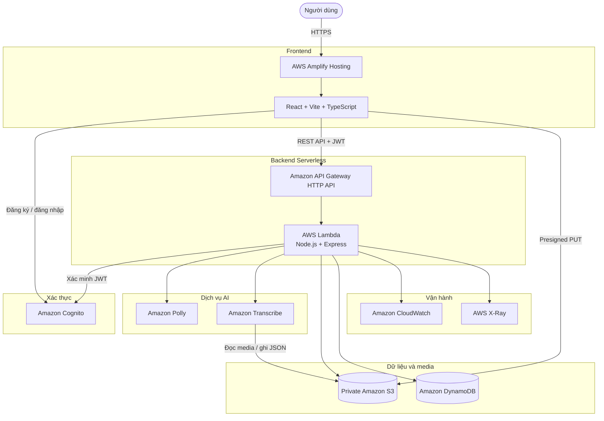

# Tổng quan Workshop

## Giới thiệu

Trong workshop này, chúng ta sẽ xây dựng và triển khai **Polly Voice** – một
ứng dụng web serverless cung cấp chức năng chuyển văn bản thành giọng nói
(Text-to-Speech) và chuyển giọng nói thành văn bản (Speech-to-Text) bằng các
dịch vụ AI trên AWS.

Ứng dụng cho phép người dùng nhập văn bản, lựa chọn giọng đọc, nghe thử, tạo và
tải file MP3. Người dùng đã đăng nhập có thể tải audio hoặc video lên để nhận
dạng lời nói, theo dõi trạng thái xử lý và quản lý lịch sử chuyển đổi của riêng
mình.

Toàn bộ hệ thống được triển khai tại region `eu-north-1` (Europe – Stockholm)
theo kiến trúc serverless. Frontend React được lưu trữ bằng AWS Amplify Hosting.
Backend Node.js và Express chạy trên AWS Lambda, được truy cập thông qua Amazon
API Gateway HTTP API. Amazon Cognito quản lý người dùng, Amazon S3 lưu media,
Amazon DynamoDB lưu lịch sử, Amazon Polly tạo giọng nói và Amazon Transcribe
thực hiện nhận dạng nội dung media.

## Bài toán

Người dùng cần tạo giọng đọc hoặc transcript thường phải cài đặt nhiều phần mềm
khác nhau hoặc sử dụng dịch vụ bên thứ ba. Điều này có thể gây ra các vấn đề:

- Phải cài đặt và cập nhật phần mềm xử lý âm thanh.
- Không có nơi lưu lịch sử TTS và STT tập trung.
- Khó kiểm soát quyền truy cập vào media cá nhân.
- File media lớn dễ gặp lỗi khi upload qua application server.
- Hệ thống tự quản lý cần máy chủ chạy liên tục.
- Chi phí và công sức bảo trì tăng khi số lượng người dùng thay đổi.

Polly Voice giải quyết các vấn đề trên bằng dịch vụ AWS managed và serverless.
Hệ thống không cần máy chủ chạy liên tục, tự động mở rộng theo request và tính
phí theo mức sử dụng thực tế.

## Mục tiêu Workshop

Sau khi hoàn thành workshop, bạn có thể:

- Hiểu cách thiết kế ứng dụng AI serverless trên AWS.
- Xây dựng React frontend và Node.js backend theo module nghiệp vụ.
- Cấu hình đăng ký, xác nhận email và đăng nhập bằng Amazon Cognito.
- Xác minh Cognito JWT trong Lambda.
- Triển khai REST API bằng API Gateway HTTP API và AWS Lambda.
- Chuyển văn bản thành MP3 bằng Amazon Polly.
- Lưu media an toàn trong private Amazon S3 bucket.
- Cấp presigned URL để upload và download media.
- Chuyển audio hoặc video được hỗ trợ thành văn bản bằng Amazon Transcribe.
- Lưu lịch sử và trạng thái job trong Amazon DynamoDB.
- Triển khai frontend bằng AWS Amplify Hosting.
- Xem Lambda Logs và metric trong Amazon CloudWatch.
- Tạo Dashboard, Alarm và SNS email notification.
- Kiểm thử chức năng, bảo mật và các trường hợp lỗi.
- Xóa tài nguyên sau workshop để tránh phát sinh chi phí.

## Đối tượng tham gia

Workshop phù hợp với:

- Sinh viên đang học AWS hoặc cloud computing.
- Lập trình viên frontend muốn tìm hiểu backend serverless.
- Lập trình viên Node.js muốn tích hợp dịch vụ AI của AWS.
- Người mới tìm hiểu Infrastructure as Code với AWS SAM.
- Người muốn xây dựng ứng dụng TTS/STT, phụ đề hoặc lồng tiếng.

Người tham gia không cần có kinh nghiệm chuyên sâu về machine learning vì
Amazon Polly và Amazon Transcribe là các dịch vụ AI managed. Kiến thức cơ bản
về JavaScript/TypeScript, REST API, Git và command line sẽ giúp quá trình thực
hành thuận lợi hơn.

## Chức năng chính

### Text-to-Speech

- Nhập hoặc upload file văn bản `.txt`.
- Chọn ngôn ngữ, giọng đọc và voice engine.
- Chọn cấu hình giọng có sẵn.
- Điều chỉnh tốc độ, âm lượng và khoảng nghỉ.
- Nghe thử với giới hạn dành cho guest.
- Tạo và tải file MP3.
- Lưu lịch sử đối với người dùng đã đăng nhập.

### Speech-to-Text

- Hỗ trợ MP3, MP4, WAV, FLAC, M4A, OGG, WebM và AMR.
- Hỗ trợ Amazon Transcribe batch file đến 2 GB.
- Upload trực tiếp từ trình duyệt vào S3 bằng presigned URL.
- Hiển thị tiến trình upload.
- Khởi chạy Transcribe job bất đồng bộ.
- Polling trạng thái đến khi hoàn thành.
- Hiển thị lý do cụ thể khi job thất bại.
- Copy và tải transcript.

### Authentication và History

- Đăng ký bằng email.
- Xác nhận tài khoản bằng mã trong email.
- Đăng nhập bằng Cognito SRP.
- Xác thực API bằng Bearer JWT.
- Lưu lịch sử riêng theo Cognito Subject ID.
- Phát lại audio TTS từ lịch sử.
- Xóa mềm bản ghi TTS/STT.

## Kiến trúc tổng quan

## Luồng Text-to-Speech

1. Người dùng nhập văn bản và lựa chọn giọng đọc.
2. React gửi request đến API Gateway.
3. API Gateway chuyển request đến Lambda.
4. Lambda kiểm tra dữ liệu và xác thực JWT nếu có.
5. Lambda gọi Amazon Polly để tổng hợp giọng nói.
6. Audio MP3 được lưu vào private S3 bucket.
7. Metadata và lịch sử được lưu vào DynamoDB.
8. Backend trả presigned URL cho frontend.
9. Người dùng nghe hoặc tải file MP3.

## Luồng Speech-to-Text

1. Người dùng đăng nhập và chọn file media.
2. Frontend yêu cầu backend tạo upload session.
3. Backend trả presigned S3 PUT URL có thời hạn.
4. Trình duyệt upload trực tiếp file vào private S3 bucket.
5. Frontend yêu cầu backend khởi chạy Transcribe job.
6. Lambda kiểm tra S3 key và kích thước file.
7. Amazon Transcribe đọc media trong S3.
8. DynamoDB lưu trạng thái `PROCESSING`.
9. Frontend polling trạng thái job.
10. Transcribe ghi file JSON kết quả vào S3.
11. Backend đọc transcript và cập nhật `COMPLETED`.
12. Frontend hiển thị nội dung cho người dùng.

## Dịch vụ AWS sử dụng

| Dịch vụ | Vai trò trong Workshop |
|---|---|
| AWS Amplify Hosting | Build và host React frontend |
| Amazon Cognito | Đăng ký, xác nhận email và đăng nhập |
| Amazon API Gateway | Public HTTP API |
| AWS Lambda | Chạy Node.js/Express backend |
| Amazon Polly | Chuyển văn bản thành audio MP3 |
| Amazon Transcribe | Chuyển media thành văn bản |
| Amazon S3 | Lưu audio, video và transcript |
| Amazon DynamoDB | Lưu lịch sử và trạng thái job |
| Amazon CloudWatch | Logs, metric, dashboard và alarm |
| AWS X-Ray | Theo dõi request và thời gian xử lý |
| AWS SAM | Build và triển khai backend |
| AWS CloudFormation | Quản lý vòng đời tài nguyên |

## Phạm vi Workshop

Workshop tập trung vào:

- Text-to-Speech bằng Amazon Polly.
- Speech-to-Text batch bằng Amazon Transcribe.
- Upload file trực tiếp vào S3.
- Authentication với Cognito.
- Serverless REST API.
- Lưu trữ và lịch sử theo người dùng.
- Logging, monitoring và clean-up.

Các chức năng sau chưa nằm trong phạm vi triển khai chính:

- Streaming transcription theo thời gian thực.
- Nhân bản giọng nói.
- Đồng bộ khẩu hình.
- Dịch transcript tự động.
- Render phụ đề cứng vào video.
- Lồng tiếng và ghép audio bằng MediaConvert.

Những chức năng này được xem là hướng phát triển sau workshop.

## Kết quả cuối cùng

Sau khi hoàn tất, bạn sẽ có:

- Website React hoạt động qua HTTPS.
- User Pool và App Client Cognito.
- Backend Lambda hoạt động sau API Gateway.
- Private S3 bucket chứa media.
- DynamoDB table chứa lịch sử.
- TTS tạo được MP3 thực tế.
- STT tạo được transcript thực tế.
- CloudWatch Dashboard và Alarm.
- Source code và hạ tầng được quản lý bằng Git và AWS SAM.
- Tài liệu kiểm thử cùng hình ảnh chứng minh.
- Hướng dẫn clean-up đầy đủ.

## Thời gian và chi phí dự kiến

| Hạng mục | Thời gian dự kiến |
|---|---:|
| Chuẩn bị môi trường | 30–45 phút |
| Cấu hình Cognito | 30 phút |
| Deploy backend | 45–60 phút |
| Deploy frontend | 30–45 phút |
| Kiểm thử TTS/STT | 45–60 phút |
| CloudWatch và bảo mật | 45–60 phút |
| Clean-up | 20–30 phút |
| **Tổng cộng** | **Khoảng 4–6 giờ** |

Chi phí thực hành phụ thuộc vào số ký tự Polly, thời lượng audio Transcribe,
dung lượng S3, data transfer và thời gian lưu log. Với dữ liệu thử nghiệm nhỏ,
chi phí thường thấp và có thể được giảm bởi AWS Free Tier hoặc credit nếu tài
khoản đủ điều kiện.

{}
Workshop sử dụng region `eu-north-1`. Tại region này, Amazon Transcribe hỗ trợ
batch transcription nhưng không hỗ trợ streaming transcription. Các preset
Polly trong project sử dụng Standard Engine để tương thích với voice hiện có
tại Stockholm.
{}

{}
Không upload dữ liệu nhạy cảm trong quá trình thực hành. Không đưa AWS access
key, password, JWT hoặc presigned URL đầy đủ vào source code, GitHub hay ảnh
chụp báo cáo.
{}
