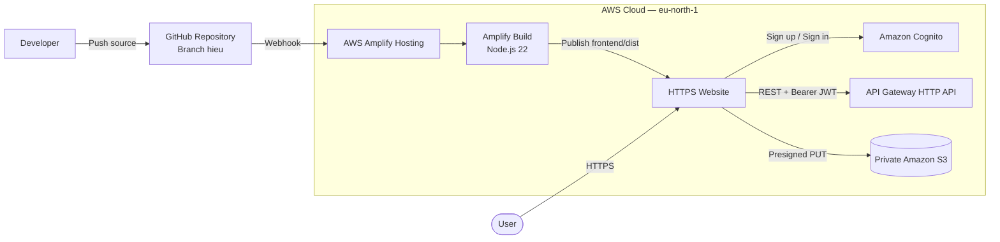
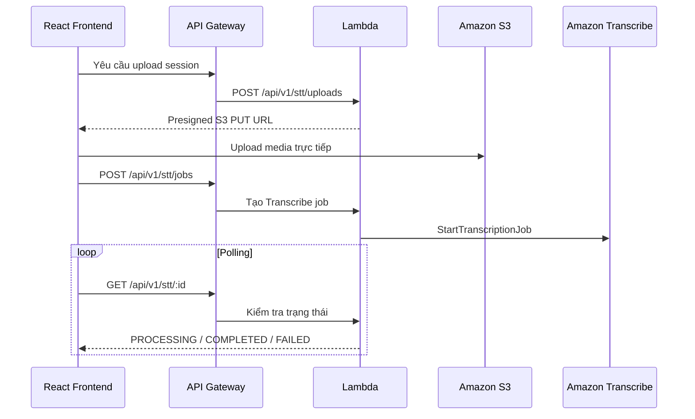

# Xây dựng và triển khai Frontend

## Mục tiêu

Giai đoạn này tập trung xây dựng giao diện người dùng cho Polly Voice và đưa
frontend lên môi trường AWS. Kết quả cần đạt được là một website hoạt động qua
HTTPS, cho phép người dùng:

- Đăng ký, xác nhận email và đăng nhập bằng Amazon Cognito.
- Nhập văn bản và cấu hình giọng đọc.
- Nghe thử, tạo và tải file MP3.
- Upload audio/video để thực hiện Speech-to-Text.
- Theo dõi trạng thái xử lý.
- Xem và quản lý lịch sử TTS/STT của tài khoản.

Frontend được xây dựng bằng **React 19**, **TypeScript** và **Vite**, sau đó được
triển khai bằng **AWS Amplify Hosting** tại region `eu-north-1`.

## Lựa chọn công nghệ

### React và TypeScript

React được lựa chọn vì giao diện Polly Voice có nhiều trạng thái tương tác như
đăng nhập, lựa chọn voice, theo dõi upload, polling trạng thái STT và điều khiển
audio player. Cách tổ chức theo component giúp từng nhóm chức năng có thể được
phát triển và thay đổi độc lập.

TypeScript được sử dụng để mô tả request và response của API. Việc này giúp phát
hiện sớm lỗi sai kiểu dữ liệu giữa frontend và backend, đặc biệt đối với các
trạng thái bất đồng bộ như `PROCESSING`, `COMPLETED` và `FAILED`.

### Vite

Vite được sử dụng làm công cụ phát triển và đóng gói frontend. So với cấu hình
Webpack thủ công, Vite giúp giảm thời gian khởi tạo dự án, hỗ trợ TypeScript và
tạo production bundle trong thư mục `dist`.

Production build của dự án được tạo bằng:

```json
{
  "scripts": {
    "dev": "vite",
    "build": "tsc -b && vite build",
    "lint": "oxlint",
    "preview": "vite preview"
  }
}
```

Lệnh build thực hiện hai công việc:

1. `tsc -b` kiểm tra TypeScript.
2. `vite build` tối ưu JavaScript, CSS và static assets cho production.

### AWS Amplify Hosting

AWS Amplify Hosting được lựa chọn thay cho việc tự cấu hình S3 và CloudFront vì
dịch vụ cung cấp sẵn:

- Kết nối trực tiếp với GitHub.
- Tự động build khi branch có commit mới.
- HTTPS và domain `amplifyapp.com`.
- Lưu build log theo từng deployment.
- Quản lý environment variables.
- Hỗ trợ rollback deployment.

Amplify chỉ chịu trách nhiệm build và host static frontend. Logic TTS/STT vẫn
được thực hiện bởi API Gateway, Lambda và các dịch vụ backend.

## Kiến trúc triển khai Frontend



Mã nguồn được lưu trên GitHub. Khi branch production thay đổi, Amplify lấy source,
cài dependencies, tạo production build và publish nội dung của thư mục `dist`.
Website sau đó gọi Cognito và backend thông qua các public endpoint riêng biệt.

## Quá trình xây dựng giao diện

### Phiên bản ban đầu

Phiên bản frontend đầu tiên tập trung vào màn hình Text-to-Speech. Giao diện cung
cấp vùng nhập văn bản, lựa chọn voice, engine, tốc độ, âm lượng và khoảng nghỉ.
Sau đó dự án được mở rộng với audio player, chức năng download, Speech-to-Text,
History, Profile và authentication.

Trong giai đoạn đầu, phần lớn logic giao diện được đặt trong một component lớn.
Cách tổ chức này giúp tạo prototype nhanh nhưng gây khó khăn khi bổ sung Cognito,
STT bất đồng bộ và nhiều API endpoint.

### Tổ chức lại source theo chức năng

Frontend được tái cấu trúc theo module nghiệp vụ:

```text
frontend/src/
├── @core/                 # Helper và formatter độc lập
├── @theme/                # Theme và style dùng chung
├── guard/                 # Bảo vệ nội dung yêu cầu đăng nhập
├── pages/
│   ├── history/           # Lịch sử TTS/STT
│   ├── profile/           # Thông tin tài khoản Cognito
│   ├── speech-to-text/    # Giao diện và trạng thái STT
│   └── workspace/         # Điều phối dashboard chính
├── security/              # Cognito authentication
└── shared/
    ├── models/            # Interface và type
    ├── services/          # REST client và S3 upload
    └── settings/          # Preset và cấu hình voice
```

Việc tách source mang lại các lợi ích:

- Logic gọi API không còn nằm trực tiếp trong component giao diện.
- Authentication được quản lý trong module `security`.
- Model TTS/STT được tái sử dụng giữa các page.
- Cấu hình voice và preset được quản lý tập trung.
- Component có phạm vi trách nhiệm rõ ràng hơn.
- Việc sửa giao diện không ảnh hưởng trực tiếp tới lớp giao tiếp backend.

## Kết nối frontend với backend

Frontend không viết cứng API URL trong component. Base URL được đọc từ biến môi
trường:

```typescript
const API_BASE_URL =
  import.meta.env.VITE_API_BASE_URL ??
  'http://localhost:8080/api/v1';
```

Cách thiết kế này cho phép cùng một source hoạt động ở hai môi trường:

| Môi trường | API base URL |
|---|---|
| Local | `http://localhost:8080/api/v1` |
| AWS | `https://<api-id>.execute-api.eu-north-1.amazonaws.com/api/v1` |

Khi tạo TTS, service gửi JSON tới backend:

```typescript
const response = await fetch(
  `${API_BASE_URL}/tts${preview ? '/preview' : ''}`,
  {
    method: 'POST',
    headers: {
      'Content-Type': 'application/json',
      ...authHeaders()
    },
    body: JSON.stringify(payload)
  }
);
```

Nếu người dùng đã đăng nhập, request chứa Cognito access token:

```typescript
function authHeaders(): Record<string, string> {
  const accessToken = localStorage.getItem('access_token');

  if (accessToken) {
    return {
      Authorization: `Bearer ${accessToken}`
    };
  }

  return {
    'X-User-Id':
      localStorage.getItem('local_user_id') ?? 'guest'
  };
}
```

Header `X-User-Id` chỉ hỗ trợ quá trình phát triển local. Trên AWS, backend xác
minh Bearer token do Cognito phát hành.

## Tích hợp Amazon Cognito

Frontend sử dụng package `amazon-cognito-identity-js` để giao tiếp với Cognito
User Pool. Pool được khởi tạo từ biến môi trường:

```typescript
const awsEnabled =
  import.meta.env.VITE_AWS_ENABLED === 'true';

const userPoolId =
  import.meta.env.VITE_COGNITO_USER_POOL_ID ?? '';

const clientId =
  import.meta.env.VITE_COGNITO_CLIENT_ID ?? '';
```

App Client được cấu hình cho Single-page Application và không sử dụng client
secret. Đây là yêu cầu quan trọng vì JavaScript chạy trên trình duyệt không thể
bảo vệ một secret dài hạn.

### Cải tiến luồng xác nhận email

Trong phiên bản đầu, luồng đăng ký phụ thuộc vào popup. Trên trình duyệt Cốc Cốc,
popup có thể bị chặn hoặc đóng trước khi người dùng nhập mã, dẫn tới tài khoản tồn
tại trong Cognito nhưng vẫn ở trạng thái chưa xác nhận.

Để khắc phục, authentication modal được chuyển thành state machine gồm ba trạng
thái:

```typescript
'login' | 'register' | 'confirm'
```

Khi Cognito yêu cầu xác nhận, giao diện giữ lại email và chuyển trực tiếp sang
form nhập mã:

```typescript
if (result === 'confirmation-required') {
  setAuthMode('confirm');
  setAuthMessage(
    `A confirmation code was sent to ${authEmailInput}.`
  );
}
```

Frontend cũng hỗ trợ gửi lại mã khi người dùng chưa nhận được email. Cải tiến này
loại bỏ phụ thuộc vào popup của trình duyệt và giúp luồng đăng ký có thể tiếp tục
sau khi xảy ra lỗi.

## Hoàn thiện luồng Speech-to-Text

Thiết kế STT ban đầu gửi file multipart tới backend. Luồng này phù hợp để thử
nghiệm local nhưng không phù hợp với production vì file phải đi qua API Gateway
và Lambda.

Frontend sau đó được thay đổi theo luồng upload trực tiếp:



Đoạn upload sử dụng `XMLHttpRequest` thay cho `fetch` để theo dõi tiến độ:

```typescript
const request = new XMLHttpRequest();
request.open('PUT', uploadUrl);
request.setRequestHeader(
  'Content-Type',
  file.type || 'application/octet-stream'
);

request.upload.onprogress = (event) => {
  if (event.lengthComputable) {
    const progress = Math.round(
      (event.loaded / event.total) * 60
    );
    onProgress?.(progress);
  }
};

request.send(file);
```

Thay đổi này giúp:

- File không đi qua API Gateway và Lambda.
- Hỗ trợ file media lớn hơn.
- Hiển thị upload progress.
- Giảm thời gian Lambda giữ request.
- Tách upload khỏi quá trình Transcribe bất đồng bộ.

## Cấu hình build trên Amplify

Repository chứa cả `frontend` và `backend`, vì vậy Amplify được cấu hình theo mô
hình monorepo với app root là `frontend`.

Build specification của frontend:

```yaml
version: 1
applications:
  - appRoot: frontend
    frontend:
      phases:
        preBuild:
          commands:
            - nvm use 22
            - npm ci
        build:
          commands:
            - npm run build
      artifacts:
        baseDirectory: dist
        files:
          - "**/*"
      cache:
        paths:
          - node_modules/**/*
```

Quá trình build bao gồm:

1. Amplify clone repository.
2. Chuyển vào thư mục `frontend`.
3. Chọn Node.js 22.
4. Cài dependencies bằng `npm ci`.
5. Kiểm tra TypeScript và chạy Vite build.
6. Publish nội dung thư mục `dist`.

Các biến môi trường production được cấu hình trong Amplify:

```text
VITE_API_BASE_URL
VITE_AWS_ENABLED
VITE_AWS_REGION
VITE_COGNITO_USER_POOL_ID
VITE_COGNITO_CLIENT_ID
```

Những biến này không chứa AWS credentials. Giá trị `VITE_*` được đóng gói vào
JavaScript trong quá trình build, vì vậy chỉ sử dụng chúng cho thông tin public
như API URL, region, User Pool ID và Client ID.

## Các lỗi gặp phải trong quá trình triển khai

### Amplify chỉ hiển thị trang Welcome

Deployment đầu tiên không publish đúng ứng dụng React và Amplify hiển thị trang:

```text
Your app will appear here once you complete your first deployment.
```

Nguyên nhân là build output directory không trỏ tới thư mục chứa `index.html`.
Vite tạo artifact trong `frontend/dist`, trong khi cấu hình ban đầu sử dụng `/`
hoặc base directory không đúng.

Sau khi app root được đặt thành `frontend` và artifact directory thành `dist`,
Amplify có thể tìm thấy `index.html` và publish website.

### Lockfile chứa native dependency của Windows

Frontend được phát triển trên Windows nhưng Amplify build trên Linux. Build đầu
tiên thất bại với lỗi:

```text
Unsupported platform for
@rolldown/binding-win32-x64-msvc
```

Nguyên nhân là lockfile từng tham chiếu trực tiếp tới native binding dành cho
Windows. Linux build container không thể cài package đó.

Lockfile được tạo lại để dependency theo platform được quản lý đúng dưới dạng
optional dependency, thay vì buộc Amplify cài Windows binding.

### Thiếu Lightning CSS Linux binding

Sau khi sửa Rolldown, Vite tiếp tục thất bại:

```text
Cannot find module
../lightningcss.linux-x64-gnu.node
```

Vấn đề xuất hiện do optional native dependency của Lightning CSS không được cài
trong môi trường build. Dự án bổ sung:

```json
{
  "optionalDependencies": {
    "lightningcss-linux-x64-gnu": "^1.32.0"
  }
}
```

Sau khi cập nhật `package-lock.json`, `npm ci` trên Amplify có thể cài đúng Linux
binary và production build hoàn tất.

### Frontend gọi `placeholder.invalid`

Sau khi giao diện được triển khai, chức năng Preview trả về `Failed to fetch`.
Developer Tools cho thấy request được gửi tới:

```text
https://placeholder.invalid/api/v1/tts/preview
```

Nguyên nhân không nằm ở Polly hay Lambda mà do `VITE_API_BASE_URL` chưa được
cấu hình đúng trong Amplify. Vì biến Vite được sử dụng tại build time, thay đổi
environment variable yêu cầu chạy lại frontend deployment.

Sau khi cập nhật API Gateway URL mới và redeploy, request được gửi đúng tới HTTP
API tại `eu-north-1`.

### CORS giữa Amplify và API Gateway

Local frontend sử dụng origin:

```text
http://localhost:5173
```

Trong khi production frontend sử dụng:

```text
https://hieu.d1sl9gotr7i3f4.amplifyapp.com
```

Backend ban đầu chỉ cho phép local origin nên trình duyệt chặn production request.
Tham số `AllowedOrigins` trong SAM template được cập nhật bằng Amplify domain.
S3 CORS cũng sử dụng cùng origin để cho phép presigned PUT upload.

## Kết quả triển khai

Frontend đã được triển khai thành công trên AWS Amplify Hosting với các đặc điểm:

| Hạng mục | Kết quả |
|---|---|
| Framework | React 19 + TypeScript + Vite |
| Hosting | AWS Amplify Hosting |
| Region | `eu-north-1` |
| Production branch | `hieu` |
| Build runtime | Node.js 22 |
| Artifact | `frontend/dist` |
| HTTPS | Amplify cung cấp tự động |
| Authentication | Amazon Cognito |
| Backend | API Gateway HTTP API |
| Upload media | Presigned S3 PUT |

Production URL:

```text
https://hieu.d1sl9gotr7i3f4.amplifyapp.com
```

Sau khi hoàn tất, frontend có thể:

- Hiển thị đầy đủ trên desktop browser.
- Đăng ký và xác nhận tài khoản mà không phụ thuộc popup.
- Gửi Cognito access token tới backend.
- Gọi TTS Preview và tạo MP3.
- Upload media trực tiếp lên private S3.
- Theo dõi Transcribe job.
- Hiển thị lịch sử riêng của từng người dùng.

## Bằng chứng cần bổ sung vào báo cáo

Các hình sau cần được chụp từ môi trường đã triển khai và đặt trong thư mục
`static/images/5-Workshop/5.3-deployfrontend/`:

| Mã hình | Nội dung |
|---|---|
| Hình 5.3.1 | Cấu trúc source frontend sau khi refactor |
| Hình 5.3.2 | Amplify kết nối repository và branch `hieu` |
| Hình 5.3.3 | Amplify build settings |
| Hình 5.3.4 | Environment variable names, không hiển thị token |
| Hình 5.3.5 | Build log hoàn tất các phase |
| Hình 5.3.6 | Production website |
| Hình 5.3.7 | Form xác nhận email trong giao diện |
| Hình 5.3.8 | Network request tới API Gateway thật |
| Hình 5.3.9 | Upload trực tiếp tới S3 bằng presigned URL |

Ảnh cần được cắt gọn, có chú thích và che mọi JWT, confirmation code hoặc
presigned URL đầy đủ.

## Đánh giá

### Kết quả đạt được

- Frontend được tách khỏi backend và có thể triển khai độc lập.
- Quá trình deploy được tự động hóa theo commit GitHub.
- Website có HTTPS mà không cần tự quản lý certificate.
- Environment-specific configuration không bị viết cứng trong source.
- Authentication và API được tích hợp thành công.
- Luồng upload STT đã loại bỏ file lớn khỏi API Gateway/Lambda.
- Source được tổ chức theo module nghiệp vụ để dễ bảo trì.

### Hạn chế

- Frontend hiện sử dụng Amplify domain, chưa có custom domain Route 53.
- Cognito access token đang được lưu trong `localStorage`.
- STT sử dụng polling hai giây một lần, có thể tạo nhiều request với job dài.
- Một số giao diện và component trong Workspace vẫn còn phạm vi trách nhiệm lớn.
- Chưa có automated UI test và end-to-end test trong CI.
- Chưa có preview environment riêng cho pull request.

### Hướng phát triển

- Thêm custom domain bằng Route 53.
- Tách Workspace thành các container nhỏ hơn.
- Chuyển session management sang thư viện hỗ trợ token lifecycle tốt hơn.
- Dùng event-driven notification hoặc WebSocket thay cho polling STT.
- Bổ sung Playwright end-to-end tests.
- Tạo Amplify preview deployment cho từng pull request.
- Thêm frontend performance monitoring và error reporting.

## Kết luận

Quá trình hoàn thiện frontend không chỉ bao gồm việc xây dựng giao diện mà còn
giải quyết các vấn đề về authentication, cấu hình môi trường, khác biệt giữa
Windows và Linux build container, CORS và upload media lớn. AWS Amplify Hosting
giúp tự động hóa build và cung cấp HTTPS, trong khi React đảm nhiệm toàn bộ trải
nghiệm tương tác với Cognito, API Gateway và S3.

Kết quả cuối cùng là một frontend production có thể triển khai lại từ GitHub,
hoạt động độc lập với backend và đáp ứng đầy đủ các luồng chính của Polly Voice.

