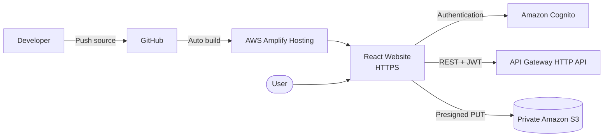

# Triển khai Frontend

Trong giai đoạn này, frontend React của Polly Voice được triển khai bằng
**AWS Amplify Hosting**. Amplify lấy source từ GitHub, build ứng dụng bằng
Node.js 22, publish thư mục `dist` và cung cấp một HTTPS domain để người dùng
truy cập.

Frontend sau khi triển khai sẽ kết nối với:

- Amazon Cognito để đăng ký, xác nhận email và đăng nhập.
- Amazon API Gateway HTTP API để gọi backend.
- Amazon S3 thông qua presigned URL để upload media.

Kiến trúc của giai đoạn này:



{}
Project sử dụng Amplify Hosting thay cho S3 Static Website Hosting. Cách này giữ
S3 media bucket ở trạng thái private, đồng thời cung cấp sẵn build pipeline,
HTTPS và tự động deploy khi GitHub branch thay đổi.
{}

## Chuẩn bị source frontend

1. Trước khi triển khai, source frontend được tổ chức trong thư mục `frontend`.

```text
polly-voice/
├── frontend/
│   ├── public/
│   ├── src/
│   ├── .env.example
│   ├── index.html
│   ├── package.json
│   ├── package-lock.json
│   └── vite.config.ts
├── backend/
└── docs/
```

<!--
Ảnh cần bổ sung:
/images/5-Workshop/5.3-deployfrontend/01-frontend-source.png
Chú thích: Cấu trúc thư mục frontend trong Visual Studio Code.
-->

2. Trong `frontend/package.json`, production build được khai báo:

```json
{
  "engines": {
    "node": ">=20.19"
  },
  "scripts": {
    "dev": "vite",
    "build": "tsc -b && vite build",
    "lint": "oxlint",
    "preview": "vite preview"
  }
}
```

Lệnh `npm run build` kiểm tra TypeScript và tạo static assets trong thư mục
`frontend/dist`.

3. Frontend được build thử trước khi đưa lên GitHub.

```powershell
cd frontend
npm ci
npm run build
```

Kết quả build thành công phải có file:

```text
frontend/dist/index.html
```

<!--
Ảnh cần bổ sung:
/images/5-Workshop/5.3-deployfrontend/02-local-build-success.png
Chú thích: Production build của frontend được tạo thành công.
-->

4. Source được commit và push lên branch `hieu` của GitHub repository.

```powershell
git add frontend
git commit -m "prepare frontend for Amplify deployment"
git push origin hieu
```

Không đưa các file chứa credential, JWT hoặc `.env` local lên repository.

<!--
Ảnh cần bổ sung:
/images/5-Workshop/5.3-deployfrontend/03-github-repository.png
Chú thích: Frontend source trên GitHub branch hieu.
-->

## Tạo ứng dụng trên AWS Amplify

5. Truy cập **AWS Management Console**, chọn region **Europe (Stockholm) –
`eu-north-1`**, sau đó tìm dịch vụ **AWS Amplify**.

<!--
Ảnh cần bổ sung:
/images/5-Workshop/5.3-deployfrontend/04-open-amplify.png
Chú thích: Dịch vụ AWS Amplify tại region eu-north-1.
-->

6. Trong trang Amplify, chọn **Create new app** hoặc **Deploy an app**.

Ở bước chọn source provider, chọn **GitHub** và cho phép Amplify truy cập
repository của project.

<!--
Ảnh cần bổ sung:
/images/5-Workshop/5.3-deployfrontend/05-connect-github.png
Chú thích: Chọn GitHub làm source provider.
-->

7. Chọn repository:

```text
super-chickens-aws/polly-voice
```

Chọn branch:

```text
hieu
```

Branch này được sử dụng làm production branch. Mỗi commit mới trên branch sẽ
kích hoạt một Amplify deployment.

<!--
Ảnh cần bổ sung:
/images/5-Workshop/5.3-deployfrontend/06-select-repository-branch.png
Chú thích: Repository và production branch được kết nối với Amplify.
-->

8. Đặt tên ứng dụng:

```text
polly-voice
```

Repository chứa cả frontend và backend nên Amplify được cấu hình theo dạng
monorepo. App root của website là:

```text
frontend
```

Nếu Amplify yêu cầu biến monorepo root, sử dụng:

```text
AMPLIFY_MONOREPO_APP_ROOT=frontend
```

<!--
Ảnh cần bổ sung:
/images/5-Workshop/5.3-deployfrontend/07-app-settings.png
Chú thích: App name và monorepo app root của Polly Voice.
-->

## Cấu hình quá trình build

9. Amplify build frontend bằng Node.js 22 và Vite. Build specification được cấu
hình như sau:

```yaml
version: 1
applications:
  - appRoot: frontend
    frontend:
      phases:
        preBuild:
          commands:
            - nvm use 22
            - npm ci
        build:
          commands:
            - npm run build
      artifacts:
        baseDirectory: dist
        files:
          - "**/*"
      cache:
        paths:
          - node_modules/**/*
```

Các giá trị quan trọng:

| Cấu hình | Giá trị |
|---|---|
| App root | `frontend` |
| Node.js | `22` |
| Install command | `npm ci` |
| Build command | `npm run build` |
| Output directory | `dist` |

<!--
Ảnh cần bổ sung:
/images/5-Workshop/5.3-deployfrontend/08-build-settings.png
Chú thích: Build settings của React/Vite frontend.
-->

{}
Không đặt output directory là `/`. Vite tạo `index.html` trong thư mục `dist`.
Nếu artifact base directory sai, Amplify có thể chỉ hiển thị trang Welcome thay
vì giao diện Polly Voice.
{}

## Cấu hình môi trường production

10. Frontend không viết cứng API URL và Cognito ID trong component. Các giá trị
được đọc từ Vite environment variables:

```text
VITE_API_BASE_URL
VITE_AWS_ENABLED
VITE_AWS_REGION
VITE_COGNITO_USER_POOL_ID
VITE_COGNITO_CLIENT_ID
```

Trong **Amplify → Hosting → Environment variables**, cấu hình:

```text
VITE_API_BASE_URL=https://<api-id>.execute-api.eu-north-1.amazonaws.com/api/v1
VITE_AWS_ENABLED=true
VITE_AWS_REGION=eu-north-1
VITE_COGNITO_USER_POOL_ID=<user-pool-id>
VITE_COGNITO_CLIENT_ID=<app-client-id>
```

<!--
Ảnh cần bổ sung:
/images/5-Workshop/5.3-deployfrontend/09-environment-variables.png
Chú thích: Tên các environment variables trong Amplify.
-->

`VITE_API_BASE_URL` phải là URL API Gateway của môi trường hiện tại và có hậu tố
`/api/v1`.

Ví dụ production API đã sử dụng trong quá trình phát triển:

```text
https://7x4houix91.execute-api.eu-north-1.amazonaws.com/api/v1
```

{}
Các biến bắt đầu bằng `VITE_` được đưa vào JavaScript bundle và có thể được xem
từ trình duyệt. Không lưu access key, secret access key, password, JWT hoặc
presigned URL trong Amplify environment variables.
{}

## Triển khai Frontend

11. Kiểm tra lại repository, branch, build specification và environment
variables, sau đó chọn **Save and deploy**.

Amplify thực hiện bốn giai đoạn:

```text
Provision → Build → Deploy → Verify
```

<!--
Ảnh cần bổ sung:
/images/5-Workshop/5.3-deployfrontend/10-deployment-started.png
Chú thích: Amplify bắt đầu quá trình triển khai frontend.
-->

12. Trong build log, kiểm tra Node.js và dependencies:

```text
Now using node v22...
npm ci
```

Sau đó kiểm tra production build:

```text
tsc -b && vite build
```

Deployment thành công khi các phase đều có trạng thái hoàn tất và Amplify tìm
thấy `dist/index.html`.

<!--
Ảnh cần bổ sung:
/images/5-Workshop/5.3-deployfrontend/11-build-success.png
Chú thích: Amplify build và deploy frontend thành công.
-->

13. Sau khi deployment hoàn tất, Amplify cung cấp domain dạng:

```text
https://<branch>.<app-id>.amplifyapp.com
```

Production website của project:

```text
https://hieu.d1sl9gotr7i3f4.amplifyapp.com
```

<!--
Ảnh cần bổ sung:
/images/5-Workshop/5.3-deployfrontend/12-production-domain.png
Chú thích: Production domain được AWS Amplify cung cấp.
-->

## Kết nối production frontend với backend

14. Khi website có domain chính thức, backend được cập nhật để chấp nhận origin:

```text
https://hieu.d1sl9gotr7i3f4.amplifyapp.com
```

Origin này được sử dụng trong:

- API Gateway CORS.
- Express CORS middleware.
- S3 bucket CORS cho presigned upload.

Không thêm dấu `/` ở cuối origin.

Luồng request production:

```text
Amplify React Website
        ↓ Authorization: Bearer <Cognito JWT>
API Gateway HTTP API
        ↓
AWS Lambda
```

Luồng upload Speech-to-Text:

```text
Amplify React Website
        ↓ Yêu cầu presigned URL
API Gateway → Lambda
        ↓ Trả presigned URL
Amplify React Website → Amazon S3
```

15. Mở production website và kiểm tra bằng Developer Tools → **Network**.

Request Preview phải được gửi đến:

```text
https://<api-id>.execute-api.eu-north-1.amazonaws.com/api/v1/tts/preview
```

Request không được gửi tới:

```text
https://placeholder.invalid
```

<!--
Ảnh cần bổ sung:
/images/5-Workshop/5.3-deployfrontend/13-network-api-request.png
Chú thích: Frontend production gọi đúng API Gateway endpoint.
-->

16. Kiểm tra các luồng chính trên production:

- Trang web tải thành công qua HTTPS.
- Giao diện không bị trắng hoặc chỉ hiển thị background.
- Đăng ký tài khoản.
- Nhập mã xác nhận email.
- Đăng nhập và đăng xuất.
- TTS Preview phát được audio.
- Tạo và tải MP3.
- Upload media trực tiếp lên S3.
- STT hiển thị trạng thái xử lý.
- History chỉ hiển thị dữ liệu của user hiện tại.

<!--
Ảnh cần bổ sung:
/images/5-Workshop/5.3-deployfrontend/14-production-website.png
Chú thích: Giao diện Polly Voice hoạt động trên AWS Amplify.
-->

## Các lỗi đã gặp và cách xử lý

### Lỗi chỉ hiển thị trang Welcome

Amplify deployment ban đầu hoàn tất nhưng website hiển thị:

```text
Your app will appear here once you complete your first deployment.
```

Build artifact không chứa `index.html` tại base directory mà Amplify đang đọc.
Project sử dụng Vite nên output đúng là:

```text
frontend/dist
```

Sau khi đặt `appRoot: frontend` và `baseDirectory: dist`, Amplify publish đúng
website.

### Lỗi native dependency của Windows

Build trên Amplify Linux từng thất bại với:

```text
Unsupported platform for
@rolldown/binding-win32-x64-msvc
```

Source được phát triển trên Windows, trong khi Amplify build trên Linux.
`package-lock.json` từng buộc quá trình cài đặt sử dụng native binding Windows.
Lockfile được cập nhật để các binding theo hệ điều hành được quản lý dưới dạng
optional dependency.

### Lỗi Lightning CSS Linux binding

Build tiếp tục gặp:

```text
Cannot find module
../lightningcss.linux-x64-gnu.node
```

Project bổ sung Linux binding vào `optionalDependencies`:

```json
{
  "optionalDependencies": {
    "lightningcss-linux-x64-gnu": "^1.32.0"
  }
}
```

Sau khi cập nhật lockfile, `npm ci` cài đúng binary cho môi trường Amplify.

### Lỗi `Failed to fetch`

Developer Tools cho thấy request được gửi tới:

```text
https://placeholder.invalid/api/v1/tts/preview
```

Nguyên nhân là `VITE_API_BASE_URL` chưa được cấu hình bằng API Gateway URL thật.
Vite sử dụng environment variables tại build time, do đó frontend được redeploy
sau khi giá trị được cập nhật.

### Lỗi CORS

Backend ban đầu chỉ cho phép:

```text
http://localhost:5173
```

Production request đến từ Amplify domain nên bị trình duyệt chặn. Backend và S3
CORS sau đó được cập nhật bằng đúng HTTPS origin của Amplify.

## Kết quả

Frontend đã được triển khai thành công với cấu hình:

| Thành phần | Kết quả |
|---|---|
| Framework | React 19 + TypeScript + Vite |
| Source | GitHub |
| Production branch | `hieu` |
| Hosting | AWS Amplify Hosting |
| Region | `eu-north-1` |
| Build runtime | Node.js 22 |
| Build output | `frontend/dist` |
| Authentication | Amazon Cognito |
| Backend endpoint | API Gateway HTTP API |
| Media upload | Presigned S3 PUT |
| HTTPS | Amplify quản lý tự động |

Frontend production đã kết nối được với Cognito, API Gateway và S3. Những vấn đề
về output directory, native dependencies, environment variables và CORS đã được
xác định thông qua Amplify build logs và trình duyệt Developer Tools.

{}
Phần tiếp theo trình bày quá trình cấu hình API Gateway và triển khai backend
Lambda để xử lý các request do frontend gửi tới.
{}
