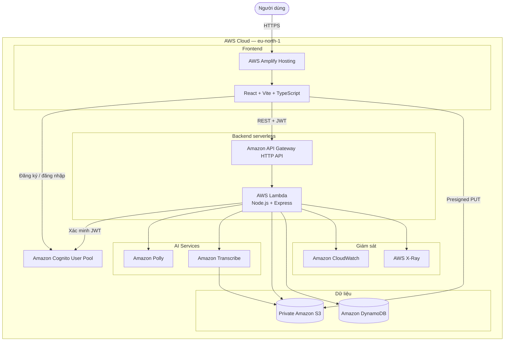

# Quy trình xây dựng và triển khai Polly Voice từ đầu đến cuối

## 1. Mục tiêu

Polly Voice là ứng dụng web serverless cung cấp hai chức năng chính:

- **Text-to-Speech (TTS):** chuyển văn bản thành giọng nói, nghe thử và tải MP3.
- **Speech-to-Text (STT):** tải audio/video lên và chuyển nội dung giọng nói thành văn bản.

Hệ thống sử dụng React cho frontend, Node.js/Express cho backend và các dịch vụ
AWS tại region `eu-north-1`.

Sau khi hoàn thành, hệ thống có:

- Website React được host bằng AWS Amplify.
- Đăng ký, xác nhận email và đăng nhập bằng Amazon Cognito.
- API serverless chạy trên API Gateway và Lambda.
- TTS bằng Amazon Polly.
- STT batch bằng Amazon Transcribe.
- Private media storage bằng Amazon S3.
- Lịch sử người dùng bằng Amazon DynamoDB.
- Logs, metrics và traces bằng CloudWatch và X-Ray.

## 2. Kiến trúc tổng thể



## 3. Giai đoạn 1 – Chuẩn bị tài khoản AWS

### 3.1 Hoàn tất tài khoản

1. Tạo tài khoản AWS.
2. Xác nhận email và số điện thoại.
3. Thêm phương thức thanh toán.
4. Chờ AWS hoàn tất xác minh tài khoản.
5. Đăng nhập AWS Console.
6. Chọn region **Europe (Stockholm) – `eu-north-1`**.

### 3.2 Bảo vệ tài khoản

1. Bật MFA cho root user.
2. Không tạo root access key.
3. Sử dụng IAM Identity Center cho công việc hằng ngày.
4. Tạo AWS Budget và email cảnh báo chi phí.

### 3.3 Chuẩn bị IAM

1. Bật IAM Identity Center.
2. Tạo group `polly-voice-developers`.
3. Tạo user và thêm vào group.
4. Tạo permission set `PollyVoiceDeveloper`.
5. Gắn `PowerUserAccess`.
6. Thêm quyền IAM giới hạn cho role có tiền tố `polly-voice-*`.
7. Gán group và permission set vào AWS account.
8. Đăng nhập bằng user mới thay cho root.

Không gắn `AdministratorAccess` vào Lambda execution role.

**Kết quả mong đợi:** người triển khai có thể sử dụng AWS Console, CLI, SAM và
CloudFormation; Lambda chỉ có quyền truy cập tài nguyên của ứng dụng.

**Bằng chứng báo cáo:** IAM user/group, permission set, MFA và kết quả
`aws sts get-caller-identity`.

## 4. Giai đoạn 2 – Chuẩn bị máy local

### 4.1 Công cụ cần cài

- Git.
- Node.js 22 và npm.
- Visual Studio Code.
- AWS CLI v2.
- AWS SAM CLI.
- Docker Desktop nếu muốn dùng `sam local`.

### 4.2 Kiểm tra phiên bản

```powershell
git --version
node --version
npm --version
aws --version
sam --version
```

### 4.3 Cấu hình AWS CLI

Ưu tiên đăng nhập bằng IAM Identity Center:

```powershell
aws configure sso --profile polly-voice
aws sso login --profile polly-voice
$env:AWS_PROFILE = "polly-voice"
$env:AWS_REGION = "eu-north-1"
$env:AWS_DEFAULT_REGION = "eu-north-1"
aws sts get-caller-identity
```

### 4.4 Lấy source code

```powershell
git clone https://github.com/super-chickens-aws/polly-voice.git
cd polly-voice
```

**Kết quả mong đợi:** các công cụ trả về phiên bản hợp lệ, CLI nhận đúng AWS
account và repository có hai thư mục `frontend`, `backend`.

**Bằng chứng báo cáo:** màn hình phiên bản công cụ và cấu trúc source code.

## 5. Giai đoạn 3 – Cài đặt và chạy local

### 5.1 Chạy backend

```powershell
cd backend
npm ci
Copy-Item .env.example .env
npm run typecheck
npm test
npm run dev
```

Backend local mặc định chạy tại:

```text
http://localhost:8080
```

Kiểm tra:

```powershell
Invoke-RestMethod http://localhost:8080/health
```

### 5.2 Chạy frontend

Mở cửa sổ PowerShell khác:

```powershell
cd frontend
npm ci
Copy-Item .env.example .env
npm run dev
```

Frontend mặc định chạy tại:

```text
http://localhost:5173
```

### 5.3 Kiểm thử local

1. Mở trang frontend.
2. Nhập văn bản.
3. Chọn voice và engine.
4. Nhấn Preview.
5. Tạo audio.
6. Thử tải file audio.
7. Kiểm tra Console và Network trong Developer Tools.

**Kết quả mong đợi:** frontend hiển thị bình thường, `/health` trả HTTP 200 và
frontend gọi được backend local.

**Bằng chứng báo cáo:** trang local, terminal backend và Network request thành công.

## 6. Giai đoạn 4 – Cấu hình Amazon Cognito

### 6.1 Tạo User Pool

1. Mở **Amazon Cognito**.
2. Chọn **Create user pool**.
3. Chọn kiểu ứng dụng **Single-page application**.
4. Chọn đăng nhập bằng email.
5. Bật self-registration.
6. Bật xác nhận tài khoản bằng mã email.
7. Cấu hình password policy tối thiểu 8 ký tự.
8. Đặt tên user pool, ví dụ `polly-voice-users`.
9. Chọn region `eu-north-1`.

### 6.2 Tạo App Client

1. Tạo app client `polly-voice`.
2. Không tạo client secret cho React SPA.
3. Bật SRP authentication.
4. Ghi lại:
   - User Pool ID.
   - App Client ID.
   - Region.

### 6.3 Cấu hình frontend local

Trong `frontend/.env`:

```dotenv
VITE_API_BASE_URL=http://localhost:8080/api/v1
VITE_AWS_ENABLED=true
VITE_AWS_REGION=eu-north-1
VITE_COGNITO_USER_POOL_ID=<USER_POOL_ID>
VITE_COGNITO_CLIENT_ID=<APP_CLIENT_ID>
```

Khởi động lại Vite sau khi thay đổi `.env`.

### 6.4 Kiểm thử authentication

1. Đăng ký bằng email.
2. Giữ màn hình nhập mã xác nhận.
3. Lấy mã từ email.
4. Xác nhận tài khoản.
5. Đăng nhập.
6. Kiểm tra access token được gửi dưới dạng Bearer token.
7. Đăng xuất và xác nhận session bị xóa.

Không cần redeploy frontend khi chỉ thay đổi trạng thái một user trong Cognito.
Chỉ cần đăng nhập lại hoặc làm mới session.

**Bằng chứng báo cáo:** User Pool, App Client không có secret, email xác nhận và
user ở trạng thái `CONFIRMED`.

## 7. Giai đoạn 5 – Triển khai backend

### 7.1 Tài nguyên được tạo

SAM template tạo:

- API Gateway HTTP API.
- Lambda Node.js.
- DynamoDB table `polly-voice-history`.
- Private S3 media bucket.
- Lambda execution role.
- CloudWatch Logs và X-Ray integration.

### 7.2 Kiểm tra trước khi deploy

```powershell
cd backend
npm ci
npm run typecheck
npm test
sam validate
sam build --no-cached
```

Nếu SAM báo không tìm thấy `esbuild`, chạy:

```powershell
npm install
```

vì `esbuild` đã được khai báo trong `devDependencies`.

### 7.3 Deploy bằng SAM

```powershell
sam deploy --guided --capabilities CAPABILITY_IAM
```

Cấu hình chính:

| Thông số | Giá trị |
|---|---|
| Stack name | `polly-voice-api` |
| Region | `eu-north-1` |
| MediaBucketName | Tên bucket duy nhất toàn cầu |
| HistoryTableName | `polly-voice-history` |
| CognitoUserPoolId | User Pool ID đã tạo |
| CognitoClientId | App Client ID |
| AllowedOrigins | URL frontend Amplify hoặc local |
| TranscribeLanguageCode | `en-US` hoặc ngôn ngữ cần dùng |

Với lần triển khai đầu tiên, có thể tạm nhập origin local rồi cập nhật sau khi
có URL Amplify.

### 7.4 Lưu Outputs

Sau khi deploy thành công, ghi lại:

- `ApiUrl`
- `FunctionName`
- `MediaBucket`
- `HistoryTable`

Ví dụ API hiện tại:

```text
https://7x4houix91.execute-api.eu-north-1.amazonaws.com
```

### 7.5 Kiểm tra backend

```powershell
Invoke-RestMethod `
  https://7x4houix91.execute-api.eu-north-1.amazonaws.com/health
```

Kết quả phải là HTTP 200. Nếu nhận HTTP 500:

1. Mở Lambda.
2. Chọn **Monitor** → **View CloudWatch logs**.
3. Mở log stream mới nhất.
4. Tìm lỗi đầu tiên trước dòng `Runtime.Unknown`.
5. Kiểm tra handler, package dependencies và environment variables.

**Bằng chứng báo cáo:** SAM deploy thành công, CloudFormation
`CREATE_COMPLETE`, Outputs, Lambda và `/health`.

## 8. Giai đoạn 6 – Triển khai frontend

### 8.1 Đẩy source lên GitHub

```powershell
git add .
git commit -m "prepare production deployment"
git push
```

Không commit file `.env` hoặc credentials.

### 8.2 Tạo Amplify application

1. Mở **AWS Amplify**.
2. Chọn **Deploy an app**.
3. Kết nối GitHub.
4. Chọn repository và branch.
5. Nếu frontend nằm trong monorepo, đặt app root là `frontend`.
6. Build command: `npm run build`.
7. Build output directory: `dist`.
8. Chọn Node.js 22.

Build configuration tham khảo:

```yaml
version: 1
applications:
  - appRoot: frontend
    frontend:
      phases:
        preBuild:
          commands:
            - nvm use 22
            - npm ci
        build:
          commands:
            - npm run build
      artifacts:
        baseDirectory: dist
        files:
          - "**/*"
      cache:
        paths:
          - node_modules/**/*
```

### 8.3 Thêm environment variables

Trong **Amplify → Hosting → Environment variables**, thêm:

```text
VITE_API_BASE_URL=https://7x4houix91.execute-api.eu-north-1.amazonaws.com/api/v1
VITE_AWS_ENABLED=true
VITE_AWS_REGION=eu-north-1
VITE_COGNITO_USER_POOL_ID=<USER_POOL_ID>
VITE_COGNITO_CLIENT_ID=<APP_CLIENT_ID>
```

`VITE_API_BASE_URL` không được chứa `placeholder.invalid`.

### 8.4 Deploy và lấy domain

1. Chọn **Save and deploy**.
2. Chờ Provision, Build, Deploy và Verify hoàn tất.
3. Mở domain `amplifyapp.com`.
4. Ghi lại production URL.

**Bằng chứng báo cáo:** build log thành công, environment variable names và
website production.

## 9. Giai đoạn 7 – Cập nhật CORS

Sau khi có Amplify URL, deploy lại backend với:

```text
AllowedOrigins=https://<branch>.<app-id>.amplifyapp.com
```

Không thêm dấu `/` ở cuối origin.

Kiểm tra:

1. Mở production website.
2. Mở Developer Tools → Network.
3. Gọi `/voices` hoặc `/health`.
4. Kiểm tra không còn lỗi CORS.
5. Kiểm tra Request URL trỏ tới API thật.

Nếu frontend vẫn dùng URL cũ, cập nhật Amplify environment variables và chạy
redeploy vì biến `VITE_*` được đóng gói tại build time.

**Bằng chứng báo cáo:** Network request, response HTTP và CORS response headers.

## 10. Giai đoạn 8 – Kiểm thử Text-to-Speech

### 10.1 Preview

1. Mở trang Text-to-Speech.
2. Nhập văn bản ngắn.
3. Chọn đúng ngôn ngữ, voice và engine.
4. Nhấn **Preview**.
5. Nghe audio trả về.

### 10.2 Tạo MP3

1. Đăng nhập.
2. Nhập văn bản.
3. Chọn voice được engine hỗ trợ.
4. Điều chỉnh tốc độ, âm lượng và khoảng nghỉ.
5. Nhấn tạo MP3.
6. Phát file.
7. Tải file về.
8. Kiểm tra bản ghi trong History.

### 10.3 Kiểm tra dữ liệu AWS

- S3 có object audio.
- DynamoDB có bản ghi TTS theo Cognito Subject ID.
- CloudWatch có log request.

Không phải voice nào cũng hỗ trợ Neural hoặc Long-form engine. Preset phải ánh
xạ tới cặp voice/engine hợp lệ tại `eu-north-1`; nếu không, Polly sẽ trả lỗi.

**Bằng chứng báo cáo:** cấu hình voice, audio player, file download, S3 object và
DynamoDB item.

## 11. Giai đoạn 9 – Kiểm thử Speech-to-Text

### 11.1 Upload media

1. Đăng nhập.
2. Mở Speech-to-Text.
3. Chọn MP3, MP4, WAV, FLAC, M4A, OGG, WebM hoặc AMR.
4. Kiểm tra kích thước không vượt giới hạn batch 2 GB của ứng dụng.
5. Frontend yêu cầu presigned URL.
6. Trình duyệt upload trực tiếp file vào S3.

File không đi qua API Gateway/Lambda nên không bị giới hạn bởi payload API.

### 11.2 Tạo Transcribe job

1. Sau khi upload, frontend gọi API tạo STT job.
2. Lambda kiểm tra S3 object.
3. Lambda gọi Amazon Transcribe.
4. DynamoDB lưu trạng thái `PROCESSING`.
5. Frontend polling trạng thái.
6. Khi hoàn thành, transcript được hiển thị.
7. Copy hoặc tải transcript.

### 11.3 Kiểm tra trường hợp lỗi

- File rỗng.
- Định dạng không hỗ trợ.
- Media không chứa giọng nói rõ ràng.
- Language code không đúng.
- User chưa đăng nhập.
- Presigned URL hết hạn.
- Lambda thiếu quyền Transcribe hoặc S3.

**Bằng chứng báo cáo:** upload progress, S3 object, Transcribe job,
DynamoDB status và transcript hoàn thành.

## 12. Giai đoạn 10 – Logging và monitoring

### 12.1 CloudWatch Logs

1. Mở Lambda.
2. Chọn **Monitor**.
3. Chọn **View CloudWatch logs**.
4. Mở log group `/aws/lambda/<function-name>`.
5. Kiểm tra log của TTS, STT và lỗi validation.

Không ghi JWT, password, nội dung nhạy cảm hoặc presigned URL đầy đủ vào log.

### 12.2 Metrics

Theo dõi:

- Lambda Invocations.
- Lambda Errors.
- Lambda Duration.
- Lambda Throttles.
- API Gateway 4xx và 5xx.
- API Gateway Latency.

### 12.3 Alarm

Tạo alarm cho:

- Lambda Errors lớn hơn 0 trong 5 phút.
- API Gateway 5xx lớn hơn ngưỡng.
- Lambda Duration gần timeout.

Kết nối alarm tới Amazon SNS và xác nhận email subscription.

### 12.4 X-Ray

1. Mở AWS X-Ray.
2. Kiểm tra service map.
3. Mở trace của request chậm hoặc lỗi.
4. Xác định thời gian tại Lambda và dịch vụ downstream.

**Bằng chứng báo cáo:** log stream, metrics graph, alarm ở trạng thái OK và X-Ray trace.

## 13. Giai đoạn 11 – Kiểm tra bảo mật

Thực hiện checklist:

- S3 Block Public Access được bật.
- Bucket không có public policy.
- Media chỉ được truy cập bằng presigned URL có thời hạn.
- App Client Cognito không có client secret.
- API bảo vệ endpoint History và STT bằng JWT.
- User A không đọc được lịch sử của user B.
- Lambda role không có `AdministratorAccess`.
- CORS chỉ cho phép frontend production và origin cần thiết.
- Không có credential trong Git.
- DynamoDB bật encryption at rest.
- S3 bật server-side encryption.
- Log không chứa secret.

Kiểm tra API không có token:

```powershell
Invoke-WebRequest `
  https://7x4houix91.execute-api.eu-north-1.amazonaws.com/api/v1/tts/history `
  -SkipHttpErrorCheck
```

Kết quả mong đợi là HTTP 401.

**Bằng chứng báo cáo:** S3 security, Lambda role, request 401 và Cognito settings.

## 14. Giai đoạn 12 – Kiểm thử end-to-end

Thực hiện theo thứ tự:

1. Mở production URL.
2. Đăng ký user mới.
3. Nhập mã xác nhận email.
4. Đăng nhập.
5. Preview một đoạn văn bản.
6. Tạo và tải MP3.
7. Mở History và phát lại audio.
8. Upload một file audio ngắn.
9. Chờ STT hoàn thành.
10. Copy và tải transcript.
11. Xóa một bản ghi.
12. Đăng xuất.
13. Gọi endpoint được bảo vệ và xác nhận HTTP 401.
14. Kiểm tra CloudWatch không có lỗi bất thường.

### Bảng nghiệm thu

| Hạng mục | Tiêu chí đạt |
|---|---|
| Frontend | Mở bằng HTTPS, không có lỗi trắng trang |
| Cognito | Đăng ký, xác nhận, đăng nhập, đăng xuất thành công |
| API | `/health` trả HTTP 200 |
| TTS | Preview và MP3 hoạt động |
| Download | Tải được media qua URL có thời hạn |
| STT | Upload trực tiếp S3 và có transcript |
| History | Dữ liệu đúng user, phát/tải/xóa được |
| Security | Endpoint bảo vệ trả 401 khi thiếu token |
| Monitoring | Có log, metric và alarm |

## 15. Giai đoạn 13 – Hoàn thiện báo cáo

Mỗi bước trong báo cáo nên có:

1. Mục tiêu.
2. Dịch vụ được sử dụng.
3. Sơ đồ hoặc luồng xử lý.
4. Các thao tác cấu hình.
5. Đoạn cấu hình hoặc lệnh quan trọng.
6. Ảnh chụp minh chứng.
7. Kết quả mong đợi.
8. Lỗi gặp phải và cách xử lý.
9. Nhận xét về bảo mật và chi phí.

### Danh sách ảnh tối thiểu

1. Kiến trúc tổng thể.
2. IAM permission set.
3. Cognito User Pool và App Client.
4. Backend chạy local.
5. Frontend chạy local.
6. SAM build và deploy thành công.
7. CloudFormation Outputs.
8. Lambda function và execution role.
9. API Gateway routes.
10. Private S3 bucket.
11. DynamoDB table.
12. Amplify build thành công.
13. Website production.
14. TTS preview và download.
15. STT upload, job và transcript.
16. History.
17. CloudWatch Logs.
18. CloudWatch Alarm.
19. Kiểm tra HTTP 401.
20. Kết quả clean-up.

Không để access key, secret key, JWT, password, confirmation code hoặc presigned
URL đầy đủ xuất hiện trong ảnh.

## 16. Giai đoạn 14 – Clean-up

Thực hiện clean-up nếu không tiếp tục sử dụng dự án.

### 16.1 Xóa frontend

1. Mở Amplify.
2. Tắt auto build nếu chỉ muốn dừng deploy tự động.
3. Xóa branch hoặc app nếu không cần hosting.
4. Xóa custom domain/DNS record nếu đã cấu hình.

### 16.2 Làm rỗng S3

Do template dùng `DeletionPolicy: Retain`, cần:

1. Tải dữ liệu cần lưu.
2. Xóa toàn bộ object và version trong media bucket.
3. Chỉ xóa bucket khi chắc chắn không cần khôi phục.

### 16.3 Xóa backend stack

```powershell
cd backend
sam delete --stack-name polly-voice-api --region eu-north-1
```

Kiểm tra CloudFormation stack đã biến mất. DynamoDB và S3 có thể được giữ lại do
Retention Policy và cần xóa thủ công nếu không còn sử dụng.

### 16.4 Xóa các tài nguyên còn lại

- Cognito User Pool.
- DynamoDB table.
- S3 bucket.
- CloudWatch log group.
- CloudWatch alarms.
- SNS topic/subscription.
- IAM assignment chỉ dùng cho workshop.

### 16.5 Xác nhận chi phí

1. Mở Billing and Cost Management.
2. Kiểm tra Cost Explorer.
3. Kiểm tra không còn tài nguyên chạy ngoài dự kiến.
4. Giữ Budget alarm hoạt động thêm một thời gian.

## 17. Kết luận

Polly Voice chứng minh khả năng xây dựng một ứng dụng AI serverless hoàn chỉnh
trên AWS. Kiến trúc tách frontend, authentication, API, xử lý AI, dữ liệu và
monitoring thành các thành phần managed độc lập. Cách tiếp cận này giảm công việc
quản trị máy chủ, tự động mở rộng theo tải và phù hợp với mô hình tính phí theo
mức sử dụng.

Quy trình hoàn thành dự án gồm bốn nhóm công việc chính:

1. Chuẩn bị tài khoản, IAM, công cụ và source code.
2. Xây dựng, cấu hình và kiểm thử ứng dụng local.
3. Triển khai Cognito, backend, frontend và kết nối end-to-end.
4. Kiểm tra chức năng, bảo mật, monitoring, chi phí và clean-up.

Khi tất cả tiêu chí nghiệm thu đều đạt, dự án có thể được xem là hoàn thành và
sẵn sàng trình bày trong báo cáo workshop.
